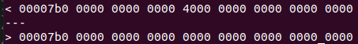
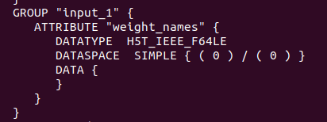
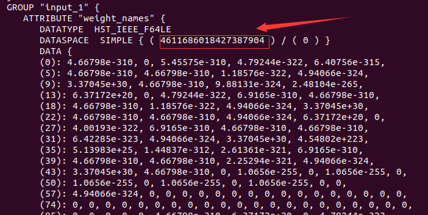

# HDF5 v1.13.0 h5dump heap-overflow


## brief description

This crash is a heap buffer overflow in the function `h5tools_str_sprin`t located in `/hdf5/tools/lib/h5tools_str.c`

With my analysis,  this crash could be caused by modifying a `DATASPACE` field. So that `h5dump` resolved the data size incorrectly, and then `h5dump` out-of-bound output a huge size of data.

diff between original file and poc:



normal output:



poc output:



and the number`4611686018427387904` is exactly `0x4000 0000 0000 0000` or `0000 0000 0000 4000` in little endian

Interestingly, I recompile the h5dump with ASAN enabled, but I am not sure whether the ASAN info corresponded with what I found.


poc:[.assets/poc](HDF5_v1.13.0_h5dump_heap_overflow.assets/poc)


## system info

HDF5 version: 1.12.0 and 1.13.0

system info: Ubuntu 20.04  gcc 9.3.0

target: h5dump

command: `/path/to/h5dump poc`


## ASAN info

```
HDF5 "id:000033,sig:11,src:000000,op:flip1,pos:1975" {
GROUP "/" {
   ATTRIBUTE "backend" {
      DATATYPE  H5T_STRING {
         STRSIZE H5T_VARIABLE;
         STRPAD H5T_STR_NULLTERM;
         CSET H5T_CSET_ASCII;
         CTYPE H5T_C_S1;
      }
      DATASPACE  SCALAR
      DATA {
      (0nknownu): "tensorflow"
      }
   }
   ATTRIBUTE "keras_version" {
      DATATYPE  H5T_STRING {
         STRSIZE H5T_VARIABLE;
         STRPAD H5T_STR_NULLTERM;
         CSET H5T_CSET_ASCII;
         CTYPE H5T_C_S1;
      }
      DATASPACE  SCALAR
      DATA {
      (0nknownu): "2.0.8"
      }
   }
   ATTRIBUTE "layer_names" {
      DATATYPE  H5T_STRING {
         STRSIZE 14;
         STRPAD H5T_STR_NULLPAD;
         CSET H5T_CSET_ASCII;
         CTYPE H5T_C_S1;
      }
      DATASPACE  SIMPLE { ( 8nknownu ) / ( 8nknownu ) }
      DATA {
      (0nknownu): "input_1\000\000\000\000\000\000\000",
      (1nknownu): "block1_conv1\000\000", "block1_pool1\000\000",
      (3nknownu): "block2_conv1\000\000", "block2_pool1\000\000",
      (5nknownu): "flatten\000\000\000\000\000\000\000", "before_softmax",
      (7nknownu): "predictions\000\000\000"
      }
   }
   GROUP "before_softmax" {
      ATTRIBUTE "weight_names" {
         DATATYPE  H5T_STRING {
            STRSIZE 23;
            STRPAD H5T_STR_NULLPAD;
            CSET H5T_CSET_ASCII;
            CTYPE H5T_C_S1;
         }
         DATASPACE  SIMPLE { ( 2nknownu ) / ( 2nknownu ) }
         DATA {
         (0nknownu): "before_softmax/kernel:0",
         (1nknownu): "before_softmax/bias:0\000\000"
         }
      }
      GROUP "before_softmax" {
         DATASET "bias:0" {
            DATATYPE  H5T_IEEE_F32LE
            DATASPACE  SIMPLE { ( 10nknownu ) / ( 10nknownu ) }
            DATA {
            (0nknownu): -0.00829703, -0.00118377, 0.00275684, -0.00274523,
            (4nknownu): -0.0190003, 0.0456237, -0.0324748, -0.0142213,
            (8nknownu): 0.00443192, 0.00534396
            }
         }
         DATASET "kernel:0" {
            DATATYPE  H5T_IEEE_F32LE
            DATASPACE  SIMPLE { ( 588nknownu, 10nknownu ) / ( 588nknownu, 10nknownu ) }
            DATA {
            (0nknownu,0nknownu): -0.00366769, -0.0335514, 0.0580021,
            (0nknownu,3nknownu): -0.057316, -0.0169165, -0.0424381,
            (0nknownu,6nknownu): 0.0591505, 0.00884233, -0.0735142,
            (0nknownu,9nknownu): 0.0876202,
            (1nknownu,0nknownu): 0.0725157, -0.0474613, -0.0294858,
            (1nknownu,3nknownu): -0.0468515, -0.0115415, 0.0555666,
            (1nknownu,6nknownu): 0.0593446, -0.0452859, 0.0659278, 0.036839,
            (2nknownu,0nknownu): -0.00337024, -0.0367603, 0.0519907,
            (2nknownu,3nknownu): -0.103183, -0.0694521, -0.0464681,
            (2nknownu,6nknownu): -0.0710507, -0.0351433, -0.0443508,
            (2nknownu,9nknownu): 0.0884151,
            (3nknownu,0nknownu): -0.0994687, -0.0624923, -0.0171975,
            (3nknownu,3nknownu): -0.0742039, -0.0594867, 0.0961988,
            (3nknownu,6nknownu): 0.0159668, 0.0152212, 0.127862, -0.0745156,
            (4nknownu,0nknownu): -0.0223976, -0.0893031, 0.0791289,
            (4nknownu,3nknownu): -0.00783777, 0.0492448, -0.0253569,
            (4nknownu,6nknownu): 0.106464, 0.0536878, 0.00389217,
            (4nknownu,9nknownu): -0.00121724,
            (5nknownu,0nknownu): -0.0837006, -0.00915064, -0.0536719,
            (5nknownu,3nknownu): -0.0806025, -0.0824062, 8.96078e-06,
            (5nknownu,6nknownu): -0.0957802, 0.107011, 0.0273309, -0.105544,
            (6nknownu,0nknownu): 0.0694501, -0.0283009, -0.117008,
            (6nknownu,3nknownu): -0.0336921, 0.0469171, 0.102259, 0.0960469,
            (6nknownu,7nknownu): 0.0481961, -0.0601288, 0.0980543,
            (7nknownu,0nknownu): 0.0288842, 0.0128132, 0.0538533, 0.0698623,
            (7nknownu,4nknownu): 0.0539375, -0.0506496, -0.0467097,
            (7nknownu,7nknownu): 0.00544262, 0.0411074, 0.0502132,
            (8nknownu,0nknownu): -0.0663138, -0.102877, -0.0247368,
            (8nknownu,3nknownu): 0.0128757, -0.129678, -0.0808705, 0.0028969,
            (8nknownu,7nknownu): -0.117695, 0.0608133, -0.0297978,
            (9nknownu,0nknownu): 0.0155427, 0.0135962, -0.119356, 0.01813,
            (9nknownu,4nknownu): 0.0468118, 0.0429341, 0.11226, 0.0634465,
            (9nknownu,8nknownu): 0.0275754, -0.0633909,
            (10nknownu,0nknownu): -0.0613448, -0.0879995, -0.0489546,
            (10nknownu,3nknownu): -0.035498, 0.073281, -0.0591465,
            (10nknownu,6nknownu): -0.0358182, -0.00399382, 0.0441622,
            (10nknownu,9nknownu): 0.036758,
            (11nknownu,0nknownu): 0.0426647, 0.0380193, -0.0866459,
            (11nknownu,3nknownu): -0.0338467, 0.0681245, 0.0205937,
            (11nknownu,6nknownu): -0.0345286, -0.0480464, 0.00168355,
            (11nknownu,9nknownu): -0.068864,
            (12nknownu,0nknownu): 0.0759509, -0.0198886, -0.0958442,
            (12nknownu,3nknownu): 0.0912128, 0.0284173, -0.13563, 0.0126592,
            (12nknownu,7nknownu): -0.0344068, -0.0694832, 0.00367268,
            (13nknownu,0nknownu): 0.0644636, 0.0396244, 0.0187547, 0.105487,
            (13nknownu,4nknownu): -0.120607, 0.0598406, 0.0622393, 0.0497719,
            (13nknownu,8nknownu): 0.0552967, 0.0208274,
            (14nknownu,0nknownu): -0.00743784, -0.0421894, -0.0202591,
            (14nknownu,3nknownu): 0.0440884, 0.0560745, 0.0530618, 0.0745939,
            (14nknownu,7nknownu): 0.0178532, 0.0260327, -0.0945326,
            (15nknownu,0nknownu): -0.0450527, -0.0645811, -0.112614,
            (15nknownu,3nknownu): -0.058455, 0.0740338, 0.058838, -0.0515083,
            (15nknownu,7nknownu): 0.104299, -0.0846105, -0.00812155,
            (16nknownu,0nknownu): -0.0648867, -0.0539293, 0.166411,
            (16nknownu,3nknownu): 0.0216048, -0.128213, -0.0752249, 0.076715,
            (16nknownu,7nknownu): 0.00902941, -0.19044, -0.085055,
            (17nknownu,0nknownu): -0.0786044, -0.00878355, -0.0245511,
            (17nknownu,3nknownu): 0.0473462, -0.0458361, -0.0362149,
            (17nknownu,6nknownu): 0.117717, 0.139435, -0.00419182, -0.258949,
            (18nknownu,0nknownu): -0.142958, -0.0428955, -0.060514,
            (18nknownu,3nknownu): 0.0123152, 0.037252, -0.150618, -0.0368543,
            (18nknownu,7nknownu): -0.0879875, 0.0797392, -0.0690467,
            (19nknownu,0nknownu): 0.0814076, -0.0750547, -0.00913808,
            (19nknownu,3nknownu): -0.105824, -0.0868699, 0.0781122,
            (19nknownu,6nknownu): 0.0311308, 0.0756538, 0.0624815,
            (19nknownu,9nknownu): -0.0942276,
            (20nknownu,0nknownu): -0.00530699, 0.034388, 0.0516618,
            (20nknownu,3nknownu): 0.0562352, -0.0746147, -0.0940081,
            (20nknownu,6nknownu): 0.0358084, -0.038262, 0.0657224,
            (20nknownu,9nknownu): -0.0852645,
            (21nknownu,0nknownu): -0.0390702, -0.0723209, 0.0430339,
            (21nknownu,3nknownu): 0.0137716, 0.0943128, 0.00452048, 0.139399,
            (21nknownu,7nknownu): -0.0332694, 0.0493635, -0.107472,
            (22nknownu,0nknownu): 0.0595484, -0.125525, 0.0512976,
            (22nknownu,3nknownu): -0.0733911, 0.106284, -0.0863475, 0.113883,
            (22nknownu,7nknownu): 0.100343, 0.0349517, -0.0152159,
            (23nknownu,0nknownu): 0.0786273, -0.0356096, -0.0366397, 0.12362,
            (23nknownu,4nknownu): 0.0532838, -0.00663587, 0.0188951,
            (23nknownu,7nknownu): -0.071478, 0.050638, 0.0979068,
            (24nknownu,0nknownu): 0.0408946, 0.0511295, 0.106718, 0.105415,
            (24nknownu,4nknownu): 0.0200795, 0.131066, 0.0210605, -0.0237798,
            (24nknownu,8nknownu): -0.0316974, -0.0758967,
            (25nknownu,0nknownu): -0.0313379, -0.0315577, -0.0186194,
            (25nknownu,3nknownu): 0.0134864, 0.0224331, -0.139558, 0.033456,
            (25nknownu,7nknownu): -0.021248, 0.0592205, 0.0641178,
            (26nknownu,0nknownu): -0.00794937, -0.0287784, -0.0460048,
            (26nknownu,3nknownu): 0.0352906, -0.00101796, 0.123252, 0.121874,
            (26nknownu,7nknownu): 0.0369746, -0.154139, -0.191827,
            (27nknownu,0nknownu): 0.0480047, 0.0287714, 0.0293419,
            (27nknownu,3nknownu): -0.0862165, 0.0586015, 0.0221592,
            (27nknownu,6nknownu): -0.00374608, 0.119018, -0.0620969,
            (27nknownu,9nknownu): -0.217463,
            (28nknownu,0nknownu): -0.133851, -0.0991619, 0.21063, 0.107436,
            (28nknownu,4nknownu): -0.0502419, -0.0963391, -0.0488439,
            (28nknownu,7nknownu): -0.0618768, -0.124317, -0.0370865,
            (29nknownu,0nknownu): -0.0229388, 0.0247019, 0.0794008,
            (29nknownu,3nknownu): -0.0862778, -0.0421306, -0.0671107,
            (29nknownu,6nknownu): 0.130113, -0.127827, -0.0864938, -0.053709,
            (30nknownu,0nknownu): -0.0883855, -0.033431, 0.0758186,
            (30nknownu,3nknownu): 0.0100879, -0.0472447, -0.0790474, 0.18947,
            (30nknownu,7nknownu): -0.134072, 0.127469, 0.0204562,
            (31nknownu,0nknownu): -0.127336, -0.0226326, 0.00266126,
            (31nknownu,3nknownu): -0.0429212, 0.0709202, -0.0358527,
            (31nknownu,6nknownu): -0.0124092, -0.0434515, 0.0225862,
            (31nknownu,9nknownu): -0.0122192,
            (32nknownu,0nknownu): -0.0489121, -0.0664126, 0.0520509,
            (32nknownu,3nknownu): 0.026395, 0.0607208, -0.0101, -0.0225726,
            (32nknownu,7nknownu): 0.0309261, 0.00794715, -0.0622028,
            (33nknownu,0nknownu): -0.0797622, 0.0760943, 0.0477783,
            (33nknownu,3nknownu): 0.0500055, 0.102373, 0.00826062, 0.0811424,
            (33nknownu,7nknownu): -0.104447, 0.0732532, -0.109871,
            (34nknownu,0nknownu): -0.0793636, -0.110163, -0.0573166,
            (34nknownu,3nknownu): -0.0256802, 0.0142893, -0.0318886,
            (34nknownu,6nknownu): -0.0236687, -0.174395, 0.0730369,
            (34nknownu,9nknownu): 0.0615702,
            (35nknownu,0nknownu): -0.0354083, -0.158112, -0.0450143,
            (35nknownu,3nknownu): 0.103776, -0.0655523, -0.0245072,
            (35nknownu,6nknownu): -0.0421369, -0.0851066, -0.0414916,
            (35nknownu,9nknownu): -0.0273271,
            (36nknownu,0nknownu): -0.0203942, -0.0156756, -0.0473699,
            (36nknownu,3nknownu): -0.0145414, -0.0230631, -0.00489247,
            (36nknownu,6nknownu): -0.0649721, -0.0671937, 0.105431,
            (36nknownu,9nknownu): -0.0027989,
            (37nknownu,0nknownu): -0.0322614, -0.0938204, -0.0825112,
            (37nknownu,3nknownu): 0.0465552, -0.0680108, -0.0143304,
            (37nknownu,6nknownu): 0.0462162, 0.00249467, 0.0664606, 0.05617,
            (38nknownu,0nknownu): -0.0752385, 0.140176, 0.0240919, 0.0401688,
            (38nknownu,4nknownu): -0.0918101, -0.0793203, 0.0865741,
            (38nknownu,7nknownu): -0.141053, -0.0658197, -0.0487805,
            (39nknownu,0nknownu): -0.0391755, 0.0771726, -0.0373995,
            (39nknownu,3nknownu): 0.0452369, 0.0161739, -0.0180669,
            (39nknownu,6nknownu): -0.0442029, -0.129983, 0.0402798,
            (39nknownu,9nknownu): -0.0194512,
            (40nknownu,0nknownu): -0.00458038, -0.0542818, 0.142499,
            (40nknownu,3nknownu): 0.115522, -0.104705, -0.0601527, 0.0027694,
            (40nknownu,7nknownu): 0.102373, -0.00182588, -0.0152583,
            (41nknownu,0nknownu): 0.0528231, 0.167548, -0.106354,
            (41nknownu,3nknownu): -0.00839868, -0.0199176, -0.0466693,
            (41nknownu,6nknownu): 0.0070775, -0.0955778, -0.0402285,
            (41nknownu,9nknownu): -0.0490958,
            (42nknownu,0nknownu): -0.116277, 0.0858355, -0.0466679, -0.14951,
            (42nknownu,4nknownu): 0.0225876, -0.135865, 0.207869, -0.0797414,
            (42nknownu,8nknownu): -0.0229041, 0.105736,
            (43nknownu,0nknownu): -0.0556674, 0.0695922, -0.0624419,
            (43nknownu,3nknownu): -0.187257, 0.0506635, -0.0437388, 0.164591,
            (43nknownu,7nknownu): -0.266721, -0.112668, -0.0341733,
            (44nknownu,0nknownu): 0.0461794, 0.0990878, 0.000942255,
            (44nknownu,3nknownu): 0.0499269, -0.0529253, -0.0594136,
            (44nknownu,6nknownu): -0.0666066, -0.0969748, 0.0312786,
            (44nknownu,9nknownu): -0.107167,
            (45nknownu,0nknownu): -0.00423901, 0.0450191, 0.0171824,
            (45nknownu,3nknownu): 0.0957936, -0.128116, -0.130319, -0.045058,
            (45nknownu,7nknownu): -0.0397281, 0.139925, -0.037967,
            (46nknownu,0nknownu): 0.0079675, -0.00308162, 0.028121,
            (46nknownu,3nknownu): 0.0405277, 0.150497, 0.0815443, 0.0288375,
            (46nknownu,7nknownu): -0.0960738, 0.121408, 0.00329335,
            (47nknownu,0nknownu): 0.00633454, -0.170468, 0.0668446, 0.173834,
            (47nknownu,4nknownu): -0.163941, 0.052223, 0.0478998, -0.120999,
            (47nknownu,8nknownu): 0.0426989, 0.0386064,
            (48nknownu,0nknownu): -0.0070143, 0.0546955, 0.0832379,
            (48nknownu,3nknownu): 0.0478007, -0.0737062, 0.013734,
            (48nknownu,6nknownu): -0.0625364, -0.0992101, 0.0668114,
            (48nknownu,9nknownu): -0.0240575,
            (49nknownu,0nknownu): 0.0274335, 0.00543545, 0.0195573,
            (49nknownu,3nknownu): 0.0513397, -0.077625, 0.0189363,
            (49nknownu,6nknownu): -0.0643884, 0.0210447, 0.0982896,
            (49nknownu,9nknownu): -0.0166788,
            (50nknownu,0nknownu): -0.0514827, -0.0251221, 0.0617008,
            (50nknownu,3nknownu): -0.00762692, -0.0240919, -0.0867095,
            (50nknownu,6nknownu): -0.0258568, -0.129004, 0.0377589,
            (50nknownu,9nknownu): 0.00486285,
            (51nknownu,0nknownu): 0.0578552, 0.00867265, 0.0314873,
            (51nknownu,3nknownu): 0.00336834, -0.0458552, 0.00686888,
            (51nknownu,6nknownu): -0.0320277, 0.0411051, -0.0529979,
            (51nknownu,9nknownu): 0.0398255,
            (52nknownu,0nknownu): 0.0171829, -0.0167379, -0.0909368,
            (52nknownu,3nknownu): -0.108829, -0.118263, 0.0444127, 0.171851,
            (52nknownu,7nknownu): 0.112355, -0.0820143, -0.0635688,
            (53nknownu,0nknownu): -0.0979274, -0.0421369, 0.0647662,
            (53nknownu,3nknownu): 0.0585308, 0.131584, -0.0850966,
            (53nknownu,6nknownu): -0.0265696, -0.0444503, -0.0222801,
            (53nknownu,9nknownu): -0.019752,
            (54nknownu,0nknownu): -0.0934209, 0.13774, -0.102003, -0.111638,
            (54nknownu,4nknownu): -0.0774913, 0.0428964, -0.00463674,
            (54nknownu,7nknownu): -0.0169426, -0.0135802, -0.173179,
            (55nknownu,0nknownu): -0.0558677, 0.218737, -0.232089, -0.112378,
            (55nknownu,4nknownu): 0.0790722, -0.10318, 0.120399, -0.0149333,
            (55nknownu,8nknownu): -0.00679645, -0.10588,
            (56nknownu,0nknownu): -0.00222272, -0.0739449, -0.0198728,
            (56nknownu,3nknownu): 0.0130766, 0.00351004, -0.115335,
            (56nknownu,6nknownu): -0.0609037, -0.0147191, -0.0473527,
            (56nknownu,9nknownu): 0.117923,
            (57nknownu,0nknownu): -0.0185855, -0.0544386, 0.0898329,
            (57nknownu,3nknownu): 0.105793, -0.112711, -0.0760724,
            (57nknownu,6nknownu): 0.00849687, -0.0997201, 0.05191,
            (57nknownu,9nknownu): -0.0248147,
            (58nknownu,0nknownu): 0.015597, 0.102551, -0.0642212, -0.0109636,
            (58nknownu,4nknownu): -0.044298, -0.0182698, 0.0767498,
            (58nknownu,7nknownu): 0.00503882, 0.0893778, 0.0249816,
            (59nknownu,0nknownu): 0.0181796, -0.0435804, -0.0828995,
            (59nknownu,3nknownu): -0.0839578, -0.124387, 0.151867, 0.0679089,
            (59nknownu,7nknownu): -0.0327681, 0.0430748, 0.0648705,
            (60nknownu,0nknownu): 0.054972, -0.0257668, 0.00734945,
            (60nknownu,3nknownu): -0.0352139, 0.0935366, 0.0489157,
            (60nknownu,6nknownu): -0.0501555, 0.0279763, -5.20812e-05,
            (60nknownu,9nknownu): 0.00407075,
            (61nknownu,0nknownu): -0.0621927, 0.0498697, 0.00205147,
            (61nknownu,3nknownu): 0.116822, 0.043363, -0.0200591, -0.0562668,
            (61nknownu,7nknownu): -0.00937136, -0.0736574, -0.0851686,
            (62nknownu,0nknownu): 0.0457233, -0.017537, -0.0419167,
            (62nknownu,3nknownu): 0.0650588, -0.0223926, -0.0185086,
            (62nknownu,6nknownu): -0.0555392, 0.0312539, 0.0147204,
            (62nknownu,9nknownu): -0.0648701,
            (63nknownu,0nknownu): 0.0065615, -0.0758367, -0.080963,
            (63nknownu,3nknownu): -0.0416899, 0.056094, 0.121086,
            (63nknownu,6nknownu): -0.00894919, -0.0653543, 0.000629252,
            (63nknownu,9nknownu): 0.0239328,
            (64nknownu,0nknownu): -0.0947751, 0.0564939, -0.129487,
            (64nknownu,3nknownu): 0.0287102, -0.164142, -0.000149792,
            (64nknownu,6nknownu): 0.0155949, 0.0862018, -0.106567, 0.116372,
            (65nknownu,0nknownu): -0.0086558, 0.0186923, -0.0615005,
            (65nknownu,3nknownu): -0.0196439, -0.0145169, -0.124926,
            (65nknownu,6nknownu): 0.0191286, -0.103504, 0.0288819, -0.069345,
            (66nknownu,0nknownu): -0.128521, -0.02597, -0.045018, -0.0469233,
            (66nknownu,4nknownu): -0.0750543, 0.140535, -0.0297931, 0.025049,
            (66nknownu,8nknownu): -0.101328, -0.0736965,
            (67nknownu,0nknownu): -0.0820856, 0.131093, -0.119454,
            (67nknownu,3nknownu): 4.66545e-05, 0.0180073, 0.239484, 0.216509,
            (67nknownu,7nknownu): 0.0558986, -0.0690622, -0.0690444,
            (68nknownu,0nknownu): -0.0563791, -0.136183, 0.105341,
            (68nknownu,3nknownu): -0.0833167, 0.0185279, -0.10339,
            (68nknownu,6nknownu): -0.0175283, -0.0553143, 0.00146953,
            (68nknownu,9nknownu): 0.125937,
            (69nknownu,0nknownu): -0.0542512, 0.090416, -0.0204735,
            (69nknownu,3nknownu): -0.0450371, -0.0686092, -0.149529,
            (69nknownu,6nknownu): 0.0339536, -0.121144, 0.103133, 0.0128092,
            (70nknownu,0nknownu): -0.0898362, -0.051549, 0.0181731,
            (70nknownu,3nknownu): -0.00397933, 0.0690655, -0.0364611,
            (70nknownu,6nknownu): 0.0873582, -0.0193053, -0.00544125,
            (70nknownu,9nknownu): 0.0153623,
            (71nknownu,0nknownu): -0.0369823, 0.05112, -0.00360244,
            (71nknownu,3nknownu): -0.0442658, -0.0760357, 0.173397,
            (71nknownu,6nknownu): -0.00404676, 0.0197399, -0.0660106,
            (71nknownu,9nknownu): 0.0463972,
            (72nknownu,0nknownu): -0.0335441, -0.0113033, 0.0532456,
            (72nknownu,3nknownu): 0.0998681, 0.0948438, -0.0405079,
            (72nknownu,6nknownu): -0.0747724, -0.0206623, 0.0249609,
            (72nknownu,9nknownu): -0.0731275,
            (73nknownu,0nknownu): -0.0662945, -0.102963, -0.117709,
            (73nknownu,3nknownu): -0.0682474, 0.0930035, 0.118792, -0.107164,
            (73nknownu,7nknownu): -0.116331, 0.0532636, -0.115746,
            (74nknownu,0nknownu): -0.0462477, 0.0152939, -0.000804559,
            (74nknownu,3nknownu): 0.00114183, 0.123645, 0.0307541, 0.0250185,
            (74nknownu,7nknownu): -0.123416, 0.1038, -0.0323353,
            (75nknownu,0nknownu): 0.0750457, 0.0182319, -0.0224984,
            (75nknownu,3nknownu): 0.00665767, 0.074021, -0.0381366,
            (75nknownu,6nknownu): 0.000407806, 0.00939035, 0.0319015,
            (75nknownu,9nknownu): 0.00556616,
            (76nknownu,0nknownu): 0.0728308, -0.0742574, -0.0696292,
            (76nknownu,3nknownu): 0.0719829, -0.0111896, 0.0989478, 0.109664,
            (76nknownu,7nknownu): 0.0649034, -0.120778, -0.0815917,
            (77nknownu,0nknownu): 0.0549258, 0.0756684, -0.0222075,
            (77nknownu,3nknownu): -0.0223162, 0.135125, -0.13757, -0.0570095,
            (77nknownu,7nknownu): -0.0329435, 0.0349493, -0.193998,
            (78nknownu,0nknownu): -0.00705334, 0.0326654, -0.0525813,
            (78nknownu,3nknownu): -0.0571374, 0.113011, -0.103549,
            (78nknownu,6nknownu): -0.0377223, -0.0889554, 0.0261701,
            (78nknownu,9nknownu): -0.0112935,
            (79nknownu,0nknownu): -0.0239476, 0.0847904, -0.104731,
            (79nknownu,3nknownu): 0.00964689, -0.104399, 0.155637, 0.108271,
            (79nknownu,7nknownu): -0.0443043, -0.053505, -0.147858,
            (80nknownu,0nknownu): 0.0529214, -0.0585162, -0.0733731,
            (80nknownu,3nknownu): 0.0237558, 0.0787397, 0.0466129, -0.109021,
            (80nknownu,7nknownu): 0.0317349, -0.0280317, 0.0421845,
            (81nknownu,0nknownu): -0.0649429, -0.112686, -0.0138753,
            (81nknownu,3nknownu): -0.0346917, 0.14654, -0.0571706, 0.0672795,
            (81nknownu,7nknownu): -0.0416744, -0.0490907, -0.160045,
            (82nknownu,0nknownu): 0.0626296, 0.0329663, -0.0843806,
            (82nknownu,3nknownu): -0.0690188, 0.0753155, -0.0293766,
            (82nknownu,6nknownu): 0.0941638, -0.144987, 0.0929427, -0.13138,
            (83nknownu,0nknownu): -0.0615255, 0.0521163, -0.143067,
            (83nknownu,3nknownu): -0.0144285, -0.00593018, 0.105746,
            (83nknownu,6nknownu): 0.0309163, -0.108419, -0.0141563,
            (83nknownu,9nknownu): 0.0479669,
            (84nknownu,0nknownu): -0.0556173, -0.00295346, -0.0296741,
            (84nknownu,3nknownu): 0.00365248, -0.0797949, -0.103802,
            (84nknownu,6nknownu): -0.0564159, 0.143743, -0.0724784,
            (84nknownu,9nknownu): -0.109346,
            (85nknownu,0nknownu): 0.0890909, -0.0348887, -0.045768, 0.066745,
            (85nknownu,4nknownu): -0.136531, -0.122518, -0.0517381,
            (85nknownu,7nknownu): -0.0651566, -0.0482315, 0.0894029,
            (86nknownu,0nknownu): 0.0474251, -0.054447, -0.0310759,
            (86nknownu,3nknownu): -0.0290909, -0.0441555, 0.0308698,
            (86nknownu,6nknownu): 0.0486902, 0.0566034, -0.0463877, 0.107364,
            (87nknownu,0nknownu): 0.0067795, 0.0522998, -0.0821714,
            (87nknownu,3nknownu): -0.0153065, -0.0760705, -0.102252,
            (87nknownu,6nknownu): -0.0188868, 0.0307617, -0.0567646,
            (87nknownu,9nknownu): -0.0690402,
            (88nknownu,0nknownu): -0.0743551, -0.0597745, -0.0660074,
            (88nknownu,3nknownu): 0.0673417, 0.0472156, 0.0650946, -0.103886,
            (88nknownu,7nknownu): 0.0693952, 0.0520595, -0.0641355,
            (89nknownu,0nknownu): -0.0150251, 0.0756295, 0.0303603,
            (89nknownu,3nknownu): -0.070767, 0.0258154, 0.0521648, 0.0927091,
            (89nknownu,7nknownu): -0.0282336, 0.0488211, -0.0422557,
            (90nknownu,0nknownu): 0.0299698, 0.00355933, 0.0122631, 0.145548,
            (90nknownu,4nknownu): 0.00559929, -0.0926964, -0.0475882,
            (90nknownu,7nknownu): -0.0874842, 0.0812963, -0.0513849,
            (91nknownu,0nknownu): -0.0674123, -0.0120391, 0.0445296, 0.05951,
            (91nknownu,4nknownu): -0.00909059, -0.0758019, 0.0205189,
            (91nknownu,7nknownu): -0.0476468, -0.0528964, 0.106424,
            (92nknownu,0nknownu): -0.0496882, -0.0467505, -0.0879799,
            (92nknownu,3nknownu): 0.00190122, -0.0668079, 0.0313302,
            (92nknownu,6nknownu): 0.0316078, 0.000740542, -0.0501585,
            (92nknownu,9nknownu): -0.0176901,
            (93nknownu,0nknownu): -0.0674001, 0.00904265, -0.041342,
            (93nknownu,3nknownu): 0.0943507, -0.0585262, 0.0480291,
            (93nknownu,6nknownu): -0.0660704, -0.0318667, 0.0603242,
            (93nknownu,9nknownu): -0.0388189,
            (94nknownu,0nknownu): -0.0986099, -0.0427992, 0.0876256,
            (94nknownu,3nknownu): 0.0430234, -0.0419328, -0.0347708,
            (94nknownu,6nknownu): 0.099612, -0.0170932, -0.147755,
            (94nknownu,9nknownu): -0.0345735,
            (95nknownu,0nknownu): 0.0612305, -0.0987817, 0.116217, 0.0667881,
            (95nknownu,4nknownu): 0.0747452, -0.166458, 0.0677017,
            (95nknownu,7nknownu): 0.00718294, -0.109949, -0.192295,
            (96nknownu,0nknownu): -0.110667, -0.0798205, 0.0818447,
            (96nknownu,3nknownu): -0.0290015, 0.0414792, -0.0186475,
            (96nknownu,6nknownu): -0.0765489, 0.150146, -0.0343091, -0.12431,
            (97nknownu,0nknownu): 0.0220333, 0.0655684, -0.00475496,
            (97nknownu,3nknownu): -0.0404203, -0.0600148, 0.0273079,
            (97nknownu,6nknownu): 0.0399407, 0.0391912, -0.031667,
            (97nknownu,9nknownu): -0.0531891,
            (98nknownu,0nknownu): 0.0605037, -0.137377, -0.105767, 0.0605611,
            (98nknownu,4nknownu): -0.079803, -0.0853161, -0.0480347,
            (98nknownu,7nknownu): 0.000672564, -0.0863957, 0.0470762,
            (99nknownu,0nknownu): -0.00123879, 0.0405626, 0.0336946,
            (99nknownu,3nknownu): -0.0211006, -0.00390418, 0.0470339,
            (99nknownu,6nknownu): 0.0583918, 0.11263, 0.00862346, -0.102006,
            (100nknownu,0nknownu): 0.0101948, 0.119355, 0.0490092, 0.136139,
            (100nknownu,4nknownu): -0.0269778, -0.00141265, -0.186431,
            (100nknownu,7nknownu): 0.185074, 0.0320544, -0.244312,
            (101nknownu,0nknownu): 0.00214512, -0.129634, -0.11853,
            (101nknownu,3nknownu): -0.227329, 0.0702954, 0.0497748, 0.180451,
            (101nknownu,7nknownu): 0.144657, -0.00663885, -0.0955945,
            (102nknownu,0nknownu): 0.0370626, -0.137352, 0.0775221, 0.10452,
            (102nknownu,4nknownu): 0.0545073, -0.184433, 0.104325,
            (102nknownu,7nknownu): -0.0200876, -0.0358963, 0.0790133,
            (103nknownu,0nknownu): -0.031712, -0.0114606, 0.0436468,
            (103nknownu,3nknownu): -0.0780404, 0.0502949, -0.0177102,
            (103nknownu,6nknownu): 0.0613962, 0.0357753, 0.121128, 0.0436661,
            (104nknownu,0nknownu): -0.0579226, -0.023323, 0.00319515,
            (104nknownu,3nknownu): 0.0504463, 0.088094, -0.0712197,
            (104nknownu,6nknownu): -0.118866, 0.123267, -0.030125, -0.380755,
            (105nknownu,0nknownu): -0.0648683, -0.0444054, -0.0837858,
            (105nknownu,3nknownu): 0.0141273, -0.0169997, -0.0247419,
            (105nknownu,6nknownu): -0.0342902, -0.0186959, 0.10264,
            (105nknownu,9nknownu): 0.0211307,
            (106nknownu,0nknownu): -0.0231801, 0.097272, 0.0971191,
            (106nknownu,3nknownu): 0.0518343, 0.0213786, -0.0802007,
            (106nknownu,6nknownu): 0.0209201, 0.0581479, -0.0633043,
            (106nknownu,9nknownu): -0.105422,
            (107nknownu,0nknownu): 0.0376462, -0.0962048, 0.0795782,
            (107nknownu,3nknownu): 0.0171718, -0.168141, -0.0635296,
            (107nknownu,6nknownu): -0.129261, 0.136512, -0.0221572,
            (107nknownu,9nknownu): -0.131461,
            (108nknownu,0nknownu): 0.0728141, -0.0484219, -0.13279,
            (108nknownu,3nknownu): 0.00304086, 0.0939297, -0.0167525,
            (108nknownu,6nknownu): 0.0820567, 0.191988, -0.0842202,
            (108nknownu,9nknownu): -0.102213,
            (109nknownu,0nknownu): -0.0134339, -0.13276, -0.00948532,
            (109nknownu,3nknownu): -0.0105195, 0.0697969, 0.0270471,
            (109nknownu,6nknownu): 0.00322297, 0.100794, 0.0106208,
            (109nknownu,9nknownu): 0.00455912,
            (110nknownu,0nknownu): 0.00695473, -0.0977912, -0.08784,
            (110nknownu,3nknownu): 0.042251, 0.0647819, 0.0519739, 0.0571093,
            (110nknownu,7nknownu): -0.00785586, 0.00496585, 0.0862729,
            (111nknownu,0nknownu): -0.111274, -0.0212516, -0.144605,
            (111nknownu,3nknownu): -0.0933868, 0.151345, -0.0137883,
            (111nknownu,6nknownu): 0.022791, 0.0886306, -0.0705057,
            (111nknownu,9nknownu): -0.311793,
            (112nknownu,0nknownu): -0.107553, 0.0220624, 0.120515, 0.127431,
            (112nknownu,4nknownu): -0.174332, -0.108759, -0.306732, 0.145441,
            (112nknownu,8nknownu): -0.162015, -0.188748,
            (113nknownu,0nknownu): -0.0685831, 0.0377317, -0.120649,
            (113nknownu,3nknownu): -0.311689, 0.0971695, 0.0763232,
            (113nknownu,6nknownu): 0.0589653, 0.0148264, 0.0670979,
            (113nknownu,9nknownu): -0.277958,
            (114nknownu,0nknownu): -0.0126759, -0.124833, -0.0853194,
            (114nknownu,3nknownu): 0.0100987, -0.113727, -0.0388145,
            (114nknownu,6nknownu): 0.0776687, 0.0162783, -0.124628,
            (114nknownu,9nknownu): 0.0898127,
            (115nknownu,0nknownu): 0.0743905, -0.0740328, -0.0465866,
            (115nknownu,3nknownu): 0.0120756, -0.0301746, 0.0332076,
            (115nknownu,6nknownu): -0.0394167, -0.0982697, -0.00392701,
            (115nknownu,9nknownu): -0.11739,
            (116nknownu,0nknownu): -0.0391445, 0.114151, 0.00519921,
            (116nknownu,3nknownu): 0.076279, -0.0275954, -0.0842741,
            (116nknownu,6nknownu): -0.223153, 0.0138398, 0.0158036,
            (116nknownu,9nknownu): -0.384728,
            (117nknownu,0nknownu): -0.0529602, 0.0277287, -0.0407303,
            (117nknownu,3nknownu): -0.114052, -0.000924525, 0.0176954,
            (117nknownu,6nknownu): 0.0350014, -0.0469514, 0.0655376,
            (117nknownu,9nknownu): 0.0809019,
            (118nknownu,0nknownu): -0.100015, -0.111791, 0.118315, 0.0614509,
            (118nknownu,4nknownu): 0.0326965, -0.042662, -0.114973, 0.125114,
            (118nknownu,8nknownu): 0.0432529, 0.1249,
            (119nknownu,0nknownu): -0.0413998, -0.109614, 0.104284, 0.120614,
            (119nknownu,4nknownu): -0.147956, -0.0439748, -0.115516,
            (119nknownu,7nknownu): 0.0254743, -0.0392053, 0.108229,
            (120nknownu,0nknownu): -0.033075, 0.0295301, -0.0786929,
            (120nknownu,3nknownu): -0.0169788, 0.0771337, 0.0483941,
            (120nknownu,6nknownu): -0.0041217, 0.0783649, -0.187518,
            (120nknownu,9nknownu): -0.189087,
            (121nknownu,0nknownu): 0.0497784, -0.107576, -0.0710923,
            (121nknownu,3nknownu): 0.137054, -0.117471, -0.0845599,
            (121nknownu,6nknownu): -0.138786, -0.0868931, -0.0444995,
            (121nknownu,9nknownu): 0.0634317,
            (122nknownu,0nknownu): 0.0382177, -0.0109288, -0.0995872,
            (122nknownu,3nknownu): 0.018209, -0.152402, 0.0503209,
            (122nknownu,6nknownu): -0.0412416, -0.122369, 0.0465788,
            (122nknownu,9nknownu): -0.00957023,
            (123nknownu,0nknownu): 0.0188191, 0.164798, 0.00229086,
            (123nknownu,3nknownu): 0.0675886, 0.119294, -0.0808941,
            (123nknownu,6nknownu): -0.026862, -0.0440973, -0.0391841,
            (123nknownu,9nknownu): -0.211252,
            (124nknownu,0nknownu): 0.0101454, -0.182066, 0.192889, 0.135515,
            (124nknownu,4nknownu): -0.328869, 0.1569, -0.0128287, 0.102059,
            (124nknownu,8nknownu): -0.114031, -0.076134,
            (125nknownu,0nknownu): 0.00230531, 0.0485558, -0.071917,
            (125nknownu,3nknownu): 0.00814916, 0.195258, -0.0313457,
            (125nknownu,6nknownu): 0.0907832, -0.0192202, 0.0646098,
            (125nknownu,9nknownu): -0.0128249,
            (126nknownu,0nknownu): -0.0397052, -0.00377612, -0.0418273,
            (126nknownu,3nknownu): -0.0229826, -0.118781, -0.0328417,
            (126nknownu,6nknownu): 0.0297609, -0.0388192, 0.0770672,
            (126nknownu,9nknownu): 0.0677092,
            (127nknownu,0nknownu): 0.0407876, 0.212445, -0.183934, 0.0324066,
            (127nknownu,4nknownu): 0.0846979, 0.011252, 0.128726, 0.0530441,
            (127nknownu,8nknownu): -0.0587711, -0.164503,
            (128nknownu,0nknownu): -0.00926086, -0.203163, 0.140458,
            (128nknownu,3nknownu): -0.0135544, -0.190337, -0.154005,
            (128nknownu,6nknownu): -0.0649522, -0.102384, -0.0360019,
            (128nknownu,9nknownu): -0.055414,
            (129nknownu,0nknownu): 0.0375117, -0.0654116, -0.0934377,
            (129nknownu,3nknownu): 0.0109281, -0.136427, 0.0434544,
            (129nknownu,6nknownu): -0.0956154, 0.0109966, -0.0146877,
            (129nknownu,9nknownu): 0.104724,
            (130nknownu,0nknownu): 0.0980717, -0.0146304, 0.0616368,
            (130nknownu,3nknownu): -0.101606, -0.0117241, 0.107231, 0.101981,
            (130nknownu,7nknownu): 0.102472, 0.0427885, 0.0663723,
            (131nknownu,0nknownu): -0.0460415, -0.021951, -0.0052415,
            (131nknownu,3nknownu): -0.0615605, -0.276007, 0.0435084,
            (131nknownu,6nknownu): -0.111175, 0.0943787, 0.106799,
            (131nknownu,9nknownu): -0.0164987,
            (132nknownu,0nknownu): -0.0569357, 0.126007, 0.0277185,
            (132nknownu,3nknownu): 0.0828155, 0.0268819, -0.138411,
            (132nknownu,6nknownu): -0.00697101, 0.0851871, -0.10443,
            (132nknownu,9nknownu): -0.00377215,
            (133nknownu,0nknownu): -0.0519001, -0.0247088, -0.00703834,
            (133nknownu,3nknownu): 0.0764021, -0.114388, -0.12899,
            (133nknownu,6nknownu): -0.0461054, -0.0473836, 0.0421944,
            (133nknownu,9nknownu): 0.0589815,
            (134nknownu,0nknownu): -0.0359032, 0.00622778, -0.0595167,
            (134nknownu,3nknownu): -0.0212451, -0.0733974, 0.0793905,
            (134nknownu,6nknownu): -0.023758, -0.001283, -0.0118777,
            (134nknownu,9nknownu): 0.138329,
            (135nknownu,0nknownu): 0.0915896, 0.0894007, 0.116259, 0.0109034,
            (135nknownu,4nknownu): 0.0200716, -0.147397, -0.158088,
            (135nknownu,7nknownu): -0.0239426, -0.0713888, 0.00321335,
            (136nknownu,0nknownu): -0.0813766, -0.343997, 0.103332, -0.20035,
            (136nknownu,4nknownu): -0.239908, 0.0612589, 0.247964, -0.172826,
            (136nknownu,8nknownu): -0.199885, -0.065258,
            (137nknownu,0nknownu): 0.0514912, 0.120631, -0.106579,
            (137nknownu,3nknownu): -0.0310903, 0.123695, -0.0756291,
            (137nknownu,6nknownu): -0.0874846, -0.0524373, -0.124622,
            (137nknownu,9nknownu): 0.0456415,
            (138nknownu,0nknownu): -0.0459224, 0.0525413, -0.0267569,
            (138nknownu,3nknownu): -0.0623511, 0.00532228, -0.0705904,
            (138nknownu,6nknownu): -0.0575388, -0.098911, 0.0461028,
            (138nknownu,9nknownu): -0.00185833,
            (139nknownu,0nknownu): -0.0955635, 0.182504, -0.107236, 0.184127,
            (139nknownu,4nknownu): 0.0894205, -0.083216, 0.0133175,
            (139nknownu,7nknownu): 0.0847551, -0.0250193, -0.213266,
            (140nknownu,0nknownu): 0.0561332, -0.170843, 0.095964, 0.0334504,
            (140nknownu,4nknownu): -0.215513, -0.0950059, -0.105028,
            (140nknownu,7nknownu): -0.0905016, -0.0268515, 0.0582251,
            (141nknownu,0nknownu): -0.0061203, -0.0704229, -0.0641434,
            (141nknownu,3nknownu): 0.128319, -0.0458251, 0.0510583, 0.059131,
            (141nknownu,7nknownu): 0.0681531, 0.0948843, -0.0691011,
            (142nknownu,0nknownu): -0.0599772, 0.0352931, 9.49349e-06,
            (142nknownu,3nknownu): 0.0371061, -0.118699, 0.0837998,
            (142nknownu,6nknownu): -0.111586, 0.0584333, -0.0487324,
            (142nknownu,9nknownu): -0.0261073,
            (143nknownu,0nknownu): -0.0928964, 0.0575121, -0.0798754,
            (143nknownu,3nknownu): 0.0752447, -0.255272, 0.150202, 0.099515,
            (143nknownu,7nknownu): 0.0816419, -0.0285576, 0.000249091,
            (144nknownu,0nknownu): 0.010839, 0.0393311, -0.049869, 0.116515,
            (144nknownu,4nknownu): 0.057212, -0.103443, -0.0219309,
            (144nknownu,7nknownu): 0.0851036, 0.13133, 0.034846,
            (145nknownu,0nknownu): -0.00424809, 0.0455316, 0.00611218,
            (145nknownu,3nknownu): -0.00828595, 0.0358494, 0.045596,
            (145nknownu,6nknownu): -0.0295606, -0.00570135, 0.118905,
            (145nknownu,9nknownu): 0.0430085,
            (146nknownu,0nknownu): 0.0824975, 0.0033265, 0.0166054,
            (146nknownu,3nknownu): 0.0827601, -0.0421163, 0.0234553,
            (146nknownu,6nknownu): -0.00292279, 0.0881987, 0.126765,
            (146nknownu,9nknownu): 0.0139984,
            (147nknownu,0nknownu): 0.118801, 0.0245174, -0.056538,
            (147nknownu,3nknownu): 0.000212608, 0.0142923, -0.0893563,
            (147nknownu,6nknownu): 0.0381878, 0.0166951, -0.0214074,
            (147nknownu,9nknownu): 0.113057,
            (148nknownu,0nknownu): -0.264085, 0.0670891, -0.194879,
            (148nknownu,3nknownu): -0.201583, -0.146189, 0.247587, 0.495699,
            (148nknownu,7nknownu): -0.0600845, -0.135576, -0.10543,
            (149nknownu,0nknownu): 0.0771023, -0.0104182, 0.0563942,
            (149nknownu,3nknownu): -0.0212772, 0.121757, -0.0490141,
            (149nknownu,6nknownu): -0.0580418, 0.0947493, 0.0685275,
            (149nknownu,9nknownu): 0.109514,
            (150nknownu,0nknownu): -0.0299408, 0.070868, 0.0590755,
            (150nknownu,3nknownu): -0.0206194, 0.00951621, -0.0760377,
            (150nknownu,6nknownu): 0.110548, 0.0200154, -0.0665792,
            (150nknownu,9nknownu): -0.0252251,
            (151nknownu,0nknownu): -0.120733, 0.074004, -0.0437869,
            (151nknownu,3nknownu): 0.0134815, 0.171104, 0.0022163, 0.0649983,
            (151nknownu,7nknownu): 0.0908907, -0.000386919, -0.155358,
            (152nknownu,0nknownu): 0.0859949, -0.154909, 0.0130524,
            (152nknownu,3nknownu): 0.0256563, -0.152454, 0.130714, 0.0842742,
            (152nknownu,7nknownu): -0.0702408, 0.101444, 0.0317082,
            (153nknownu,0nknownu): 0.112551, -0.0679133, 0.0303431,
            (153nknownu,3nknownu): 0.00952202, 0.0596989, -0.198714,
            (153nknownu,6nknownu): 0.025191, -0.0706224, -0.0443533,
            (153nknownu,9nknownu): 0.038495,
            (154nknownu,0nknownu): 0.0315314, -0.0424206, -0.140406,
            (154nknownu,3nknownu): -0.106954, 0.0798673, 0.0932049,
            (154nknownu,6nknownu): -0.132293, -0.00823455, -0.0687278,
            (154nknownu,9nknownu): 0.0460454,
            (155nknownu,0nknownu): 0.0129779, 0.0174738, -0.0262922,
            (155nknownu,3nknownu): -0.000653162, 0.085019, 0.135244,
            (155nknownu,6nknownu): -0.00778558, 0.0406201, 0.0449943,
            (155nknownu,9nknownu): -0.0923557,
            (156nknownu,0nknownu): 0.0480729, 0.0436128, -0.0811618,
            (156nknownu,3nknownu): -0.116121, -0.0418326, -0.0641911,
            (156nknownu,6nknownu): -0.0129072, 0.0496742, 0.058831,
            (156nknownu,9nknownu): 0.0111245,
            (157nknownu,0nknownu): -0.0229619, -0.118694, -0.0220985,
            (157nknownu,3nknownu): 0.0140439, 0.0748236, -0.0291569,
            (157nknownu,6nknownu): -0.0160422, -0.0885604, 0.0140335,
            (157nknownu,9nknownu): 0.00386998,
            (158nknownu,0nknownu): 0.0786435, -0.105027, -0.0298796,
            (158nknownu,3nknownu): 0.00602568, 0.121267, -0.0206843,
            (158nknownu,6nknownu): -0.00169499, -0.0324337, -0.0262954,
            (158nknownu,9nknownu): -0.0561975,
            (159nknownu,0nknownu): -0.0481409, 0.0731254, 0.00256915,
            (159nknownu,3nknownu): 0.0896998, -0.0118099, -0.0695219,
            (159nknownu,6nknownu): 0.0488833, -0.0760741, -0.0218131,
            (159nknownu,9nknownu): -0.0508751,
            (160nknownu,0nknownu): -0.365768, 0.000627863, -0.0707187,
            (160nknownu,3nknownu): -0.201311, 0.140795, 0.082842, 0.192662,
            (160nknownu,7nknownu): -0.0642382, -0.15676, -0.098011,
            (161nknownu,0nknownu): 0.0135691, -0.0860337, -0.0607461,
            (161nknownu,3nknownu): -0.106926, 0.0362214, -0.00564115,
            (161nknownu,6nknownu): -0.123097, 0.0289022, 0.0578585,
            (161nknownu,9nknownu): -0.0312278,
            (162nknownu,0nknownu): 0.0725112, -0.0274588, -0.105572,
            (162nknownu,3nknownu): -0.00450488, 0.0508231, 0.0211497,
            (162nknownu,6nknownu): -0.0938, -0.0370975, 0.0708075, -0.121922,
            (163nknownu,0nknownu): -0.000453339, 0.138969, -0.0604727,
            (163nknownu,3nknownu): -0.0178599, 0.161923, 0.0216363, 0.114749,
            (163nknownu,7nknownu): -0.0288009, 0.0421228, -0.246016,
            (164nknownu,0nknownu): 0.086555, 0.00898055, -0.0917061,
            (164nknownu,3nknownu): -0.100043, -0.12702, 0.103786, 0.0788868,
            (164nknownu,7nknownu): 0.0263799, 0.0252965, -0.0180457,
            (165nknownu,0nknownu): 0.0055682, -0.11398, 0.0325995, 0.0373896,
            (165nknownu,4nknownu): 0.0468709, -0.0282638, -0.0316342,
            (165nknownu,7nknownu): -0.14539, 0.0686772, -0.0916846,
            (166nknownu,0nknownu): 0.0286866, -0.0487986, 0.00156319,
            (166nknownu,3nknownu): -0.0360489, 0.0310877, -0.000463399,
            (166nknownu,6nknownu): 0.0280082, 0.0193723, 0.124557, -0.061616,
            (167nknownu,0nknownu): 0.0190421, 0.0161881, 0.0540253,
            (167nknownu,3nknownu): -0.0592508, 0.118876, -0.0584019,
            (167nknownu,6nknownu): 0.056846, -0.0574114, 0.070965, -0.138934,
            (168nknownu,0nknownu): -0.0870934, 0.080192, -0.0880674,
            (168nknownu,3nknownu): -0.0122951, 0.115779, -0.0509654,
            (168nknownu,6nknownu): -0.0891573, -0.0111725, 0.00686086,
            (168nknownu,9nknownu): -0.024494,
            (169nknownu,0nknownu): -0.0384666, 0.0886882, 0.110908,
            (169nknownu,3nknownu): -0.069359, 0.103424, -0.172224,
            (169nknownu,6nknownu): -0.0921589, 0.0191613, 0.0880267,
            (169nknownu,9nknownu): 0.0670398,
            (170nknownu,0nknownu): -0.0304098, 0.0585158, 0.0562375,
            (170nknownu,3nknownu): 0.111124, -0.0729412, -0.159566,
            (170nknownu,6nknownu): -0.0464879, 0.0784898, 0.00388988,
            (170nknownu,9nknownu): -0.128081,
            (171nknownu,0nknownu): -0.0105379, -0.0265505, 0.0583046,
            (171nknownu,3nknownu): -0.00836369, 0.0373672, 0.0398914,
            (171nknownu,6nknownu): 0.0385239, -0.085935, -0.0885748,
            (171nknownu,9nknownu): -0.0344467,
            (172nknownu,0nknownu): -0.0521259, -0.0324662, 0.0856503,
            (172nknownu,3nknownu): 0.0548786, -0.143306, 0.0157767,
            (172nknownu,6nknownu): 0.00665527, 0.0267596, 0.089255,
            (172nknownu,9nknownu): -0.0424294,
            (173nknownu,0nknownu): 0.045856, -0.0371047, 0.0450177,
            (173nknownu,3nknownu): 0.0394231, -4.11278e-05, -0.0271954,
            (173nknownu,6nknownu): -0.0186756, 0.0082937, -0.115909,
            (173nknownu,9nknownu): -0.0911363,
            (174nknownu,0nknownu): -0.0884333, 0.0108687, 0.0278402,
            (174nknownu,3nknownu): -0.0108134, 0.0745074, -0.157047,
            (174nknownu,6nknownu): 0.0201784, -0.0096774, -0.036758,
            (174nknownu,9nknownu): 0.047717,
            (175nknownu,0nknownu): 0.0737585, 0.0808371, -0.051105,
            (175nknownu,3nknownu): 0.0150009, -0.0993101, -0.0623523,
            (175nknownu,6nknownu): -0.066994, -0.0113507, 0.0388659,
            (175nknownu,9nknownu): -0.0844471,
            (176nknownu,0nknownu): -0.0562064, -0.00112248, -0.0170113,
            (176nknownu,3nknownu): -0.0195337, -0.165563, -0.0837927,
            (176nknownu,6nknownu): -0.0222172, 0.108295, -0.00409521,
            (176nknownu,9nknownu): 0.0103509,
            (177nknownu,0nknownu): 0.0265606, -0.109075, -0.0253174,
            (177nknownu,3nknownu): 0.0239327, -0.0290248, -0.0517186,
            (177nknownu,6nknownu): 0.0541251, 0.120746, 0.0289203, 0.0450832,
            (178nknownu,0nknownu): -0.0972712, 0.0117272, 0.0128891,
            (178nknownu,3nknownu): -0.0512401, -0.155706, -0.0910956,
            (178nknownu,6nknownu): -0.0883718, 0.0340133, -0.0125673,
            (178nknownu,9nknownu): 0.0295578,
            (179nknownu,0nknownu): -0.116618, 0.00508546, -0.0500061,
            (179nknownu,3nknownu): 0.00165071, -0.104414, 0.00200231,
            (179nknownu,6nknownu): -0.142594, -0.0421778, -0.0686421,
            (179nknownu,9nknownu): -0.01906,
            (180nknownu,0nknownu): -0.0931998, -0.0819208, 0.0119035,
            (180nknownu,3nknownu): -0.0952446, 0.00571859, 0.0463488,
            (180nknownu,6nknownu): 0.0376694, -0.0385486, 0.00351794,
            (180nknownu,9nknownu): -0.0866333,
            (181nknownu,0nknownu): 0.0447679, 0.00327327, 0.052527,
            (181nknownu,3nknownu): -0.0305637, 0.0458907, -0.00566191,
            (181nknownu,6nknownu): -0.0495793, -0.00466063, -0.0400276,
            (181nknownu,9nknownu): 0.00549464,
            (182nknownu,0nknownu): -0.00803521, -0.0184573, 0.00512461,
            (182nknownu,3nknownu): 0.168686, -0.107447, -0.165892, -0.110849,
            (182nknownu,7nknownu): 0.110857, 0.0330082, -0.123046,
            (183nknownu,0nknownu): -0.0723885, -0.0605311, 0.0505394,
            (183nknownu,3nknownu): 1.68296e-05, -0.0139361, 0.116367,
            (183nknownu,6nknownu): -0.0855821, 0.0507056, 0.014397,
            (183nknownu,9nknownu): 0.0033289,
            (184nknownu,0nknownu): -0.166989, -0.0335921, 0.244362,
            (184nknownu,3nknownu): 0.0296425, -0.0665308, 0.0332286,
            (184nknownu,6nknownu): -0.359438, 0.106914, 0.107758, -0.202518,
            (185nknownu,0nknownu): 0.0414003, -0.0865287, -0.319635,
            (185nknownu,3nknownu): -0.330119, 0.0944075, 0.0224506,
            (185nknownu,6nknownu): 0.0548981, -0.0497251, 0.0486507,
            (185nknownu,9nknownu): 0.185773,
            (186nknownu,0nknownu): 0.0851351, 0.0276488, 0.00606333,
            (186nknownu,3nknownu): 0.0432498, 0.0380329, 0.0841073,
            (186nknownu,6nknownu): 0.0901954, 0.0230027, -0.0955209,
            (186nknownu,9nknownu): -0.0474339,
            (187nknownu,0nknownu): 0.0602776, -0.092763, -0.0137197,
            (187nknownu,3nknownu): 0.0372206, -0.0495376, 0.0463208,
            (187nknownu,6nknownu): 0.0753858, -0.124945, 0.0134152,
            (187nknownu,9nknownu): -0.0617246,
            (188nknownu,0nknownu): 0.0175865, 0.00642863, 0.0375018,
            (188nknownu,3nknownu): 0.0070688, -0.0356356, -0.0345827,
            (188nknownu,6nknownu): -0.0693923, 0.0386354, 0.17061, 0.0191792,
            (189nknownu,0nknownu): 0.0811787, -0.12325, 0.0717908, 0.0420308,
            (189nknownu,4nknownu): 0.10936, -0.0404085, -0.0758324,
            (189nknownu,7nknownu): 0.0752083, 0.0150561, 0.0308832,
            (190nknownu,0nknownu): -0.0494458, -0.0888946, 0.111997,
            (190nknownu,3nknownu): 0.0377422, -0.0872928, -0.0411389,
            (190nknownu,6nknownu): -0.0474278, -0.0180293, 0.175865,
            (190nknownu,9nknownu): 0.0666624,
            (191nknownu,0nknownu): -0.11085, -0.0643595, 0.0970348,
            (191nknownu,3nknownu): 0.0413263, -0.150252, -0.0416013,
            (191nknownu,6nknownu): -0.0766551, -0.0233312, -0.0360634,
            (191nknownu,9nknownu): -0.0755302,
            (192nknownu,0nknownu): 0.0533722, -0.110521, -0.018158,
            (192nknownu,3nknownu): -0.270246, -0.0415056, 0.093973,
            (192nknownu,6nknownu): -0.00476395, -0.10936, 0.0488451,
            (192nknownu,9nknownu): -0.0202081,
            (193nknownu,0nknownu): 0.0271497, -0.0320527, 0.0794178,
            (193nknownu,3nknownu): -0.0686533, -0.093637, -0.0883171,
            (193nknownu,6nknownu): -0.0413837, 0.0832124, 0.0267615,
            (193nknownu,9nknownu): -0.0236071,
            (194nknownu,0nknownu): 0.103041, 0.0780187, 0.0597914, 0.087909,
            (194nknownu,4nknownu): -0.116047, -0.026496, -0.0215847,
            (194nknownu,7nknownu): 0.0774097, -0.0831303, 0.082775,
            (195nknownu,0nknownu): -0.106625, 0.0623803, 0.0761757,
            (195nknownu,3nknownu): -0.0632459, -0.00950712, 0.132939,
            (195nknownu,6nknownu): -0.0241325, -0.0209478, 0.106852,
            (195nknownu,9nknownu): -0.103304,
            (196nknownu,0nknownu): -0.0957221, -0.0699384, 0.0993184,
            (196nknownu,3nknownu): -0.0551158, -0.115618, -0.0119239,
            (196nknownu,6nknownu): -0.277177, 0.174837, 0.100067, -0.0827333,
            (197nknownu,0nknownu): 0.0249723, -0.194715, -0.222822,
            (197nknownu,3nknownu): -0.431928, 0.133382, 0.13224, 0.2207,
            (197nknownu,7nknownu): -0.248521, 0.0875374, 0.0195228,
            (198nknownu,0nknownu): 0.0152851, 0.0139527, -0.0758473,
            (198nknownu,3nknownu): -0.0227172, 0.0926397, -0.096565,
            (198nknownu,6nknownu): 0.0707125, -0.0416907, -0.0676591,
            (198nknownu,9nknownu): 0.0523256,
            (199nknownu,0nknownu): 0.0588982, -0.0387317, -0.0231075,
            (199nknownu,3nknownu): -0.154368, 0.124091, 0.0640775, -0.017699,
            (199nknownu,7nknownu): -0.0221294, -0.0230642, -0.081226,
            (200nknownu,0nknownu): -0.0136236, -0.0552583, 0.0214695,
            (200nknownu,3nknownu): -0.0523519, -0.171258, -0.0655363,
            (200nknownu,6nknownu): -0.248839, 0.126071, 0.072944, -0.0167475,
            (201nknownu,0nknownu): 0.0189389, -0.0760266, -0.0274571,
            (201nknownu,3nknownu): -0.0541761, 0.0594892, 0.0393555,
            (201nknownu,6nknownu): -0.0210579, 0.00718195, 0.0535338,
            (201nknownu,9nknownu): -0.0549504,
            (202nknownu,0nknownu): -0.0314758, -0.0967029, 0.0598924,
            (202nknownu,3nknownu): 0.0124135, -0.0741634, 0.0140756,
            (202nknownu,6nknownu): 0.0705955, -0.0465109, -0.0537064,
            (202nknownu,9nknownu): 0.0347297,
            (203nknownu,0nknownu): -0.00940675, -0.0364048, -0.00972166,
            (203nknownu,3nknownu): 0.036199, -0.198925, -0.0655709,
            (203nknownu,6nknownu): -0.0140768, 0.1473, 0.0654608, -0.0450254,
            (204nknownu,0nknownu): -0.137114, -0.00679018, 0.0590754,
            (204nknownu,3nknownu): -0.0139991, -0.10227, 0.0555547,
            (204nknownu,6nknownu): 0.00111394, -0.0600532, 0.0431075,
            (204nknownu,9nknownu): 0.0176242,
            (205nknownu,0nknownu): -0.0601878, -0.0579635, -0.0586267,
            (205nknownu,3nknownu): -0.0239246, -0.10033, 0.03467,
            (205nknownu,6nknownu): -0.00890116, -0.00349641, 0.108182,
            (205nknownu,9nknownu): 0.0408843,
            (206nknownu,0nknownu): -0.0174699, 0.0458875, -0.101912,
            (206nknownu,3nknownu): 0.0161303, -0.0885222, 0.0716866,
            (206nknownu,6nknownu): 0.0899898, 0.0939293, 0.0596021,
            (206nknownu,9nknownu): -0.0373811,
            (207nknownu,0nknownu): 0.0230651, 0.135703, -0.0281893,
            (207nknownu,3nknownu): -0.0136587, 0.0974647, -0.0610992,
            (207nknownu,6nknownu): -0.11652, -0.049573, 0.0144017,
            (207nknownu,9nknownu): -0.0950464,
            (208nknownu,0nknownu): 0.147484, -0.131025, 0.0620093,
            (208nknownu,3nknownu): -0.0298781, -0.271898, -0.0837997,
            (208nknownu,6nknownu): -0.297515, 0.308884, -0.263614, 0.016846,
            (209nknownu,0nknownu): 0.0079337, 0.138083, -0.103885, -0.116971,
            (209nknownu,4nknownu): 0.0764038, -0.0347439, 0.0509665,
            (209nknownu,7nknownu): -0.00456446, -0.00871497, -0.0817982,
            (210nknownu,0nknownu): 0.0845178, 0.045085, 0.0577276, 0.0161711,
            (210nknownu,4nknownu): -0.00273946, -0.0657732, -0.0630696,
            (210nknownu,7nknownu): 0.102824, -0.093438, -0.116444,
            (211nknownu,0nknownu): 0.0259649, 0.149544, -0.0338849,
            (211nknownu,3nknownu): -0.0236627, 0.0807044, -0.124709,
            (211nknownu,6nknownu): 0.0221487, 0.156028, -0.148688, -0.112425,
            (212nknownu,0nknownu): 0.0933067, -0.0694848, 0.112647,
            (212nknownu,3nknownu): 0.0390711, -0.131773, -0.0497701,
            (212nknownu,6nknownu): -0.217732, 0.183697, 0.0221267, 0.0766298,
            (213nknownu,0nknownu): -0.0808983, 0.0764373, 0.022485,
            (213nknownu,3nknownu): 0.0480944, 0.0398223, -0.0826808,
            (213nknownu,6nknownu): 0.00632911, -0.0720972, -0.0412105,
            (213nknownu,9nknownu): -0.0322289,
            (214nknownu,0nknownu): 0.0887098, 0.109353, -0.0738354,
            (214nknownu,3nknownu): -0.0553991, -0.024312, 0.0635551,
            (214nknownu,6nknownu): 0.0329809, 0.0177851, -0.10361, -0.108243,
            (215nknownu,0nknownu): 0.0299047, 0.00184277, 0.0675724,
            (215nknownu,3nknownu): -0.0479305, -0.0977003, 0.0967609,
            (215nknownu,6nknownu): -0.13566, 0.119874, 0.0629733, -0.0296611,
            (216nknownu,0nknownu): 0.0046032, 0.126636, 0.0134521,
            (216nknownu,3nknownu): -0.0634526, -0.0459131, 0.0262241,
            (216nknownu,6nknownu): 0.0162529, -0.00397554, -0.113206,
            (216nknownu,9nknownu): 0.0755382,
            (217nknownu,0nknownu): -0.0508624, -0.0220393, -0.0582661,
            (217nknownu,3nknownu): -0.0633737, -0.126485, 0.107348,
            (217nknownu,6nknownu): 0.0906203, 0.0864561, 0.0958484,
            (217nknownu,9nknownu): 0.0237816,
            (218nknownu,0nknownu): -0.0692838, 0.0784774, -0.00927479,
            (218nknownu,3nknownu): -0.100766, -0.134658, 0.0609362,
            (218nknownu,6nknownu): -0.0147758, 0.071904, 0.0846946,
            (218nknownu,9nknownu): -0.0207229,
            (219nknownu,0nknownu): -0.0188381, 0.137868, 0.0797447,
            (219nknownu,3nknownu): 0.00291319, -0.150214, -0.220364,
            (219nknownu,6nknownu): -0.145942, 0.0102395, -0.165858,
            (219nknownu,9nknownu): 0.000104113,
            (220nknownu,0nknownu): 0.0637277, -0.0551569, 0.0941463,
            (220nknownu,3nknownu): 0.0512732, -0.445882, 0.0784874,
            (220nknownu,6nknownu): -0.0408108, -0.0324367, -0.165239,
            (220nknownu,9nknownu): -0.0490051,
            (221nknownu,0nknownu): -0.0141042, -0.0290963, 0.0202377,
            (221nknownu,3nknownu): -0.0291302, 0.0815517, -0.18254,
            (221nknownu,6nknownu): -0.142504, 0.110402, -0.0878209,
            (221nknownu,9nknownu): -0.0748753,
            (222nknownu,0nknownu): -0.00110149, -0.0598455, -0.0159628,
            (222nknownu,3nknownu): 0.112373, -0.0398223, -0.117552,
            (222nknownu,6nknownu): -0.00734997, 0.0583163, 0.0037664,
            (222nknownu,9nknownu): 0.0606376,
            (223nknownu,0nknownu): 0.0260811, 0.0048546, 0.0459761, 0.213034,
            (223nknownu,4nknownu): 0.0570812, -0.295326, 0.0128398,
            (223nknownu,7nknownu): 0.0945014, -0.117122, -0.078643,
            (224nknownu,0nknownu): 0.00742221, -0.0707672, -0.0316736,
            (224nknownu,3nknownu): 0.0863211, -0.248398, 0.0504374,
            (224nknownu,6nknownu): 0.00395661, 0.0176634, 0.0614514,
            (224nknownu,9nknownu): 0.0231425,
            (225nknownu,0nknownu): -0.0304428, 0.0521719, 0.0329459,
            (225nknownu,3nknownu): 0.113381, -0.0430022, -0.0747016,
            (225nknownu,6nknownu): -0.0702153, 0.0646842, 0.0612553, 0.01708,
            (226nknownu,0nknownu): -0.0421346, 0.0898982, -0.103493,
            (226nknownu,3nknownu): -0.000725285, -0.0640081, 0.101148,
            (226nknownu,6nknownu): 0.0973087, -0.0612494, 0.0212291,
            (226nknownu,9nknownu): 0.0145009,
            (227nknownu,0nknownu): 0.0392416, -0.0532803, -0.116743,
            (227nknownu,3nknownu): 0.00280505, -0.0792881, 0.102639,
            (227nknownu,6nknownu): 0.00725471, -0.091284, -0.0594783,
            (227nknownu,9nknownu): -0.0718183,
            (228nknownu,0nknownu): 0.0957548, -0.0653045, 0.0902732,
            (228nknownu,3nknownu): 0.0270052, 0.055174, -0.0877023,
            (228nknownu,6nknownu): -0.0872563, 0.0776646, -0.0206089,
            (228nknownu,9nknownu): -0.00499006,
            (229nknownu,0nknownu): 0.0776835, -0.071128, 0.0818319,
            (229nknownu,3nknownu): 0.0350098, -0.0707066, 0.0863973,
            (229nknownu,6nknownu): -0.00913404, 0.0145036, 0.108331,
            (229nknownu,9nknownu): 0.00259204,
            (230nknownu,0nknownu): -0.0745871, 0.0852852, -0.149348,
            (230nknownu,3nknownu): -0.103664, -0.0460044, 0.0741726,
            (230nknownu,6nknownu): 0.046962, 0.0804976, -0.0713932,
            (230nknownu,9nknownu): -0.0816747,
            (231nknownu,0nknownu): 0.163407, 0.011505, 0.103316, -0.0396437,
            (231nknownu,4nknownu): -0.0299154, 0.0087048, 0.0182646,
            (231nknownu,7nknownu): 0.00395576, -0.03874, 0.0452059,
            (232nknownu,0nknownu): -0.00122292, -0.0528273, -0.132404,
            (232nknownu,3nknownu): 0.145029, -0.12322, 0.116733, 0.0287676,
            (232nknownu,7nknownu): -0.0643568, 0.0479991, -0.175153,
            (233nknownu,0nknownu): 0.0328199, -0.0140405, 0.0293325,
            (233nknownu,3nknownu): -0.00354067, 0.0739954, -0.145068,
            (233nknownu,6nknownu): 0.0608231, 0.109987, -0.126093, 0.0337496,
            (234nknownu,0nknownu): -0.0909176, 0.029513, 0.0190319,
            (234nknownu,3nknownu): -0.0295444, -0.025213, -0.0414934,
            (234nknownu,6nknownu): -0.0664392, -0.0632384, -0.0570275,
            (234nknownu,9nknownu): 0.0874924,
            (235nknownu,0nknownu): -0.0369665, 0.0639396, 0.0130302,
            (235nknownu,3nknownu): 0.115191, 0.089375, -0.160398, -0.128636,
            (235nknownu,7nknownu): 0.0291856, 0.0213887, -0.139827,
            (236nknownu,0nknownu): -0.0324657, -0.209988, -0.192406,
            (236nknownu,3nknownu): -0.0853222, -0.0850331, 0.18222, 0.107606,
            (236nknownu,7nknownu): -0.0515892, -0.0495708, -0.0914501,
            (237nknownu,0nknownu): 0.084764, -0.0344706, 0.0775354,
            (237nknownu,3nknownu): 0.00164456, -0.00324482, -0.145354,
            (237nknownu,6nknownu): -0.0825206, -0.0611361, -0.0962444,
            (237nknownu,9nknownu): 0.127379,
            (238nknownu,0nknownu): -0.0331853, -0.0548337, -0.040331,
            (238nknownu,3nknownu): 0.0115903, 0.0472234, 0.114346, 0.166391,
            (238nknownu,7nknownu): -0.0132831, -0.0988065, -0.115568,
            (239nknownu,0nknownu): 0.0177309, -0.101133, -0.0336848,
            (239nknownu,3nknownu): 0.00723642, 0.0848683, 0.0193016,
            (239nknownu,6nknownu): 0.00440882, 0.0165995, -0.0227112,
            (239nknownu,9nknownu): -0.0102955,
            (240nknownu,0nknownu): 0.11071, -0.00566543, 0.0565112,
            (240nknownu,3nknownu): -0.0202533, 0.0321614, -0.110377,
            (240nknownu,6nknownu): 0.123302, 0.045856, 0.0176217, 0.022139,
            (241nknownu,0nknownu): -0.0592499, -0.0311391, 0.0411595,
            (241nknownu,3nknownu): -0.0384054, -0.0505132, 0.0560042,
            (241nknownu,6nknownu): 0.0590736, -0.0561566, -0.0361026,
            (241nknownu,9nknownu): 0.0223133,
            (242nknownu,0nknownu): 0.0947744, 0.0178269, -0.029715,
            (242nknownu,3nknownu): -0.0942336, 0.0170689, 0.0789325,
            (242nknownu,6nknownu): -0.00394391, 0.0864193, 0.0630479,
            (242nknownu,9nknownu): 0.0533703,
            (243nknownu,0nknownu): -0.00426393, -0.0968516, -0.0682115,
            (243nknownu,3nknownu): -0.0744364, -0.0869723, 0.0693542,
            (243nknownu,6nknownu): 0.0886809, 0.0875712, 0.0959419,
            (243nknownu,9nknownu): -0.0403944,
            (244nknownu,0nknownu): -0.220791, -0.0434079, -0.191062,
            (244nknownu,3nknownu): -0.000959857, -0.0281897, 0.156577,
            (244nknownu,6nknownu): -0.0857176, -0.0959785, 0.113785,
            (244nknownu,9nknownu): -0.128315,
            (245nknownu,0nknownu): -0.0186284, -0.115996, -0.0603295,
            (245nknownu,3nknownu): -0.18276, -0.102053, 0.0512225, 0.0173051,
            (245nknownu,7nknownu): -0.0623923, 0.00370797, -0.208339,
            (246nknownu,0nknownu): 0.111924, 0.0233738, -0.0870587,
            (246nknownu,3nknownu): -0.065972, 0.0202156, -0.0215058,
            (246nknownu,6nknownu): -0.136889, 0.0731297, 0.0360384,
            (246nknownu,9nknownu): -0.0327653,
            (247nknownu,0nknownu): 0.0517907, -0.0424876, 0.124653,
            (247nknownu,3nknownu): -0.017483, 0.0772126, -0.238983,
            (247nknownu,6nknownu): -0.166787, -0.0337421, 0.094993,
            (247nknownu,9nknownu): -0.0814321,
            (248nknownu,0nknownu): -0.179613, -0.112401, -0.049745,
            (248nknownu,3nknownu): -0.0478807, -0.00713673, 0.209665,
            (248nknownu,6nknownu): -0.0132037, -0.038483, -0.0511913,
            (248nknownu,9nknownu): -0.0776766,
            (249nknownu,0nknownu): -0.007003, -0.052685, 0.00100127,
            (249nknownu,3nknownu): 0.0239919, 0.0215017, 0.0771594,
            (249nknownu,6nknownu): -0.119454, -0.0917706, -0.0453992,
            (249nknownu,9nknownu): -0.0927297,
            (250nknownu,0nknownu): 0.0317807, -0.20398, 0.0020034, -0.156957,
            (250nknownu,4nknownu): -0.161649, 0.146972, 0.199627, -0.0553471,
            (250nknownu,8nknownu): -0.010385, -0.0134284,
            (251nknownu,0nknownu): -0.136309, -0.0890621, 0.0142556,
            (251nknownu,3nknownu): -0.057183, -0.000880816, -0.0234138,
            (251nknownu,6nknownu): -0.0504396, 0.0711998, -0.0371917,
            (251nknownu,9nknownu): -0.0725458,
            (252nknownu,0nknownu): -0.00454163, -0.010126, 0.0251065,
            (252nknownu,3nknownu): 0.0534305, -0.0497176, -0.0299264,
            (252nknownu,6nknownu): 0.0300543, -0.00589234, -0.0535152,
            (252nknownu,9nknownu): -0.0407769,
            (253nknownu,0nknownu): 0.00479986, 0.0824867, 0.207468,
            (253nknownu,3nknownu): -0.0208634, 0.0476773, -0.02583,
            (253nknownu,6nknownu): 0.0172972, -0.0646583, -0.104185,
            (253nknownu,9nknownu): -0.0852745,
            (254nknownu,0nknownu): -0.0842814, 0.0795303, 0.0165063,
            (254nknownu,3nknownu): -0.10666, -0.154946, -0.0565372,
            (254nknownu,6nknownu): -0.019885, 0.140502, 0.0999242, -0.179775,
            (255nknownu,0nknownu): 0.0748593, 0.111433, 0.0459071,
            (255nknownu,3nknownu): -0.0111002, 0.0508016, 0.0837998,
            (255nknownu,6nknownu): -0.0298285, 0.0177145, 0.0732198,
            (255nknownu,9nknownu): -0.0493495,
            (256nknownu,0nknownu): -0.0335397, 0.0584646, -0.0573407,
            (256nknownu,3nknownu): -0.0443996, -0.0804933, -0.0999595,
            (256nknownu,6nknownu): -0.0694563, 0.0997014, 0.0261275,
            (256nknownu,9nknownu): 0.0181937,
            (257nknownu,0nknownu): -0.031336, -0.0824848, 0.00392547,
            (257nknownu,3nknownu): 0.152853, -0.066892, -0.0124081,
            (257nknownu,6nknownu): 0.0311948, 0.0921231, -0.0230964,
            (257nknownu,9nknownu): -0.122392,
            (258nknownu,0nknownu): 0.0495369, -0.0130178, -0.0647328,
            (258nknownu,3nknownu): 0.00995083, -0.0362303, 0.0123956,
            (258nknownu,6nknownu): -0.0159751, -0.0637542, -0.0640889,
            (258nknownu,9nknownu): -0.0455141,
            (259nknownu,0nknownu): 0.0114829, 0.0877672, -0.0423241,
            (259nknownu,3nknownu): -0.0519322, -0.00624742, -0.0562383,
            (259nknownu,6nknownu): -0.0743407, -0.0370946, -0.032941,
            (259nknownu,9nknownu): 0.0731389,
            (260nknownu,0nknownu): -0.101703, -0.0090606, -0.107911,
            (260nknownu,3nknownu): -0.0752778, 0.0394915, 0.0645913,
            (260nknownu,6nknownu): 0.0610851, -0.0175327, -0.0498355,
            (260nknownu,9nknownu): -0.018907,
            (261nknownu,0nknownu): -0.00693771, 0.053606, 0.100514,
            (261nknownu,3nknownu): -0.0143547, 0.0746366, 0.0424057,
            (261nknownu,6nknownu): -0.00206152, 0.0194489, 0.0296687,
            (261nknownu,9nknownu): 0.0503818,
            (262nknownu,0nknownu): 0.0141831, 0.00751455, 0.0830243,
            (262nknownu,3nknownu): 0.0251351, -0.0175364, 0.00890579,
            (262nknownu,6nknownu): 0.0277343, 0.00469394, -0.000559995,
            (262nknownu,9nknownu): -0.0111987,
            (263nknownu,0nknownu): -0.0280684, -0.000270202, 0.0631071,
            (263nknownu,3nknownu): 0.0415351, 0.00991575, 0.0890354,
            (263nknownu,6nknownu): -0.103834, 0.122408, 0.0115348,
            (263nknownu,9nknownu): -0.0517374,
            (264nknownu,0nknownu): -0.0106092, 0.00923688, -0.0113471,
            (264nknownu,3nknownu): 0.0727122, 0.0256485, 0.121048, -0.114966,
            (264nknownu,7nknownu): -0.163206, -0.139597, 0.041802,
            (265nknownu,0nknownu): -0.108095, 0.0382687, 0.0116101,
            (265nknownu,3nknownu): -0.0133196, 0.105199, 0.0545441,
            (265nknownu,6nknownu): 0.0291923, 0.103215, 0.0741143,
            (265nknownu,9nknownu): -0.0375342,
            (266nknownu,0nknownu): 0.0602389, 0.026477, 0.170418,
            (266nknownu,3nknownu): -0.00702134, -0.0343003, -0.0602774,
            (266nknownu,6nknownu): -0.151955, 0.0116764, -0.0482101,
            (266nknownu,9nknownu): -0.0128325,
            (267nknownu,0nknownu): 0.0261351, -0.110574, -0.11402, 0.041505,
            (267nknownu,4nknownu): -0.0453336, 0.116993, 0.0447467,
            (267nknownu,7nknownu): 0.0106698, 0.0518301, 0.138832,
            (268nknownu,0nknownu): -0.0958171, -0.227188, -0.100551,
            (268nknownu,3nknownu): 0.00802846, 0.109012, 0.053833, -0.143535,
            (268nknownu,7nknownu): 0.034178, -0.0303965, 0.0370872,
            (269nknownu,0nknownu): 0.053669, -0.0326239, -0.181679,
            (269nknownu,3nknownu): -0.0172209, 0.126507, -0.103883, 0.153371,
            (269nknownu,7nknownu): -0.0282581, -0.0754693, 0.188393,
            (270nknownu,0nknownu): 0.0846792, 0.0665607, -0.0287856,
            (270nknownu,3nknownu): -0.0200977, 0.0125737, -0.103436,
            (270nknownu,6nknownu): -0.0479042, 0.0253208, 0.094612,
            (270nknownu,9nknownu): 0.00934458,
            (271nknownu,0nknownu): 0.0531328, -0.0718477, 0.0337204,
            (271nknownu,3nknownu): -0.133339, 0.11148, 0.0241549, 0.105605,
            (271nknownu,7nknownu): 0.0135887, -0.0724223, -0.0395857,
            (272nknownu,0nknownu): -0.177404, -0.0557379, -0.173361,
            (272nknownu,3nknownu): -0.0138263, 0.0366337, 0.0117056,
            (272nknownu,6nknownu): -0.139159, -0.0721388, -0.0296148,
            (272nknownu,9nknownu): 0.0651521,
            (273nknownu,0nknownu): -0.0395419, -0.0970304, -0.0733726,
            (273nknownu,3nknownu): 0.0103341, 0.00262695, -0.00387764,
            (273nknownu,6nknownu): -0.007523, -0.0160479, -0.00811205,
            (273nknownu,9nknownu): -0.0693247,
            (274nknownu,0nknownu): -0.0670673, -0.0998124, 0.0474532,
            (274nknownu,3nknownu): -0.0103929, 0.037599, -0.0885428,
            (274nknownu,6nknownu): 0.0012902, 0.102297, 0.0380765, -0.093268,
            (275nknownu,0nknownu): 0.00472589, 0.0702824, -0.0635416,
            (275nknownu,3nknownu): -0.0508365, 0.072926, 0.071164, -0.029774,
            (275nknownu,7nknownu): -0.0165623, -0.1339, -0.102309,
            (276nknownu,0nknownu): 0.0998879, -0.0937383, -0.168571,
            (276nknownu,3nknownu): -0.0406124, 0.0722644, 0.053469,
            (276nknownu,6nknownu): 0.00942687, -0.0646619, -0.038098,
            (276nknownu,9nknownu): 0.042382,
            (277nknownu,0nknownu): -0.118279, -0.0869339, 0.0350923,
            (277nknownu,3nknownu): -0.0561035, 0.0945249, -0.0782272,
            (277nknownu,6nknownu): -0.0564456, -0.0742726, 0.150699,
            (277nknownu,9nknownu): 0.0144457,
            (278nknownu,0nknownu): -0.0432256, 0.0718583, 0.020635,
            (278nknownu,3nknownu): -0.012666, -0.0740986, -0.0460867,
            (278nknownu,6nknownu): 0.0223575, 0.0840695, 0.0226649,
            (278nknownu,9nknownu): -0.0283372,
            (279nknownu,0nknownu): 0.0263902, 0.0341464, -0.0911882,
            (279nknownu,3nknownu): -0.0511227, 0.0617039, 0.110598,
            (279nknownu,6nknownu): 0.0169746, -0.0411442, 0.0396424,
            (279nknownu,9nknownu): 0.0647678,
            (280nknownu,0nknownu): -0.14265, -0.0781392, -0.0364798,
            (280nknownu,3nknownu): -0.0424675, 0.166261, 0.129835, -0.148124,
            (280nknownu,7nknownu): -0.0443044, -0.017016, 0.105129,
            (281nknownu,0nknownu): 0.170925, -0.0993071, -0.0722817,
            (281nknownu,3nknownu): -0.169067, 0.108898, -0.0713868, 0.196037,
            (281nknownu,7nknownu): -0.0153253, -0.0913613, -0.138484,
            (282nknownu,0nknownu): 0.0601586, 0.109463, 0.0464626,
            (282nknownu,3nknownu): -0.0764857, 0.0361936, -0.0789716,
            (282nknownu,6nknownu): -0.079279, 0.121799, 0.035318, -0.0131709,
            (283nknownu,0nknownu): 0.104157, -0.0400257, -0.102879,
            (283nknownu,3nknownu): 0.0459184, 0.0205244, 0.0272692,
            (283nknownu,6nknownu): 0.0373791, -0.136668, -0.0145887,
            (283nknownu,9nknownu): 0.0522197,
            (284nknownu,0nknownu): -0.134062, -0.018822, -0.150211,
            (284nknownu,3nknownu): 0.0662962, 0.107293, -0.00630004,
            (284nknownu,6nknownu): -0.203256, -0.120469, 0.141658, 0.146474,
            (285nknownu,0nknownu): -0.00265443, -0.074517, -0.145864,
            (285nknownu,3nknownu): -0.0205215, -0.00586872, 0.0110187,
            (285nknownu,6nknownu): -0.0656486, 0.0317162, 0.0889617,
            (285nknownu,9nknownu): 0.0805458,
            (286nknownu,0nknownu): 0.0928426, -0.00587415, 0.114873,
            (286nknownu,3nknownu): 0.0644926, -0.0451318, -0.0572605,
            (286nknownu,6nknownu): -0.00513217, 0.21085, -0.131887,
            (286nknownu,9nknownu): -0.225815,
            (287nknownu,0nknownu): -0.0818991, 0.035495, -0.0427206,
            (287nknownu,3nknownu): -0.058105, -0.0127679, -0.0686689,
            (287nknownu,6nknownu): -0.00851854, 0.0800027, -0.105208,
            (287nknownu,9nknownu): -0.0338082,
            (288nknownu,0nknownu): 0.0167304, 0.0549096, 0.0300914,
            (288nknownu,3nknownu): -0.00349619, 0.0740073, 0.0149558,
            (288nknownu,6nknownu): -0.0330111, -0.0154837, 0.130136,
            (288nknownu,9nknownu): -0.0898822,
            (289nknownu,0nknownu): -0.10884, -0.121862, 0.10807, -0.0570886,
            (289nknownu,4nknownu): 0.106681, -0.0674375, 0.111655, -0.136787,
            (289nknownu,8nknownu): 0.0694614, -0.0873334,
            (290nknownu,0nknownu): -0.0950657, 2.22237e-05, -0.023888,
            (290nknownu,3nknownu): 0.0672592, 0.0277385, 0.0469472, 0.141184,
            (290nknownu,7nknownu): -0.041936, -0.0557391, 0.00921149,
            (291nknownu,0nknownu): -0.00563502, 0.0593839, 0.0431391,
            (291nknownu,3nknownu): -0.203949, -0.0630283, 0.0286745,
            (291nknownu,6nknownu): -0.144221, -0.0778395, 0.168201,
            (291nknownu,9nknownu): 0.0644752,
            (292nknownu,0nknownu): -0.141534, 0.00285376, -0.229323,
            (292nknownu,3nknownu): 0.0377957, 0.0238773, 0.13378, -0.209749,
            (292nknownu,7nknownu): -0.013297, -0.140155, -0.00287893,
            (293nknownu,0nknownu): -0.1221, 0.0573641, 0.016387, 0.101526,
            (293nknownu,4nknownu): -0.151821, -0.127598, -0.00311572,
            (293nknownu,7nknownu): 0.0594315, 0.076788, -0.0799892,
            (294nknownu,0nknownu): 0.0876685, -0.0288054, 0.0429553,
            (294nknownu,3nknownu): -0.0128824, -0.0795389, 0.0768323,
            (294nknownu,6nknownu): -0.0123236, -0.0977645, -0.03967,
            (294nknownu,9nknownu): -0.0360639,
            (295nknownu,0nknownu): -0.0572547, 0.0076197, -0.016752,
            (295nknownu,3nknownu): -0.0665671, 0.0214148, -0.0225305,
            (295nknownu,6nknownu): -0.0366989, 0.143204, -0.0847585,
            (295nknownu,9nknownu): -0.0170436,
            (296nknownu,0nknownu): -0.0448596, -0.11241, -0.134694, 0.132797,
            (296nknownu,4nknownu): 0.0224926, 0.0792991, 0.000500118,
            (296nknownu,7nknownu): -0.0760231, -0.0552937, 0.10998,
            (297nknownu,0nknownu): -0.0865417, -0.00979458, 0.0758902,
            (297nknownu,3nknownu): 0.0906269, -0.0594767, -0.084373,
            (297nknownu,6nknownu): 0.107027, -0.0044027, 0.0111376,
            (297nknownu,9nknownu): -0.0532777,
            (298nknownu,0nknownu): -0.229621, -0.0313494, -0.0172616,
            (298nknownu,3nknownu): 0.14616, -0.152154, 0.0301437, 0.0725189,
            (298nknownu,7nknownu): -0.0632956, -0.000879603, 0.00313961,
            (299nknownu,0nknownu): 0.0416166, -0.0412562, -0.0731243,
            (299nknownu,3nknownu): -0.0215657, -0.00994214, 0.0570437,
            (299nknownu,6nknownu): -0.0813679, -0.0807961, -0.0424386,
            (299nknownu,9nknownu): 0.0643926,
            (300nknownu,0nknownu): 0.0356038, -0.0781223, -0.0199416,
            (300nknownu,3nknownu): 0.00735095, -0.0574667, 0.0728865,
            (300nknownu,6nknownu): -0.0303216, -0.0967384, 0.131373,
            (300nknownu,9nknownu): 0.0018297,
            (301nknownu,0nknownu): 0.0149899, -0.182089, -0.0189946,
            (301nknownu,3nknownu): 0.0725333, -0.113984, 0.116361, 0.0844679,
            (301nknownu,7nknownu): -0.0401063, -0.00196081, 0.0846606,
            (302nknownu,0nknownu): -0.121798, 0.0221278, -0.10685, 0.0755332,
            (302nknownu,4nknownu): 0.0869917, 0.0764835, 0.0769655,
            (302nknownu,7nknownu): -0.0663884, 0.0785869, -0.0381611,
            (303nknownu,0nknownu): 0.0508045, 0.0956718, -0.0708304,
            (303nknownu,3nknownu): -0.204969, -0.00032353, 0.0655169,
            (303nknownu,6nknownu): -0.0626094, -0.07538, -0.00593941,
            (303nknownu,9nknownu): 0.091671,
            (304nknownu,0nknownu): -0.00267747, -0.00735412, -0.016684,
            (304nknownu,3nknownu): 0.160554, -0.0877352, 0.0315272, -0.07465,
            (304nknownu,7nknownu): -0.0582989, 0.00254419, 0.148355,
            (305nknownu,0nknownu): -0.0267594, -0.0408791, 0.107916,
            (305nknownu,3nknownu): 0.0486842, 0.0734507, -0.0972207,
            (305nknownu,6nknownu): -0.105112, 0.0989894, -0.0544767,
            (305nknownu,9nknownu): 0.107211,
            (306nknownu,0nknownu): -0.0247588, 0.0809601, -0.0112118,
            (306nknownu,3nknownu): -0.00382111, 0.0840382, -0.0968721,
            (306nknownu,6nknownu): 0.0610606, 0.0380013, 0.056141, 0.0887185,
            (307nknownu,0nknownu): -0.0443218, 0.028343, 0.140913, 0.120467,
            (307nknownu,4nknownu): -0.0394093, -0.101192, -0.0734876,
            (307nknownu,7nknownu): -0.00764787, -0.0551804, -0.0313674,
            (308nknownu,0nknownu): -0.0340993, -0.198798, 0.000857242,
            (308nknownu,3nknownu): -0.0458752, -0.0110782, 0.194699,
            (308nknownu,6nknownu): 0.0372604, -0.0625836, 0.0872677,
            (308nknownu,9nknownu): -0.0644164,
            (309nknownu,0nknownu): -0.0597905, 0.00728059, 0.0517579,
            (309nknownu,3nknownu): 0.0221282, -0.0270795, 0.0562153,
            (309nknownu,6nknownu): 0.0128045, 0.041717, 0.093943, 0.0808919,
            (310nknownu,0nknownu): -0.0725428, 0.0492541, -0.036781,
            (310nknownu,3nknownu): -0.0109195, -0.0322011, 0.00388926,
            (310nknownu,6nknownu): -0.131176, 0.000265197, 0.00185354,
            (310nknownu,9nknownu): -0.0884717,
            (311nknownu,0nknownu): -0.0377601, 0.101754, -0.100942,
            (311nknownu,3nknownu): 0.0243798, -0.00774255, -0.00732685,
            (311nknownu,6nknownu): -0.0148268, -0.0642269, -0.0729525,
            (311nknownu,9nknownu): -0.00233705,
            (312nknownu,0nknownu): -0.0946736, 0.0433674, -0.080492,
            (312nknownu,3nknownu): 0.107401, 0.083771, 0.00798385, 0.0220786,
            (312nknownu,7nknownu): -0.0773062, -0.00865806, -0.0790995,
            (313nknownu,0nknownu): -0.10127, -0.0133613, 0.000877296,
            (313nknownu,3nknownu): 0.050544, -0.0133224, 0.204678, 0.101894,
            (313nknownu,7nknownu): 0.100817, 0.00694984, -0.202658,
            (314nknownu,0nknownu): -0.046695, -0.11746, -0.0702023,
            (314nknownu,3nknownu): 0.0216991, 0.0662928, -0.125559,
            (314nknownu,6nknownu): -0.0153727, 0.0286701, 0.123813,
            (314nknownu,9nknownu): 0.0244761,
            (315nknownu,0nknownu): 0.0131892, 0.0314343, -0.0820174,
            (315nknownu,3nknownu): -0.0599821, -0.084405, 0.0773034,
            (315nknownu,6nknownu): 0.123407, 0.0719788, -0.107633,
            (315nknownu,9nknownu): -0.00832816,
            (316nknownu,0nknownu): -0.0353887, -0.0347454, 0.158942,
            (316nknownu,3nknownu): 0.0765343, -0.0157859, -0.0651039,
            (316nknownu,6nknownu): -0.160632, -0.061138, -0.0329229,
            (316nknownu,9nknownu): 0.0207663,
            (317nknownu,0nknownu): 0.0971538, 0.0109837, -0.0749897,
            (317nknownu,3nknownu): 0.00153108, 0.04664, 0.0106027, 0.0345147,
            (317nknownu,7nknownu): -0.0524652, 0.075099, 0.103749,
            (318nknownu,0nknownu): 0.0267666, -0.0682244, 0.0226522,
            (318nknownu,3nknownu): 0.0739853, -0.0223428, -0.0468526,
            (318nknownu,6nknownu): 0.0941358, 0.0423837, -0.0626912,
            (318nknownu,9nknownu): 0.117463,
            (319nknownu,0nknownu): 0.0909779, 0.067099, 0.168301, -0.0725041,
            (319nknownu,4nknownu): 0.0455585, -0.23756, -0.208106, 0.0935457,
            (319nknownu,8nknownu): 0.000426477, 0.168109,
            (320nknownu,0nknownu): -0.179, 0.00398078, -0.141841, 0.111284,
            (320nknownu,4nknownu): -0.0589972, 0.197354, 0.129816, 0.0196452,
            (320nknownu,8nknownu): 0.0272812, -0.238561,
            (321nknownu,0nknownu): 0.0314206, -0.0417854, 0.0698393,
            (321nknownu,3nknownu): -0.025346, -0.129523, -0.104276,
            (321nknownu,6nknownu): 0.00837302, -0.0340542, -0.00903854,
            (321nknownu,9nknownu): 0.121394,
            (322nknownu,0nknownu): -0.17402, -0.00327268, -0.0243012,
            (322nknownu,3nknownu): -0.00871588, -0.0414429, 0.0530743,
            (322nknownu,6nknownu): -0.0032044, 0.00209397, 0.0678317,
            (322nknownu,9nknownu): -0.123732,
            (323nknownu,0nknownu): -0.033527, -0.0588208, 0.0111851,
            (323nknownu,3nknownu): -0.0270112, 0.122662, 0.0444037,
            (323nknownu,6nknownu): -0.0562778, 0.0381112, 0.124335,
            (323nknownu,9nknownu): -0.00889032,
            (324nknownu,0nknownu): 0.0295196, 0.0531608, -0.0271882,
            (324nknownu,3nknownu): 0.0889772, -0.0404063, -0.0319088,
            (324nknownu,6nknownu): 0.101355, 0.0603105, -0.0306107, 0.073633,
            (325nknownu,0nknownu): 0.032376, -0.0705357, 0.0758097,
            (325nknownu,3nknownu): -0.102318, 0.0287801, -0.0328229,
            (325nknownu,6nknownu): 0.0307947, 0.0507892, -0.0690134,
            (325nknownu,9nknownu): -0.0786423,
            (326nknownu,0nknownu): 0.0687787, 0.0630112, 0.0909107,
            (326nknownu,3nknownu): 0.0237732, 0.0638382, -0.035039,
            (326nknownu,6nknownu): -0.0391974, -0.0600873, -0.0446534,
            (326nknownu,9nknownu): -0.0708299,
            (327nknownu,0nknownu): 0.0624307, -0.0389727, -0.0250007,
            (327nknownu,3nknownu): -0.0566312, -0.104169, 0.0899129,
            (327nknownu,6nknownu): 0.104901, 0.0131826, -0.126223,
            (327nknownu,9nknownu): -0.0686676,
            (328nknownu,0nknownu): -0.0843744, -0.128394, -0.0141814,
            (328nknownu,3nknownu): 0.0215277, 0.0280694, 0.066815, 0.0246785,
            (328nknownu,7nknownu): 0.106779, 0.171033, 0.0652417,
            (329nknownu,0nknownu): -0.0102687, 0.0270009, 0.0298086,
            (329nknownu,3nknownu): 0.0957125, -0.108969, 0.104255,
            (329nknownu,6nknownu): -0.0462757, 0.0335314, -0.0905449,
            (329nknownu,9nknownu): -0.271283,
            (330nknownu,0nknownu): 0.0925512, -0.0991333, -0.0183196,
            (330nknownu,3nknownu): -0.00570127, 0.0242784, -0.113699,
            (330nknownu,6nknownu): -0.0891298, 0.0165958, -0.0346896,
            (330nknownu,9nknownu): 0.0983634,
            (331nknownu,0nknownu): 0.0374338, -0.111647, 0.0426107,
            (331nknownu,3nknownu): -0.0426349, -0.0693134, -0.140478,
            (331nknownu,6nknownu): -0.0235357, -0.0462247, -0.0678919,
            (331nknownu,9nknownu): -0.0184544,
            (332nknownu,0nknownu): -0.171988, 0.019931, -0.0150828,
            (332nknownu,3nknownu): -0.0077695, 0.0398643, 0.220899,
            (332nknownu,6nknownu): -0.0593121, 0.0146789, 0.0307808,
            (332nknownu,9nknownu): -0.132424,
            (333nknownu,0nknownu): -0.0263001, -0.0354815, 0.110624,
            (333nknownu,3nknownu): -0.0279847, -0.167512, 0.136629,
            (333nknownu,6nknownu): -0.0443111, -0.0154808, -0.116058,
            (333nknownu,9nknownu): 0.00150494,
            (334nknownu,0nknownu): -0.0601208, -0.0392835, 0.0117147,
            (334nknownu,3nknownu): 0.154804, 0.0961829, 0.0799471, 0.0330583,
            (334nknownu,7nknownu): 0.00967429, 0.00501003, -0.253519,
            (335nknownu,0nknownu): 0.0499013, 0.0517224, -0.0691344,
            (335nknownu,3nknownu): 0.036471, -0.0643376, -0.0337583,
            (335nknownu,6nknownu): 0.0176138, 0.0304109, -0.0198609,
            (335nknownu,9nknownu): -0.0587417,
            (336nknownu,0nknownu): -0.128367, -0.0686004, -0.0427685,
            (336nknownu,3nknownu): -0.0632947, -0.0346798, 0.0131511,
            (336nknownu,6nknownu): -0.114401, -0.0541462, 0.127087,
            (336nknownu,9nknownu): -0.0612828,
            (337nknownu,0nknownu): -0.114438, -0.0489826, 0.0806465,
            (337nknownu,3nknownu): 0.0661862, -0.0172247, -0.00214565,
            (337nknownu,6nknownu): -0.138332, 0.0568053, 0.049726, -0.138452,
            (338nknownu,0nknownu): -0.0954906, 0.0585327, 0.0132441,
            (338nknownu,3nknownu): 0.0328005, 0.162048, 0.0525772, -0.164849,
            (338nknownu,7nknownu): -0.0483428, -0.168741, -0.0285889,
            (339nknownu,0nknownu): 0.00501337, 0.016725, 0.0785903,
            (339nknownu,3nknownu): -0.107004, 0.0127676, 0.0541054, 0.056113,
            (339nknownu,7nknownu): -0.101595, 0.00849039, 0.00716576,
            (340nknownu,0nknownu): 0.0156661, -0.0809864, -0.049657,
            (340nknownu,3nknownu): -0.0406313, 0.118727, 0.144352,
            (340nknownu,6nknownu): 0.00658139, -0.0252435, 0.0293096,
            (340nknownu,9nknownu): 0.0816773,
            (341nknownu,0nknownu): -0.0693113, 0.0485324, -0.00349008,
            (341nknownu,3nknownu): -0.00457396, -0.0515061, 0.00143058,
            (341nknownu,6nknownu): -0.00484033, 0.0825132, 0.000201717,
            (341nknownu,9nknownu): -0.125135,
            (342nknownu,0nknownu): 0.0374278, -0.0923698, -0.0842865,
            (342nknownu,3nknownu): 0.00842819, 0.0872441, -0.0499115,
            (342nknownu,6nknownu): -0.0895963, 0.0623787, 0.026639,
            (342nknownu,9nknownu): 0.0138906,
            (343nknownu,0nknownu): 0.0354442, 0.0677548, 0.0449536,
            (343nknownu,3nknownu): 0.0431687, 0.0994232, 0.0302174,
            (343nknownu,6nknownu): 0.0490355, 0.0545768, -0.0190618,
            (343nknownu,9nknownu): -0.0208799,
            (344nknownu,0nknownu): 0.0735918, 0.0169913, -0.0979596,
            (344nknownu,3nknownu): 0.015094, 0.033487, 0.0641156, 0.0511916,
            (344nknownu,7nknownu): 0.024601, 0.0747124, -0.0555851,
            (345nknownu,0nknownu): -0.0120778, -0.00596687, 0.129007,
            (345nknownu,3nknownu): 0.019968, 0.041803, 0.00252693,
            (345nknownu,6nknownu): -0.0542085, -0.0566514, 0.0632086,
            (345nknownu,9nknownu): -0.0712564,
            (346nknownu,0nknownu): 0.047443, -0.016261, 0.143907, -0.0278542,
            (346nknownu,4nknownu): 0.0974611, -0.0548646, -0.122969,
            (346nknownu,7nknownu): -0.0128209, 0.022945, -0.0774486,
            (347nknownu,0nknownu): -0.000751468, -0.0582055, 0.0183662,
            (347nknownu,3nknownu): -0.00279298, 0.0754665, 0.0603551,
            (347nknownu,6nknownu): -0.0353935, 0.0953837, -0.037049,
            (347nknownu,9nknownu): -0.0932187,
            (348nknownu,0nknownu): 0.0750734, -0.0762238, -0.0821137,
            (348nknownu,3nknownu): 0.0559053, 0.0311807, -0.0309057,
            (348nknownu,6nknownu): -0.0425818, -0.0497367, -0.0351961,
            (348nknownu,9nknownu): 0.0541631,
            (349nknownu,0nknownu): 0.0241133, 0.0143512, 0.0835758,
            (349nknownu,3nknownu): 0.0409942, -0.0889301, 0.0936941,
            (349nknownu,6nknownu): -0.110002, 0.00525855, -0.0436185,
            (349nknownu,9nknownu): -0.01846,
            (350nknownu,0nknownu): -0.0182133, -0.00615749, -0.00440174,
            (350nknownu,3nknownu): 0.0516737, 0.0925413, 0.0444227,
            (350nknownu,6nknownu): -0.0717248, -0.0331381, -0.146789,
            (350nknownu,9nknownu): 0.0232592,
            (351nknownu,0nknownu): 0.0374457, -0.108894, -0.0417967,
            (351nknownu,3nknownu): 0.0642595, 0.0622968, -0.0530968,
            (351nknownu,6nknownu): -0.0391604, 0.0180405, 0.0071653,
            (351nknownu,9nknownu): 0.115889,
            (352nknownu,0nknownu): -0.012244, -0.332664, -0.0637562,
            (352nknownu,3nknownu): 0.0255371, 0.0547564, -0.0280813,
            (352nknownu,6nknownu): -0.021154, -0.0341454, -0.115284,
            (352nknownu,9nknownu): -0.0344521,
            (353nknownu,0nknownu): 0.106559, 0.0939383, 0.100389, -0.160534,
            (353nknownu,4nknownu): -0.0324945, -0.0755636, -0.011092,
            (353nknownu,7nknownu): 0.211603, 0.208103, -0.222951,
            (354nknownu,0nknownu): 0.0691818, -0.0641714, 0.108054,
            (354nknownu,3nknownu): -0.0394905, 0.0528362, 0.00229938,
            (354nknownu,6nknownu): -0.0431135, 0.121531, -0.0234418,
            (354nknownu,9nknownu): -0.0131565,
            (355nknownu,0nknownu): 0.043465, -0.0517103, -0.00122717,
            (355nknownu,3nknownu): -0.00577908, -0.0406462, -0.0414851,
            (355nknownu,6nknownu): 0.102324, 0.064076, 0.0569938, -0.0709277,
            (356nknownu,0nknownu): -0.122924, -0.0657404, -0.140438,
            (356nknownu,3nknownu): -0.0122005, -0.0357847, 0.107393,
            (356nknownu,6nknownu): -0.017246, -0.0123858, -0.015854,
            (356nknownu,9nknownu): 0.112532,
            (357nknownu,0nknownu): -0.0120651, -0.0826759, 0.0760745,
            (357nknownu,3nknownu): -0.0527589, -0.0596192, -0.081737,
            (357nknownu,6nknownu): 0.0208545, -0.126318, 0.137998, 0.123616,
            (358nknownu,0nknownu): -0.127376, -0.0476686, -0.0462292,
            (358nknownu,3nknownu): 0.131649, 0.121334, -0.0160401,
            (358nknownu,6nknownu): -0.0407523, -0.0649788, 0.0247464,
            (358nknownu,9nknownu): -0.0378519,
            (359nknownu,0nknownu): -0.0378014, -0.11946, -0.0582812,
            (359nknownu,3nknownu): -0.0831738, 0.00501929, 0.102675,
            (359nknownu,6nknownu): 0.049797, 0.0564355, -0.00869852,
            (359nknownu,9nknownu): -0.0277388,
            (360nknownu,0nknownu): -0.0115167, 0.00659516, -0.142987,
            (360nknownu,3nknownu): 0.0660446, -0.0361975, 0.0170664,
            (360nknownu,6nknownu): 0.126396, -0.0387072, -0.021186,
            (360nknownu,9nknownu): -0.0225905,
            (361nknownu,0nknownu): -0.0660351, 0.0462621, 0.0484271,
            (361nknownu,3nknownu): -0.0705385, 0.00185632, 0.0058528,
            (361nknownu,6nknownu): -0.126187, 0.0128992, -0.123412,
            (361nknownu,9nknownu): 0.0288608,
            (362nknownu,0nknownu): -0.0952983, -0.08581, 0.0216056,
            (362nknownu,3nknownu): 0.0337823, -0.0368756, 0.0226962,
            (362nknownu,6nknownu): -0.114787, -0.100682, 0.0938216,
            (362nknownu,9nknownu): -0.0454449,
            (363nknownu,0nknownu): -0.0795177, 0.0710063, -0.1319, 0.070702,
            (363nknownu,4nknownu): -0.101226, 0.0332988, -0.0558376,
            (363nknownu,7nknownu): -0.101467, 0.0106021, -0.0388375,
            (364nknownu,0nknownu): -0.011223, -0.126351, -0.0606259,
            (364nknownu,3nknownu): -0.00478915, -0.0353727, 0.0272112,
            (364nknownu,6nknownu): 0.0429562, -0.0795845, -0.185091,
            (364nknownu,9nknownu): 0.120167,
            (365nknownu,0nknownu): 0.103205, 0.0894285, 0.0821975, -0.253411,
            (365nknownu,4nknownu): -0.106448, -0.0859684, 0.174372,
            (365nknownu,7nknownu): 0.0901724, 0.105326, -0.242956,
            (366nknownu,0nknownu): 0.039001, -0.0780097, 0.00315178,
            (366nknownu,3nknownu): -0.0270568, -0.0342046, 0.00475623,
            (366nknownu,6nknownu): -0.109634, 0.0744807, -0.0514574,
            (366nknownu,9nknownu): 0.0278523,
            (367nknownu,0nknownu): 0.07261, -0.0418376, -0.0197092,
            (367nknownu,3nknownu): -0.0657992, 0.0864891, -0.133939,
            (367nknownu,6nknownu): 0.136039, 0.00399196, -0.0140958,
            (367nknownu,9nknownu): -0.0543089,
            (368nknownu,0nknownu): -0.0632021, 0.0605172, -0.110441,
            (368nknownu,3nknownu): 0.186468, 0.119745, 0.0644993, -0.0675075,
            (368nknownu,7nknownu): -0.12176, 0.0123697, 0.126076,
            (369nknownu,0nknownu): 0.0173902, 0.0474821, 0.00405325,
            (369nknownu,3nknownu): -0.0786416, 0.0847468, -0.0855862,
            (369nknownu,6nknownu): -0.0276738, -0.0975414, 0.0566975,
            (369nknownu,9nknownu): -0.0872324,
            (370nknownu,0nknownu): -0.165285, -0.0149372, 0.0973882,
            (370nknownu,3nknownu): -0.0624004, -0.0837399, 0.109281,
            (370nknownu,6nknownu): -0.00816477, 0.0591957, 0.0955927,
            (370nknownu,9nknownu): -0.120211,
            (371nknownu,0nknownu): -0.0104489, -0.0107042, 0.0150502,
            (371nknownu,3nknownu): -0.0660103, 0.0285658, -0.100593,
            (371nknownu,6nknownu): -0.0139198, 0.0161659, 0.0484366,
            (371nknownu,9nknownu): 0.0253936,
            (372nknownu,0nknownu): 0.0344254, -0.00995641, 0.0461677,
            (372nknownu,3nknownu): 0.0338985, -0.0549792, -0.00381789,
            (372nknownu,6nknownu): 0.012753, 0.071529, 0.0158463, 0.00555007,
            (373nknownu,0nknownu): 0.0581167, -0.141542, -0.0480436,
            (373nknownu,3nknownu): 0.0180659, 0.0852499, 0.0999539,
            (373nknownu,6nknownu): 0.00156207, -0.0868213, -0.0111289,
            (373nknownu,9nknownu): -0.0404273,
            (374nknownu,0nknownu): -0.0489682, 0.0145483, 0.0700277,
            (374nknownu,3nknownu): -0.0945411, 0.00330771, -0.0946487,
            (374nknownu,6nknownu): 0.065058, 0.0256729, -0.0443994,
            (374nknownu,9nknownu): -0.0228548,
            (375nknownu,0nknownu): 0.0248228, 0.014097, -0.0274707,
            (375nknownu,3nknownu): 0.0665753, 0.0692922, -0.0332975,
            (375nknownu,6nknownu): -0.0216774, 0.00329961, -0.0325834,
            (375nknownu,9nknownu): 0.129894,
            (376nknownu,0nknownu): -0.120116, 0.0822457, -0.00599186,
            (376nknownu,3nknownu): 0.0295452, 0.136547, -0.0157743,
            (376nknownu,6nknownu): 0.0167069, -0.0658437, 0.0353243,
            (376nknownu,9nknownu): 0.149064,
            (377nknownu,0nknownu): -0.199386, 0.11067, 0.124944, -0.259998,
            (377nknownu,4nknownu): 0.0805224, -0.0419219, 0.00489537,
            (377nknownu,7nknownu): 0.00314224, -0.0727878, -0.0336801,
            (378nknownu,0nknownu): -0.0911279, 0.0503397, -0.0106734,
            (378nknownu,3nknownu): -0.0771154, -0.0107259, -0.122302,
            (378nknownu,6nknownu): 0.077229, -0.037177, 0.136385, 0.0150684,
            (379nknownu,0nknownu): 0.0241231, 0.0400723, -0.0892122,
            (379nknownu,3nknownu): -0.147834, 0.118995, -0.0589947,
            (379nknownu,6nknownu): -0.0942517, 0.0832764, -0.108245,
            (379nknownu,9nknownu): 0.0507159,
            (380nknownu,0nknownu): -0.0814645, -0.135376, 0.111051, 0.152381,
            (380nknownu,4nknownu): 0.111039, 0.0444448, -0.0403394,
            (380nknownu,7nknownu): -0.0702098, -0.0652972, 0.169961,
            (381nknownu,0nknownu): -0.0821262, -0.00650008, 0.035652,
            (381nknownu,3nknownu): 0.0120105, -0.0310757, 0.0815308,
            (381nknownu,6nknownu): 0.0485393, -0.0265038, 0.0243699,
            (381nknownu,9nknownu): 0.0031436,
            (382nknownu,0nknownu): -0.0181034, 0.0539059, 0.080838, 0.108719,
            (382nknownu,4nknownu): -0.0987927, 0.0922303, 0.0673721,
            (382nknownu,7nknownu): 0.113984, -0.165072, -0.0702582,
            (383nknownu,0nknownu): -0.00463519, 0.0294917, 0.0952547,
            (383nknownu,3nknownu): -0.0708342, -0.0469805, -0.0919875,
            (383nknownu,6nknownu): -0.0836832, -0.153739, 0.0426834,
            (383nknownu,9nknownu): 0.0689389,
            (384nknownu,0nknownu): -0.132404, 0.090287, -0.0583786,
            (384nknownu,3nknownu): -0.0671056, -0.0381796, -0.0234663,
            (384nknownu,6nknownu): 0.0879309, -0.0458499, 0.113782,
            (384nknownu,9nknownu): -0.0381329,
            (385nknownu,0nknownu): -0.0846775, -0.0346551, 0.0014365,
            (385nknownu,3nknownu): 0.108248, -0.0187895, 0.0247184,
            (385nknownu,6nknownu): 0.0277006, -0.127817, -0.0620356,
            (385nknownu,9nknownu): -0.165035,
            (386nknownu,0nknownu): -0.0605799, 0.0609429, -0.0503394,
            (386nknownu,3nknownu): -0.0105273, 0.145709, -0.0992453,
            (386nknownu,6nknownu): 0.0120084, 0.146781, 0.0114945,
            (386nknownu,9nknownu): -0.0811541,
            (387nknownu,0nknownu): -0.0251847, -0.0522295, -0.0419158,
            (387nknownu,3nknownu): 0.0141876, -0.0517646, 0.0442096,
            (387nknownu,6nknownu): 0.0362281, -0.0942963, 0.0252441,
            (387nknownu,9nknownu): 0.0452942,
            (388nknownu,0nknownu): -0.121519, -0.00763511, 0.0552394,
            (388nknownu,3nknownu): -0.0389579, 0.146188, -0.02397, -0.105544,
            (388nknownu,7nknownu): 0.123168, -0.133173, 0.0439095,
            (389nknownu,0nknownu): -0.0356045, -0.141003, 0.0201286,
            (389nknownu,3nknownu): -0.0492915, 0.0634774, 0.0553367,
            (389nknownu,6nknownu): 0.00665401, 0.121259, -0.0582679,
            (389nknownu,9nknownu): 0.0818756,
            (390nknownu,0nknownu): 0.0755954, -0.09124, -0.104511, 0.0550923,
            (390nknownu,4nknownu): 0.0151487, -0.00636442, 0.049236,
            (390nknownu,7nknownu): -0.0809479, -0.0526708, 0.0515068,
            (391nknownu,0nknownu): 0.076059, 0.0583844, -0.0661602, -0.15078,
            (391nknownu,4nknownu): -0.0484701, -0.0121505, -0.208263,
            (391nknownu,7nknownu): -0.05646, -0.199416, 0.126737,
            (392nknownu,0nknownu): -0.109233, -0.00914035, 0.0532322,
            (392nknownu,3nknownu): 0.107235, 0.0596451, 0.0184094, 0.0338098,
            (392nknownu,7nknownu): 0.07191, 0.0530835, -0.0250981,
            (393nknownu,0nknownu): -0.0426941, 0.00877811, 0.0310019,
            (393nknownu,3nknownu): 0.0512602, -0.0340217, -0.0691781,
            (393nknownu,6nknownu): -0.0599649, 0.0978116, 0.0225362,
            (393nknownu,9nknownu): 0.0967106,
            (394nknownu,0nknownu): -0.0815218, 0.0494171, -0.0569225,
            (394nknownu,3nknownu): -0.0694756, 0.127477, -0.0951368,
            (394nknownu,6nknownu): -0.0589876, -0.0458856, -0.217876,
            (394nknownu,9nknownu): 0.0997994,
            (395nknownu,0nknownu): 0.0839227, -0.133654, 0.0148156,
            (395nknownu,3nknownu): -0.0225372, -0.0252527, 0.0494986,
            (395nknownu,6nknownu): 0.092868, -0.0427816, 0.0544559,
            (395nknownu,9nknownu): -0.0155975,
            (396nknownu,0nknownu): -0.0582303, -0.0152568, -0.080035,
            (396nknownu,3nknownu): 0.0917386, -0.029943, 0.0414402, 0.080923,
            (396nknownu,7nknownu): -0.0555367, 0.0380056, -0.0923082,
            (397nknownu,0nknownu): -0.0844161, 0.0125808, 0.0180784,
            (397nknownu,3nknownu): -0.0514979, -0.0566145, 0.0741712,
            (397nknownu,6nknownu): 0.0120493, 0.00603703, 0.0428073,
            (397nknownu,9nknownu): -0.11895,
            (398nknownu,0nknownu): 0.0953062, -0.0160859, 0.145545,
            (398nknownu,3nknownu): -0.101573, 0.0873503, 0.035499, 0.0546686,
            (398nknownu,7nknownu): -0.0425762, -0.113911, -0.0665193,
            (399nknownu,0nknownu): -0.0250117, -0.0714028, 0.0387417,
            (399nknownu,3nknownu): 0.108149, 0.0307056, 0.112925, -0.0377322,
            (399nknownu,7nknownu): 0.0486919, 0.064284, 0.0132767,
            (400nknownu,0nknownu): 0.0825709, -0.363327, -0.0148095,
            (400nknownu,3nknownu): 0.0294194, 0.0342778, -0.043255,
            (400nknownu,6nknownu): 0.0851959, 0.0699583, -0.0522344,
            (400nknownu,9nknownu): -0.0428945,
            (401nknownu,0nknownu): 0.0152533, -0.0524779, -0.0963891,
            (401nknownu,3nknownu): -0.0054913, -0.048346, 0.0713958,
            (401nknownu,6nknownu): 0.0651119, -0.0303815, -0.0186246,
            (401nknownu,9nknownu): -0.0531635,
            (402nknownu,0nknownu): 0.0539623, 0.0513724, -0.0625972,
            (402nknownu,3nknownu): -0.0701257, 0.0225154, -0.0226917,
            (402nknownu,6nknownu): 0.0128125, 0.019079, 0.0239324, 0.0675923,
            (403nknownu,0nknownu): 0.0863701, -0.0096846, 0.0334832,
            (403nknownu,3nknownu): -0.0561614, -0.14915, 0.106327, 0.0802373,
            (403nknownu,7nknownu): -0.00551268, -0.144826, 0.186679,
            (404nknownu,0nknownu): -0.0742658, 0.0234454, 0.20645, -0.14198,
            (404nknownu,4nknownu): 0.0864344, -0.152449, 9.23951e-05,
            (404nknownu,7nknownu): 0.0646806, -0.00600251, -0.287751,
            (405nknownu,0nknownu): 0.0636329, 0.0651898, -0.0850132,
            (405nknownu,3nknownu): 0.0487683, 0.0147142, 0.0237204, 0.087968,
            (405nknownu,7nknownu): -0.102858, -0.0543392, -0.0102542,
            (406nknownu,0nknownu): -0.0158136, -0.0186125, 0.0725507,
            (406nknownu,3nknownu): -0.0566108, -0.103805, -0.0547564,
            (406nknownu,6nknownu): -0.0436213, -0.110011, -0.0272768,
            (406nknownu,9nknownu): -0.0755189,
            (407nknownu,0nknownu): -0.00443011, 0.0283086, -0.0460152,
            (407nknownu,3nknownu): -0.0360323, 0.0865242, -0.111346,
            (407nknownu,6nknownu): -0.0602042, -0.0297909, -0.0726025,
            (407nknownu,9nknownu): -0.0784474,
            (408nknownu,0nknownu): -0.0159693, 0.0032484, -0.00142439,
            (408nknownu,3nknownu): -0.0740891, 0.0184932, 0.0562555,
            (408nknownu,6nknownu): 0.0892167, 0.0259343, 0.0677177,
            (408nknownu,9nknownu): -0.00687163,
            (409nknownu,0nknownu): -0.110656, 0.0115556, -0.0361866,
            (409nknownu,3nknownu): 0.0497445, -0.0368117, -0.0265996,
            (409nknownu,6nknownu): -0.102417, -0.0696528, -0.0100084,
            (409nknownu,9nknownu): -0.0664287,
            (410nknownu,0nknownu): 0.0430673, 0.0141135, 0.144606,
            (410nknownu,3nknownu): -0.0397035, 0.0354351, 0.0872016,
            (410nknownu,6nknownu): -0.0660266, 0.0271367, 0.0777309,
            (410nknownu,9nknownu): 0.017912,
            (411nknownu,0nknownu): -0.148282, -0.0125634, -0.100424,
            (411nknownu,3nknownu): -0.0611702, 0.0672993, 0.0097512,
            (411nknownu,6nknownu): -0.105374, -0.0427742, -0.0414793,
            (411nknownu,9nknownu): -0.144761,
            (412nknownu,0nknownu): 0.0990246, -0.0352562, 0.176741,
            (412nknownu,3nknownu): -0.0931205, -0.0835143, -0.115942,
            (412nknownu,6nknownu): 0.0484656, 0.117844, -0.00602848,
            (412nknownu,9nknownu): -0.0740463,
            (413nknownu,0nknownu): -0.0106904, 0.0930407, 0.0880962,
            (413nknownu,3nknownu): 0.0190357, -0.0998699, -0.0652496,
            (413nknownu,6nknownu): -0.018141, 0.00419698, -0.0312543,
            (413nknownu,9nknownu): 0.0467082,
            (414nknownu,0nknownu): 0.0647333, 0.00709392, -0.0495385,
            (414nknownu,3nknownu): 0.0290267, 0.0558634, -0.00191564,
            (414nknownu,6nknownu): -0.069661, 0.0167717, 0.0552269, -0.10156,
            (415nknownu,0nknownu): -0.0335558, -0.0109014, -0.0365559,
            (415nknownu,3nknownu): -0.0141455, -0.047627, -0.0243074,
            (415nknownu,6nknownu): 0.0778034, 0.069081, 0.0308201, -0.116424,
            (416nknownu,0nknownu): -0.135054, -0.0394989, 0.146725,
            (416nknownu,3nknownu): -0.205974, 0.0101528, -0.0780931,
            (416nknownu,6nknownu): -0.133162, -0.0950011, -0.0455811,
            (416nknownu,9nknownu): -0.192389,
            (417nknownu,0nknownu): 0.0900912, -0.0620179, 0.112021,
            (417nknownu,3nknownu): -0.0611776, -0.138339, 0.0429485,
            (417nknownu,6nknownu): -0.0913287, 0.0282623, 0.0222073,
            (417nknownu,9nknownu): 0.0565037,
            (418nknownu,0nknownu): -0.210526, 0.0832408, 0.136554, 0.0476689,
            (418nknownu,4nknownu): -0.112987, -0.117628, -0.0731671,
            (418nknownu,7nknownu): 0.0588578, -0.0117772, -0.0949332,
            (419nknownu,0nknownu): -0.0595259, 0.112241, -0.00956242,
            (419nknownu,3nknownu): 0.106113, -0.0411421, -0.0268935,
            (419nknownu,6nknownu): 0.0897609, -0.111179, -0.0926185,
            (419nknownu,9nknownu): 0.00446878,
            (420nknownu,0nknownu): 0.0143081, 0.0910809, 0.0546497,
            (420nknownu,3nknownu): 0.0850238, 0.0518959, 0.149919,
            (420nknownu,6nknownu): -0.0516067, -0.00313689, -0.076158,
            (420nknownu,9nknownu): 0.0365798,
            (421nknownu,0nknownu): -0.0879645, 0.0611796, 0.012296,
            (421nknownu,3nknownu): 0.0395343, 0.00328527, -0.0206994,
            (421nknownu,6nknownu): -0.0877888, -0.0335816, -0.079258,
            (421nknownu,9nknownu): 0.0338666,
            (422nknownu,0nknownu): -0.115345, -0.0660788, -0.10268, 0.169363,
            (422nknownu,4nknownu): 0.090405, 0.019205, -0.0450058, -0.11107,
            (422nknownu,8nknownu): -0.139682, -0.00951352,
            (423nknownu,0nknownu): -0.0959444, -0.0326348, -0.0409217,
            (423nknownu,3nknownu): 0.0641662, -0.0556668, 0.0128036,
            (423nknownu,6nknownu): 0.0114105, -0.00978682, -0.0444475,
            (423nknownu,9nknownu): -0.0471139,
            (424nknownu,0nknownu): -0.116516, 0.0797153, -0.0405168,
            (424nknownu,3nknownu): 0.00555003, -0.0252398, 0.00724487,
            (424nknownu,6nknownu): -0.0246944, -0.138672, -0.0951095,
            (424nknownu,9nknownu): 0.0384478,
            (425nknownu,0nknownu): -0.0853747, -0.088221, 0.0715093,
            (425nknownu,3nknownu): -0.0556279, 0.117638, 0.0762865,
            (425nknownu,6nknownu): -0.0385297, 0.0857733, -0.154603, -0.2188,
            (426nknownu,0nknownu): -0.00711624, 0.0626916, -0.0369361,
            (426nknownu,3nknownu): -0.0968203, -0.104138, -0.00406719,
            (426nknownu,6nknownu): -0.0386178, 0.0753096, -0.0345957,
            (426nknownu,9nknownu): -0.16388,
            (427nknownu,0nknownu): 0.0106322, -0.078019, 0.0620915,
            (427nknownu,3nknownu): -0.0805573, -0.034508, -0.0205296,
            (427nknownu,6nknownu): 0.0230663, 0.005359, -0.0534537,
            (427nknownu,9nknownu): -0.0246519,
            (428nknownu,0nknownu): 5.65234e-05, -0.0396349, 0.00996734,
            (428nknownu,3nknownu): 0.107895, 0.0345237, -0.0690579,
            (428nknownu,6nknownu): -0.0332778, -0.00427652, -0.0593262,
            (428nknownu,9nknownu): 0.0229842,
            (429nknownu,0nknownu): 0.0737679, -0.0276669, -0.0580621,
            (429nknownu,3nknownu): 0.0105763, -0.0112156, 0.0121992,
            (429nknownu,6nknownu): -0.0765168, -0.0593235, -0.0013044,
            (429nknownu,9nknownu): 0.0534365,
            (430nknownu,0nknownu): -0.09455, -0.0327749, -0.0362329,
            (430nknownu,3nknownu): 0.0117253, 0.0549052, -0.0380471,
            (430nknownu,6nknownu): -0.0293591, 0.0936204, 0.131758,
            (430nknownu,9nknownu): 0.0126166,
            (431nknownu,0nknownu): 0.0414619, 0.111738, -0.024602, -0.052087,
            (431nknownu,4nknownu): 0.0771059, -0.0261402, -0.072445,
            (431nknownu,7nknownu): -0.0883864, -0.060122, 0.00902173,
            (432nknownu,0nknownu): 0.034328, -0.0582703, -0.101298,
            (432nknownu,3nknownu): 0.0100512, -0.0468993, -0.0720003,
            (432nknownu,6nknownu): 0.0307543, -0.0198776, -0.0819686,
            (432nknownu,9nknownu): 0.142838,
            (433nknownu,0nknownu): 0.0402557, -0.0517003, -0.100828,
            (433nknownu,3nknownu): 0.111649, 0.114478, 0.126719, -0.251426,
            (433nknownu,7nknownu): 0.0362448, -0.196802, -0.00969115,
            (434nknownu,0nknownu): 0.0528891, -0.0734167, 0.00655968,
            (434nknownu,3nknownu): 0.0348168, -0.0962295, 0.0282861,
            (434nknownu,6nknownu): -0.0938368, 0.00636963, -0.125487,
            (434nknownu,9nknownu): 0.105013,
            (435nknownu,0nknownu): 0.0559422, -0.0179626, 0.0159188,
            (435nknownu,3nknownu): 0.0668862, -0.0426814, -0.0729414,
            (435nknownu,6nknownu): 0.137844, -0.111425, 0.129042,
            (435nknownu,9nknownu): -0.00130308,
            (436nknownu,0nknownu): 0.0720574, -0.0577989, -0.047101,
            (436nknownu,3nknownu): -0.0436852, 0.00783326, -0.00509268,
            (436nknownu,6nknownu): -0.0121955, -0.0808158, 0.068633,
            (436nknownu,9nknownu): -0.0842361,
            (437nknownu,0nknownu): -0.0798118, 0.124572, 0.130372,
            (437nknownu,3nknownu): -0.0550674, 0.118962, -0.147692, -0.15941,
            (437nknownu,7nknownu): 0.164956, 0.100463, -0.0413163,
            (438nknownu,0nknownu): 0.0310548, -0.0363228, -0.0465797,
            (438nknownu,3nknownu): -0.0470782, -0.0811075, -0.0379591,
            (438nknownu,6nknownu): -0.104337, -0.111389, -0.0582779,
            (438nknownu,9nknownu): 0.110437,
            (439nknownu,0nknownu): 0.0688929, 0.0366572, 0.0730754,
            (439nknownu,3nknownu): -0.093753, 0.00817712, -0.0732454,
            (439nknownu,6nknownu): 0.0320215, 0.017842, -0.021578,
            (439nknownu,9nknownu): -0.0666928,
            (440nknownu,0nknownu): 0.0400995, -0.0737658, -0.0345795,
            (440nknownu,3nknownu): -0.128153, -0.0384215, 0.0497769,
            (440nknownu,6nknownu): 0.0170154, -0.184472, -0.0990251,
            (440nknownu,9nknownu): 0.0736986,
            (441nknownu,0nknownu): 0.0734873, -0.0551128, 0.0927232,
            (441nknownu,3nknownu): -0.059286, -0.0658731, -0.0306428,
            (441nknownu,6nknownu): 0.00191225, -0.077661, -0.089415,
            (441nknownu,9nknownu): 0.107705,
            (442nknownu,0nknownu): 0.0183142, 0.110959, -0.0701734,
            (442nknownu,3nknownu): -0.0886357, 0.016712, 0.0279464,
            (442nknownu,6nknownu): 0.0247818, 0.0518467, 0.0106205,
            (442nknownu,9nknownu): -0.0833064,
            (443nknownu,0nknownu): 0.0795366, -0.10194, 0.0501319, 0.0474893,
            (443nknownu,4nknownu): -0.100306, 0.000165484, 0.0530759,
            (443nknownu,7nknownu): -0.0989382, -0.039105, 0.0902348,
            (444nknownu,0nknownu): 0.00446446, 0.170397, -0.03233, -0.156235,
            (444nknownu,4nknownu): -0.0812323, -0.0227368, 0.00916427,
            (444nknownu,7nknownu): 0.125584, -0.07656, -0.130314,
            (445nknownu,0nknownu): -0.0656094, -0.0888662, 0.035479, 0.16242,
            (445nknownu,4nknownu): -0.177167, 0.147204, 0.0425309,
            (445nknownu,7nknownu): -0.0892847, -0.105145, 0.0331579,
            (446nknownu,0nknownu): 0.0128513, 0.0750709, -0.0337442,
            (446nknownu,3nknownu): -0.0328293, -0.0954705, 0.0756605,
            (446nknownu,6nknownu): 0.030598, 0.0257659, -0.055015, -0.025612,
            (447nknownu,0nknownu): 0.129626, 0.145715, -0.0224378,
            (447nknownu,3nknownu): 0.00530087, 0.0773814, -0.15303, 0.07586,
            (447nknownu,7nknownu): -0.00463501, -0.0449769, -0.130509,
            (448nknownu,0nknownu): 0.00201136, -0.013689, 0.144555,
            (448nknownu,3nknownu): -0.081884, -0.0795056, -0.0124382,
            (448nknownu,6nknownu): 0.0161747, -0.172915, -0.00562715,
            (448nknownu,9nknownu): -0.0890488,
            (449nknownu,0nknownu): -0.1723, 0.092783, 0.0851542, -0.0968234,
            (449nknownu,4nknownu): 0.0646353, -0.163384, -0.150081, 0.125995,
            (449nknownu,8nknownu): -0.0206685, 0.0313671,
            (450nknownu,0nknownu): 0.0741117, 0.0236107, 0.0908115,
            (450nknownu,3nknownu): -0.103558, 0.00579914, 0.0146967,
            (450nknownu,6nknownu): 0.025966, -0.048549, 0.0397194,
            (450nknownu,9nknownu): -0.0148458,
            (451nknownu,0nknownu): -0.116607, 0.0297592, 0.119247, -0.171311,
            (451nknownu,4nknownu): -0.017605, -0.114953, 0.0318454,
            (451nknownu,7nknownu): -0.0146861, 0.0237686, -0.0532749,
            (452nknownu,0nknownu): 0.014515, 0.00784327, -0.0248446,
            (452nknownu,3nknownu): 0.0722051, -0.000779518, -0.0450928,
            (452nknownu,6nknownu): 0.0815404, -0.110156, -0.0845267,
            (452nknownu,9nknownu): -0.0507346,
            (453nknownu,0nknownu): -0.00509764, -0.0691329, -0.00787626,
            (453nknownu,3nknownu): 0.0269437, -0.00887835, -0.12052,
            (453nknownu,6nknownu): 0.0174501, -0.00145332, -0.019725,
            (453nknownu,9nknownu): -0.0769905,
            (454nknownu,0nknownu): -0.0430887, -0.0724768, -0.0652054,
            (454nknownu,3nknownu): 0.030325, -0.0599532, 0.173591, -0.141412,
            (454nknownu,7nknownu): 0.0578112, -0.289844, 0.0832073,
            (455nknownu,0nknownu): 0.0758366, 0.0391008, -0.0892377,
            (455nknownu,3nknownu): 0.0616472, -0.0228431, 0.0187948,
            (455nknownu,6nknownu): -0.0228669, 0.0151216, -0.0528783,
            (455nknownu,9nknownu): 0.0546319,
            (456nknownu,0nknownu): -0.0128401, 0.0809568, -0.0873613,
            (456nknownu,3nknownu): -0.199808, 0.0190342, -0.0634476,
            (456nknownu,6nknownu): -0.117132, 0.0283634, 0.130233, 0.0126321,
            (457nknownu,0nknownu): 0.0961955, -0.0248606, -0.0277988,
            (457nknownu,3nknownu): 0.091763, -0.163696, 0.00109375,
            (457nknownu,6nknownu): 0.00656281, -0.0356428, 0.0226258,
            (457nknownu,9nknownu): 0.00211668,
            (458nknownu,0nknownu): -0.0552801, -0.078604, -0.0778937,
            (458nknownu,3nknownu): 0.0766486, -0.086389, -0.0626044,
            (458nknownu,6nknownu): 0.0667869, 0.0116281, -0.021535,
            (458nknownu,9nknownu): -0.0337899,
            (459nknownu,0nknownu): -0.145076, 0.0890729, -0.0465831,
            (459nknownu,3nknownu): 0.0397355, -0.0287817, 0.0399602,
            (459nknownu,6nknownu): -0.0655023, 0.04894, 0.0246671, 0.0453864,
            (460nknownu,0nknownu): 0.0190799, 0.0866275, 0.063223, -0.14027,
            (460nknownu,4nknownu): -0.0918004, 0.039529, 0.0544311,
            (460nknownu,7nknownu): -0.134947, -0.0823908, -0.0766554,
            (461nknownu,0nknownu): -0.0100867, -0.0675301, -0.109554,
            (461nknownu,3nknownu): -0.0767157, 0.0618486, 0.0664025,
            (461nknownu,6nknownu): -0.119619, 0.169218, -0.166314,
            (461nknownu,9nknownu): 0.000185449,
            (462nknownu,0nknownu): 0.00717109, 0.0598239, -0.0486049,
            (462nknownu,3nknownu): 0.0548204, -0.0612059, -0.0514692,
            (462nknownu,6nknownu): -0.0594015, -0.0808792, 0.0266075,
            (462nknownu,9nknownu): 0.0427991,
            (463nknownu,0nknownu): -0.00533154, -0.0249336, 0.0692347,
            (463nknownu,3nknownu): -0.15548, 0.029383, 0.0123938, -0.0838451,
            (463nknownu,7nknownu): 0.0571853, -0.057979, 0.0269015,
            (464nknownu,0nknownu): 0.0477482, 0.0158833, 0.0194951,
            (464nknownu,3nknownu): 0.0334315, -0.0558351, -0.0418766,
            (464nknownu,6nknownu): -0.0414728, 0.0728175, -0.0963463,
            (464nknownu,9nknownu): 0.0334195,
            (465nknownu,0nknownu): 0.0605574, -0.0571577, 0.0912878,
            (465nknownu,3nknownu): 0.0620964, -0.0647021, -0.0516172,
            (465nknownu,6nknownu): -0.0199686, -0.0179588, -0.0221928,
            (465nknownu,9nknownu): -0.0296688,
            (466nknownu,0nknownu): 0.101902, 0.0903618, 0.133896, 0.127646,
            (466nknownu,4nknownu): -0.156106, -0.00139685, -0.00777768,
            (466nknownu,7nknownu): -0.0297343, -0.0330473, -0.0275852,
            (467nknownu,0nknownu): -0.00394687, 0.0980454, -0.0485538,
            (467nknownu,3nknownu): -0.0790462, 0.0427552, -0.0130151,
            (467nknownu,6nknownu): -0.0638573, -0.0905648, 0.00013312,
            (467nknownu,9nknownu): -0.0284628,
            (468nknownu,0nknownu): -0.00196456, 0.0631943, -0.0960635,
            (468nknownu,3nknownu): -0.056007, -0.0407773, -0.0459191,
            (468nknownu,6nknownu): 0.0410315, 0.08405, 0.0463786, 0.109343,
            (469nknownu,0nknownu): -0.0659365, 0.0592272, 0.238272,
            (469nknownu,3nknownu): -0.0618652, -0.0771183, -0.0181968,
            (469nknownu,6nknownu): 0.0455174, -0.131863, -0.0633988,
            (469nknownu,9nknownu): -0.062045,
            (470nknownu,0nknownu): -0.0736374, -0.0589915, 0.00706881,
            (470nknownu,3nknownu): 0.0882557, -0.135025, 0.0988147, 0.101096,
            (470nknownu,7nknownu): -0.122486, -0.04412, 0.025752,
            (471nknownu,0nknownu): 0.0371855, 0.00699896, -0.0739251,
            (471nknownu,3nknownu): -0.0133047, 0.0310246, -0.0592331,
            (471nknownu,6nknownu): -0.00267242, 0.0219709, -0.0193877,
            (471nknownu,9nknownu): 0.00429646,
            (472nknownu,0nknownu): 0.0121756, 0.0991987, 0.134749, 0.0454247,
            (472nknownu,4nknownu): 0.0392614, -0.0740055, 0.145904,
            (472nknownu,7nknownu): -0.117486, -0.0421765, -0.17629,
            (473nknownu,0nknownu): 0.0279452, -0.10067, -0.0603861,
            (473nknownu,3nknownu): 0.0863736, 0.0100257, -0.00615319,
            (473nknownu,6nknownu): -0.111874, -0.0192401, -0.077146,
            (473nknownu,9nknownu): 0.126177,
            (474nknownu,0nknownu): 0.00731055, -0.0986914, 0.0049279,
            (474nknownu,3nknownu): 0.0894709, -0.00875591, 0.00119751,
            (474nknownu,6nknownu): 0.0517617, -0.0888943, -0.0721406,
            (474nknownu,9nknownu): -0.0423592,
            (475nknownu,0nknownu): -0.0287029, 0.0356168, -0.139412,
            (475nknownu,3nknownu): 0.0190428, -0.0192282, 0.0103267,
            (475nknownu,6nknownu): -0.113092, 0.0217228, -0.106018, 0.120097,
            (476nknownu,0nknownu): 0.0561976, 0.0118786, 0.159061, 0.0323679,
            (476nknownu,4nknownu): 0.0326378, -0.097767, -0.0429166,
            (476nknownu,7nknownu): -0.0794002, -0.120011, -0.113002,
            (477nknownu,0nknownu): -0.109405, 0.0667013, 0.056114, 0.054095,
            (477nknownu,4nknownu): 0.0085061, -0.0404572, -0.0156837,
            (477nknownu,7nknownu): 0.00459365, -0.0139138, 0.00940827,
            (478nknownu,0nknownu): 0.0390307, 0.0141421, -0.00131664,
            (478nknownu,3nknownu): -0.0684791, -0.227175, 0.0155942,
            (478nknownu,6nknownu): 0.0438517, 0.0211152, -0.12155, 0.0448312,
            (479nknownu,0nknownu): 0.0912039, 0.0863009, 0.0744464,
            (479nknownu,3nknownu): -0.0270086, -0.0697063, -2.37801e-05,
            (479nknownu,6nknownu): -0.0281433, -0.0418505, -0.0727128,
            (479nknownu,9nknownu): 0.0814931,
            (480nknownu,0nknownu): 0.0683252, 0.0769929, -0.0731962,
            (480nknownu,3nknownu): 0.0540943, -0.0195298, -0.0576371,
            (480nknownu,6nknownu): -0.0748572, 0.00480129, 0.0674086,
            (480nknownu,9nknownu): 0.0504655,
            (481nknownu,0nknownu): -0.0905617, -0.0307361, 0.249084,
            (481nknownu,3nknownu): -0.0130219, -0.0942313, -0.0147405,
            (481nknownu,6nknownu): -0.0451507, -0.1419, -0.132781,
            (481nknownu,9nknownu): -0.00894316,
            (482nknownu,0nknownu): -0.00540786, 0.146881, -0.0285964,
            (482nknownu,3nknownu): 0.0347788, 0.0304384, 0.0650852,
            (482nknownu,6nknownu): -0.0496875, -0.11265, 0.0363359,
            (482nknownu,9nknownu): -0.0304304,
            (483nknownu,0nknownu): -0.028936, 0.161706, 0.0396217,
            (483nknownu,3nknownu): 0.00452194, 0.0692674, -0.0306854,
            (483nknownu,6nknownu): -0.12444, -0.142629, 0.0104931, 0.0232445,
            (484nknownu,0nknownu): -0.00366142, -0.0283881, 0.133838,
            (484nknownu,3nknownu): 0.0233243, -0.104301, -0.0257283,
            (484nknownu,6nknownu): -0.0111205, -0.0771269, -0.0102502,
            (484nknownu,9nknownu): -0.0716365,
            (485nknownu,0nknownu): 0.0233745, -0.0176949, -0.127241,
            (485nknownu,3nknownu): 0.0964342, -0.103013, 0.0307344,
            (485nknownu,6nknownu): -0.0178764, 0.0134884, 0.0561161,
            (485nknownu,9nknownu): 0.0290781,
            (486nknownu,0nknownu): 0.0790196, 0.106453, 0.0382683, 0.0133755,
            (486nknownu,4nknownu): 0.0471418, 0.00111305, 0.0537989,
            (486nknownu,7nknownu): 0.0246461, 0.0604099, -0.0881079,
            (487nknownu,0nknownu): 0.0142593, -0.023608, -0.108771, 0.113338,
            (487nknownu,4nknownu): -0.0348789, 0.0696693, 0.0874795,
            (487nknownu,7nknownu): -0.0883153, 0.0104848, -0.101875,
            (488nknownu,0nknownu): 0.106603, 0.0976112, 0.225278, -0.0835966,
            (488nknownu,4nknownu): -0.0385609, -0.102077, -0.0265196,
            (488nknownu,7nknownu): 0.0320956, -0.0693562, -0.115321,
            (489nknownu,0nknownu): 0.0921239, -0.0513382, -0.102525,
            (489nknownu,3nknownu): -0.0515883, 0.0442383, 0.0948466,
            (489nknownu,6nknownu): 0.0413506, -0.0913356, 0.125108,
            (489nknownu,9nknownu): 0.0573937,
            (490nknownu,0nknownu): -0.0503927, -0.0557061, 0.0969707,
            (490nknownu,3nknownu): -0.0945458, -0.0567694, -0.00228518,
            (490nknownu,6nknownu): -0.0292185, -0.0525647, -0.127056,
            (490nknownu,9nknownu): 0.0290046,
            (491nknownu,0nknownu): -0.0447955, 0.0437375, -0.061563,
            (491nknownu,3nknownu): -0.0618844, -0.120983, 0.0684041,
            (491nknownu,6nknownu): -0.0751797, 0.0408232, -0.0966906,
            (491nknownu,9nknownu): -0.0820624,
            (492nknownu,0nknownu): 0.0699818, 0.115187, -0.0203832, 0.037319,
            (492nknownu,4nknownu): -0.0879494, 0.0592098, -0.0137865,
            (492nknownu,7nknownu): -0.0620217, 0.0880649, 0.0233673,
            (493nknownu,0nknownu): -0.0560974, 0.0387697, 0.082286,
            (493nknownu,3nknownu): -0.0856027, -0.0723691, -0.132932,
            (493nknownu,6nknownu): -0.00220422, -0.117434, -0.0370125,
            (493nknownu,9nknownu): -0.0468495,
            (494nknownu,0nknownu): 0.0349409, -0.0787783, 0.0325469,
            (494nknownu,3nknownu): -0.0823101, -0.053819, -0.0642859,
            (494nknownu,6nknownu): -0.0834404, -0.0370805, 0.0805167,
            (494nknownu,9nknownu): 0.0205778,
            (495nknownu,0nknownu): -0.0617282, 0.0396796, 0.033597,
            (495nknownu,3nknownu): -0.0417932, 0.00120587, -0.125936,
            (495nknownu,6nknownu): -0.00752292, -0.0570678, 0.0882584,
            (495nknownu,9nknownu): 0.100553,
            (496nknownu,0nknownu): 0.0170319, 0.0452377, 0.0922815,
            (496nknownu,3nknownu): -0.0836579, -0.00435739, -0.0696811,
            (496nknownu,6nknownu): 0.0807223, -0.0477323, -0.080373,
            (496nknownu,9nknownu): -0.0760253,
            (497nknownu,0nknownu): -0.0962623, -0.09745, 0.0050764,
            (497nknownu,3nknownu): -0.116662, -0.057819, -0.0249369,
            (497nknownu,6nknownu): 0.0221707, -0.0842729, -0.0482234,
            (497nknownu,9nknownu): -0.0391429,
            (498nknownu,0nknownu): 0.0360347, 0.0129213, 0.0123449,
            (498nknownu,3nknownu): -0.0210513, -0.0125612, -0.018937,
            (498nknownu,6nknownu): -0.00136214, 0.0207855, 0.0838314,
            (498nknownu,9nknownu): -0.0619337,
            (499nknownu,0nknownu): -0.0576106, 0.127759, 0.0799761, 0.125507,
            (499nknownu,4nknownu): 0.0309479, 0.014199, -0.0517997,
            (499nknownu,7nknownu): 0.0513753, 0.0288635, 0.0459984,
            (500nknownu,0nknownu): -0.0655713, 0.0421662, 0.111862,
            (500nknownu,3nknownu): -0.0391086, 0.0512448, -0.0935994,
            (500nknownu,6nknownu): -0.00449533, 0.070084, -0.0489689,
            (500nknownu,9nknownu): 0.0714613,
            (501nknownu,0nknownu): -0.0623166, 0.0552314, 0.0391287,
            (501nknownu,3nknownu): 0.0331627, -0.0377164, -2.56783e-05,
            (501nknownu,6nknownu): -0.086589, -0.0745721, 0.101951,
            (501nknownu,9nknownu): -0.00541179,
            (502nknownu,0nknownu): -0.0970158, 0.100907, 0.0746795, -0.17483,
            (502nknownu,4nknownu): 0.00341377, -0.128824, 0.0326693,
            (502nknownu,7nknownu): -0.021344, -0.197521, -0.00609636,
            (503nknownu,0nknownu): -0.0737461, 0.0572522, 0.061578, 0.098897,
            (503nknownu,4nknownu): -0.0668031, -0.0421214, -0.0680506,
            (503nknownu,7nknownu): 0.0544733, -0.0531729, -0.0526686,
            (504nknownu,0nknownu): 0.0257417, 0.0835521, -0.0222681,
            (504nknownu,3nknownu): 0.131454, -0.0421536, 0.00835727,
            (504nknownu,6nknownu): -0.0292452, -0.129986, -0.00962517,
            (504nknownu,9nknownu): -0.108574,
            (505nknownu,0nknownu): -0.0926903, -0.132308, -0.0796446,
            (505nknownu,3nknownu): -0.0255932, -0.0114444, 0.0545588,
            (505nknownu,6nknownu): 0.0147467, -0.0344954, 0.0458545,
            (505nknownu,9nknownu): -0.0123849,
            (506nknownu,0nknownu): -0.0375002, -0.112415, 0.0656293, 0.16027,
            (506nknownu,4nknownu): 0.071716, 0.0150863, -0.157603,
            (506nknownu,7nknownu): -0.0274921, 0.0240085, 0.0372807,
            (507nknownu,0nknownu): 0.0457806, -0.0243242, 0.0669901,
            (507nknownu,3nknownu): 0.000733884, 0.0225901, 0.0392545,
            (507nknownu,6nknownu): -0.123533, -0.128408, -0.0375348,
            (507nknownu,9nknownu): -0.0317098,
            (508nknownu,0nknownu): 0.0620832, 0.028829, -0.0665634, 0.137085,
            (508nknownu,4nknownu): -0.0915079, -0.188163, -0.0939363,
            (508nknownu,7nknownu): 0.0424481, -0.0578375, 0.133971,
            (509nknownu,0nknownu): 0.0526315, -0.0446861, 0.0873047,
            (509nknownu,3nknownu): -0.100833, 0.0781653, 0.0567908,
            (509nknownu,6nknownu): -0.0958712, 0.0865606, -0.0529145,
            (509nknownu,9nknownu): 0.032965,
            (510nknownu,0nknownu): 0.104566, 0.0712238, 0.0278984, 0.066107,
            (510nknownu,4nknownu): 0.0454629, -0.017566, -0.124433,
            (510nknownu,7nknownu): -0.0513197, -0.0745826, -0.0171477,
            (511nknownu,0nknownu): -0.0799761, -0.0900359, -0.0625608,
            (511nknownu,3nknownu): 0.0280614, -0.0856117, -0.00513858,
            (511nknownu,6nknownu): 0.0284857, 0.00681107, -0.0699369,
            (511nknownu,9nknownu): 0.0420091,
            (512nknownu,0nknownu): 0.0687213, -0.00438028, 0.0607471,
            (512nknownu,3nknownu): 0.0133432, 0.0235882, 0.0169912,
            (512nknownu,6nknownu): -0.112249, 0.0104469, 0.089829,
            (512nknownu,9nknownu): 0.00544015,
            (513nknownu,0nknownu): 0.0575111, -0.00724344, 0.0734928,
            (513nknownu,3nknownu): -0.007571, -0.105693, -0.0949881,
            (513nknownu,6nknownu): -0.153867, -0.0659863, -0.092125,
            (513nknownu,9nknownu): 0.0925324,
            (514nknownu,0nknownu): -0.00290928, -0.103883, 0.0452123,
            (514nknownu,3nknownu): 0.00929705, 0.0191557, 0.051343,
            (514nknownu,6nknownu): -0.0791934, 0.0252258, -0.1232, 0.0313079,
            (515nknownu,0nknownu): -0.068993, 0.105979, -0.0967705,
            (515nknownu,3nknownu): -0.0294958, 0.0725545, 0.0403294,
            (515nknownu,6nknownu): 0.00409748, 0.073366, -0.0598622,
            (515nknownu,9nknownu): -0.0305401,
            (516nknownu,0nknownu): 0.0946553, -0.0718469, 0.0409551,
            (516nknownu,3nknownu): 0.0613532, -0.0710664, -0.0377751,
            (516nknownu,6nknownu): -0.00383244, -0.0626073, -0.059328,
            (516nknownu,9nknownu): -0.0570914,
            (517nknownu,0nknownu): -0.0170323, -0.00708079, -0.0385844,
            (517nknownu,3nknownu): 0.142316, -0.0102386, 0.0483504,
            (517nknownu,6nknownu): 0.0462796, -0.0819094, -0.0781408,
            (517nknownu,9nknownu): 0.00618538,
            (518nknownu,0nknownu): 0.00689918, 0.0205401, -0.0430714,
            (518nknownu,3nknownu): 0.0441376, -0.0607417, 0.0128781,
            (518nknownu,6nknownu): -0.103162, -0.0746574, 0.0599677,
            (518nknownu,9nknownu): -0.0338714,
            (519nknownu,0nknownu): 0.0316776, -0.0471775, -0.00258931,
            (519nknownu,3nknownu): 0.0383547, -0.11984, 0.0384942, 0.133722,
            (519nknownu,7nknownu): -0.148859, 0.0796664, -0.0219917,
            (520nknownu,0nknownu): 0.0885867, 0.0678527, -0.0409844,
            (520nknownu,3nknownu): -0.0287786, -0.0486193, -0.0333448,
            (520nknownu,6nknownu): -0.013327, -0.136685, 0.021846, 0.0274923,
            (521nknownu,0nknownu): -0.0925552, 0.187822, -0.140048,
            (521nknownu,3nknownu): -0.0440702, 0.0739453, -0.0887335,
            (521nknownu,6nknownu): 0.0678841, 0.102683, -0.109704, 0.0834854,
            (522nknownu,0nknownu): -0.0267048, 0.0862857, 0.00388646,
            (522nknownu,3nknownu): -0.0371, -0.0907019, -0.0243198,
            (522nknownu,6nknownu): -0.0231581, 0.0887725, -0.0963872,
            (522nknownu,9nknownu): 0.112408,
            (523nknownu,0nknownu): 0.0301985, -0.0636001, 0.129226,
            (523nknownu,3nknownu): -0.0436312, 0.00867615, -0.0371708,
            (523nknownu,6nknownu): 0.0270976, -0.0691827, -0.0336233,
            (523nknownu,9nknownu): 0.0725991,
            (524nknownu,0nknownu): 0.0268322, 0.0043206, -0.0137226,
            (524nknownu,3nknownu): 0.103558, -0.0528173, -0.0474015,
            (524nknownu,6nknownu): 0.0287857, -0.177449, 0.10251, -0.0873705,
            (525nknownu,0nknownu): -0.00799891, -0.122693, 0.0260326,
            (525nknownu,3nknownu): 0.0282294, 0.0121812, -0.032927,
            (525nknownu,6nknownu): 0.0277411, 0.0436704, -0.0269031,
            (525nknownu,9nknownu): -0.0859847,
            (526nknownu,0nknownu): -0.000774024, -0.0855351, -0.00637061,
            (526nknownu,3nknownu): 0.144899, -0.112508, 0.0431191, -0.11245,
            (526nknownu,7nknownu): -0.0192963, -0.0381596, 0.10492,
            (527nknownu,0nknownu): 0.0278501, -0.0862684, -0.0521729,
            (527nknownu,3nknownu): -0.0618493, -0.0977868, 0.0385333,
            (527nknownu,6nknownu): -0.0314136, -0.116097, -0.0957671,
            (527nknownu,9nknownu): -0.0695547,
            (528nknownu,0nknownu): 0.119437, -0.0281718, 0.0446476,
            (528nknownu,3nknownu): -0.173675, -0.00471462, -0.0708396,
            (528nknownu,6nknownu): -0.011483, 0.123644, -0.114665, 0.0100155,
            (529nknownu,0nknownu): 0.0454394, 0.0426652, 0.00317818,
            (529nknownu,3nknownu): 0.213314, -0.00695623, 0.0484004,
            (529nknownu,6nknownu): 0.0101579, -0.129354, -0.0986793,
            (529nknownu,9nknownu): -0.0808381,
            (530nknownu,0nknownu): -0.0909401, -0.111907, 0.0404078,
            (530nknownu,3nknownu): 0.0842936, -0.0276761, -0.00403473,
            (530nknownu,6nknownu): -0.00978252, -0.0329364, 0.0623548,
            (530nknownu,9nknownu): 0.0751826,
            (531nknownu,0nknownu): -0.0293962, -0.0335722, -0.10232,
            (531nknownu,3nknownu): -0.253466, -0.045643, -0.0585701,
            (531nknownu,6nknownu): 0.086064, 0.115909, 0.0864156, -0.0664979,
            (532nknownu,0nknownu): 0.141499, -0.00702326, -0.0122616,
            (532nknownu,3nknownu): -0.00897332, 0.0390531, 0.0700861,
            (532nknownu,6nknownu): -0.0131097, 0.0184935, 0.135423,
            (532nknownu,9nknownu): -0.0618609,
            (533nknownu,0nknownu): -0.0658105, -0.154519, -0.205682,
            (533nknownu,3nknownu): 0.144081, 0.127879, -0.0419307, -0.172364,
            (533nknownu,7nknownu): 0.118642, -0.213754, 0.136329,
            (534nknownu,0nknownu): 0.0160466, 0.0483931, 0.0443302,
            (534nknownu,3nknownu): -0.0532688, -0.024327, -0.0332192,
            (534nknownu,6nknownu): 0.037231, -0.0435689, 0.0415908,
            (534nknownu,9nknownu): -0.0318382,
            (535nknownu,0nknownu): -0.0141639, 0.193881, -0.133807,
            (535nknownu,3nknownu): -0.0921887, 0.0189273, -0.100395,
            (535nknownu,6nknownu): -0.232442, 0.164081, -0.179004,
            (535nknownu,9nknownu): -0.0101599,
            (536nknownu,0nknownu): 0.0754361, -0.0161504, -0.00354982,
            (536nknownu,3nknownu): -0.0622478, -0.106459, 0.0293976,
            (536nknownu,6nknownu): 0.0170247, -0.136927, -0.0054739,
            (536nknownu,9nknownu): -0.040311,
            (537nknownu,0nknownu): 0.0101991, -0.120606, -0.0466486,
            (537nknownu,3nknownu): 0.0779695, -0.149274, 0.105773,
            (537nknownu,6nknownu): -0.0221747, -0.120771, 0.0858201,
            (537nknownu,9nknownu): -0.00666755,
            (538nknownu,0nknownu): -0.0687712, -0.0872455, -0.160433,
            (538nknownu,3nknownu): 0.176403, -0.0883004, 0.0405316,
            (538nknownu,6nknownu): -0.170866, -0.0588362, -0.17543,
            (538nknownu,9nknownu): 0.0210801,
            (539nknownu,0nknownu): -0.00104848, -0.0392151, -0.0286286,
            (539nknownu,3nknownu): 0.105536, -0.0428233, 0.0935939,
            (539nknownu,6nknownu): -0.0202634, -0.0805668, 0.0791384,
            (539nknownu,9nknownu): -0.118797,
            (540nknownu,0nknownu): -0.0958456, -0.0575656, 0.0423202,
            (540nknownu,3nknownu): -0.137036, 0.0685067, -0.12362, -0.112151,
            (540nknownu,7nknownu): 0.170085, -0.0188217, 0.109041,
            (541nknownu,0nknownu): 0.0599916, 0.0936942, 0.0476122, 0.108547,
            (541nknownu,4nknownu): 0.00216199, 0.0332962, -0.0182915,
            (541nknownu,7nknownu): -0.0938645, -0.0417025, -0.116343,
            (542nknownu,0nknownu): 0.0149612, -0.0257342, 0.0845783,
            (542nknownu,3nknownu): 0.119199, -0.0408268, 0.139601, -0.156963,
            (542nknownu,7nknownu): 0.0590931, -0.0832373, 0.0285014,
            (543nknownu,0nknownu): -0.12736, 0.0410532, -0.110748,
            (543nknownu,3nknownu): -0.0295689, 0.190643, -0.109443,
            (543nknownu,6nknownu): -0.116435, 0.178149, -0.131567,
            (543nknownu,9nknownu): -0.0227963,
            (544nknownu,0nknownu): 0.0900578, 0.0308925, -0.0162322,
            (544nknownu,3nknownu): -0.0316404, 0.0538908, 0.0231447,
            (544nknownu,6nknownu): 0.0866606, -0.0221792, -0.0179238,
            (544nknownu,9nknownu): -0.00789905,
            (545nknownu,0nknownu): -0.117423, -0.0335467, -0.208811,
            (545nknownu,3nknownu): 0.0684542, 0.0403777, 0.0798656,
            (545nknownu,6nknownu): -0.178817, 0.0993586, -0.0035401,
            (545nknownu,9nknownu): 0.134602,
            (546nknownu,0nknownu): 0.0570062, 0.0503114, -0.0549906,
            (546nknownu,3nknownu): 0.103834, -0.0821634, 0.00629421,
            (546nknownu,6nknownu): -0.0047355, 0.00605706, 0.020232,
            (546nknownu,9nknownu): 0.087426,
            (547nknownu,0nknownu): -0.148224, 0.0711615, -0.28713, -0.063559,
            (547nknownu,4nknownu): 0.152901, -0.0215607, -0.219551, 0.22476,
            (547nknownu,8nknownu): -0.212804, 0.10776,
            (548nknownu,0nknownu): -0.057137, 0.102655, -0.05634, -0.0551021,
            (548nknownu,4nknownu): -0.0765029, -0.0521517, -0.00895323,
            (548nknownu,7nknownu): -0.119004, 0.130136, -0.0928588,
            (549nknownu,0nknownu): -0.106931, 0.0165112, -0.0910224,
            (549nknownu,3nknownu): 0.0737678, 0.00211035, 0.110653,
            (549nknownu,6nknownu): -0.0711261, -0.0726517, -0.0311996,
            (549nknownu,9nknownu): -0.0176143,
            (550nknownu,0nknownu): -0.0701174, -0.0232476, -0.135315,
            (550nknownu,3nknownu): 0.0941064, -0.0707759, 0.205488, 0.03184,
            (550nknownu,7nknownu): -0.0646548, -0.188393, 0.0482322,
            (551nknownu,0nknownu): 0.0687086, -0.0125933, 0.0604074,
            (551nknownu,3nknownu): 0.00673521, -0.0036686, -0.0729407,
            (551nknownu,6nknownu): 0.0252137, -0.115125, 0.0697134,
            (551nknownu,9nknownu): 0.0393061,
            (552nknownu,0nknownu): -0.155379, -0.0436674, -0.0848913,
            (552nknownu,3nknownu): 0.0346683, 0.0835473, -0.00323294,
            (552nknownu,6nknownu): -0.0267829, -0.0163986, -0.0702481,
            (552nknownu,9nknownu): -0.0510283,
            (553nknownu,0nknownu): -0.0478513, 0.0612799, 0.0546697,
            (553nknownu,3nknownu): -0.0874902, -0.109674, 0.0536171,
            (553nknownu,6nknownu): -0.0491673, 0.0860953, 0.0659153,
            (553nknownu,9nknownu): 0.0535822,
            (554nknownu,0nknownu): 0.0791914, -0.189825, 0.0751829,
            (554nknownu,3nknownu): 0.0890134, -0.0849902, 0.140404,
            (554nknownu,6nknownu): -0.0770538, -0.138754, -0.0351011,
            (554nknownu,9nknownu): -0.0753918,
            (555nknownu,0nknownu): -0.0396535, 0.0544593, -0.068622,
            (555nknownu,3nknownu): -0.186205, 0.136128, 0.0708199, -0.160032,
            (555nknownu,7nknownu): -0.0403094, -0.107395, 0.131889,
            (556nknownu,0nknownu): 0.0287864, 0.0169916, 0.0610955,
            (556nknownu,3nknownu): -0.0774986, 0.0545871, 0.0345475,
            (556nknownu,6nknownu): -0.0371956, -0.0101101, -0.0218022,
            (556nknownu,9nknownu): 0.044771,
            (557nknownu,0nknownu): -0.191136, -0.0271009, -0.0642433,
            (557nknownu,3nknownu): 0.0480794, 0.0766662, 0.023129, -0.149668,
            (557nknownu,7nknownu): 0.124792, 0.00687305, 0.0253102,
            (558nknownu,0nknownu): -0.14495, 0.113631, 0.00209809,
            (558nknownu,3nknownu): -0.0896086, -0.0155436, -0.0147522,
            (558nknownu,6nknownu): -0.0758652, 0.0284799, 0.0767297,
            (558nknownu,9nknownu): 0.0321433,
            (559nknownu,0nknownu): -0.0566322, -0.13876, -0.174812,
            (559nknownu,3nknownu): 0.0499048, 0.139494, -0.0753782,
            (559nknownu,6nknownu): -0.192089, 0.0627429, 0.243769, 0.0278286,
            (560nknownu,0nknownu): -0.0559219, -0.0600896, 0.0864955,
            (560nknownu,3nknownu): -0.0583287, 0.0280397, 0.0108414,
            (560nknownu,6nknownu): -0.0542005, -0.088429, 0.0194673,
            (560nknownu,9nknownu): -0.0515932,
            (561nknownu,0nknownu): -0.0135509, 0.0469047, 0.0691876,
            (561nknownu,3nknownu): 0.0665222, 0.0819568, 0.00490378,
            (561nknownu,6nknownu): 0.0430603, -0.0488382, -0.0490723,
            (561nknownu,9nknownu): -0.0140595,
            (562nknownu,0nknownu): -0.0753499, 0.00844227, 0.0123173,
            (562nknownu,3nknownu): -0.0265199, -0.187308, 0.0681009,
            (562nknownu,6nknownu): -0.0328827, 0.0525911, -0.165583,
            (562nknownu,9nknownu): -0.096667,
            (563nknownu,0nknownu): 0.041798, 0.105958, -0.0203721, -0.102265,
            (563nknownu,4nknownu): -0.0654235, -0.10121, 0.0348581,
            (563nknownu,7nknownu): -0.132579, -0.0352302, -0.034959,
            (564nknownu,0nknownu): -0.113508, -0.0307554, 0.0217016,
            (564nknownu,3nknownu): 0.00440109, -0.0608208, 0.0976384,
            (564nknownu,6nknownu): 0.0253148, 0.0991827, -0.035048,
            (564nknownu,9nknownu): -0.00299686,
            (565nknownu,0nknownu): -0.0739059, 0.0276283, 0.193561,
            (565nknownu,3nknownu): -0.0841411, 0.0440397, -0.0798482,
            (565nknownu,6nknownu): -0.0566674, -0.093723, -0.0702946,
            (565nknownu,9nknownu): 0.111206,
            (566nknownu,0nknownu): -0.0583625, -0.000447584, -0.00639251,
            (566nknownu,3nknownu): 0.0265682, -0.139377, 0.100742,
            (566nknownu,6nknownu): -0.0368365, -0.07905, 0.0588347, 0.116036,
            (567nknownu,0nknownu): -0.0431811, -0.0819956, -0.0589905,
            (567nknownu,3nknownu): -0.127278, 0.036732, 0.0372311, -0.133424,
            (567nknownu,7nknownu): 0.0287683, -0.118507, 0.0297425,
            (568nknownu,0nknownu): -0.00715831, 0.121205, -0.0325125,
            (568nknownu,3nknownu): 0.0429096, 0.0868564, 0.00940573,
            (568nknownu,6nknownu): -0.00856682, -0.168447, 0.118245,
            (568nknownu,9nknownu): -0.0274271,
            (569nknownu,0nknownu): 0.0171661, -0.10754, -0.0238716,
            (569nknownu,3nknownu): 0.0678831, -0.136528, 0.0802479,
            (569nknownu,6nknownu): -0.0233657, -0.101217, -0.0783595,
            (569nknownu,9nknownu): 0.0860152,
            (570nknownu,0nknownu): 0.0394638, -0.0633346, 0.00610523,
            (570nknownu,3nknownu): -0.060297, 0.0746718, 0.0353991,
            (570nknownu,6nknownu): 0.0736155, -0.0498092, 0.101339,
            (570nknownu,9nknownu): 0.0565532,
            (571nknownu,0nknownu): -0.201278, 0.0405399, -0.0361398,
            (571nknownu,3nknownu): -0.0831678, -0.0200998, -0.0126412,
            (571nknownu,6nknownu): -0.11983, 0.0347058, 0.0637372,
            (571nknownu,9nknownu): -0.0655946,
            (572nknownu,0nknownu): -0.00662514, 0.117536, 0.0900897,
            (572nknownu,3nknownu): -0.110335, 0.0941058, -0.0591453,
            (572nknownu,6nknownu): -0.000892745, -0.0898907, 0.0389811,
            (572nknownu,9nknownu): 0.0939085,
            (573nknownu,0nknownu): -0.0730748, 0.0723233, -0.117718,
            (573nknownu,3nknownu): -0.109552, -0.0811602, 0.0579703,
            (573nknownu,6nknownu): -0.0655618, -0.0646549, 0.0915953,
            (573nknownu,9nknownu): 0.0882338,
            (574nknownu,0nknownu): 0.0896016, -0.117288, 0.117156, -0.052802,
            (574nknownu,4nknownu): -0.0420656, -0.034188, 0.0842341,
            (574nknownu,7nknownu): -0.0334163, -0.0808874, 0.123812,
            (575nknownu,0nknownu): -0.111699, 0.0573187, -0.0345928,
            (575nknownu,3nknownu): 0.0450468, 0.0867155, 0.0480097,
            (575nknownu,6nknownu): 0.0624458, -0.131451, -0.0018292,
            (575nknownu,9nknownu): 0.0597599,
            (576nknownu,0nknownu): -0.129682, -0.00108505, -0.030757,
            (576nknownu,3nknownu): 0.0250215, 0.0794347, -0.0724407,
            (576nknownu,6nknownu): 0.0179001, -0.00704327, 0.0728666,
            (576nknownu,9nknownu): -0.0400325,
            (577nknownu,0nknownu): -0.145685, -0.0670039, 0.146325,
            (577nknownu,3nknownu): -0.0108905, 0.0760986, -0.0939933,
            (577nknownu,6nknownu): -0.0721933, -0.107547, -0.131208,
            (577nknownu,9nknownu): -0.0247266,
            (578nknownu,0nknownu): 0.0462354, -0.0698953, 0.160226,
            (578nknownu,3nknownu): -0.108513, -0.137924, 0.0165965,
            (578nknownu,6nknownu): -0.0360109, -0.0872047, -0.130041,
            (578nknownu,9nknownu): -0.0192287,
            (579nknownu,0nknownu): -0.0838267, -0.0375698, 0.0109206,
            (579nknownu,3nknownu): -0.0782614, -0.13556, 0.0475935,
            (579nknownu,6nknownu): -0.0394267, 0.0947257, -0.113714,
            (579nknownu,9nknownu): -0.0268493,
            (580nknownu,0nknownu): -0.0862042, -0.0639981, 0.105514,
            (580nknownu,3nknownu): -0.0676152, 0.0109009, 0.108953,
            (580nknownu,6nknownu): -0.111122, -0.185932, 0.0938475,
            (580nknownu,9nknownu): -0.0273751,
            (581nknownu,0nknownu): -0.0892799, -0.0537163, -0.0578787,
            (581nknownu,3nknownu): 0.0894405, -0.0699466, 0.0327436,
            (581nknownu,6nknownu): -0.0783449, -0.0740365, 0.0505797,
            (581nknownu,9nknownu): -0.0696186,
            (582nknownu,0nknownu): -0.118937, 0.0780813, -0.0141504,
            (582nknownu,3nknownu): 0.0589822, -0.0851004, 0.00967405,
            (582nknownu,6nknownu): -0.132366, -0.0943063, 0.0308945,
            (582nknownu,9nknownu): 0.105789,
            (583nknownu,0nknownu): -0.00746659, 0.00558116, -0.0778394,
            (583nknownu,3nknownu): -0.103271, -0.0329338, -0.0997742,
            (583nknownu,6nknownu): -0.0593588, 0.0637763, -0.0337997,
            (583nknownu,9nknownu): 0.0904655,
            (584nknownu,0nknownu): 0.0394299, 0.0770177, 0.00153075,
            (584nknownu,3nknownu): -0.0950669, -0.0533017, 0.053091,
            (584nknownu,6nknownu): -0.103528, -0.114041, 0.0278541,
            (584nknownu,9nknownu): 0.0670736,
            (585nknownu,0nknownu): -0.0191221, 0.0561434, -0.00892984,
            (585nknownu,3nknownu): 0.0391857, -0.102961, 0.0805256, 0.032708,
            (585nknownu,7nknownu): -0.050529, -0.0649809, 0.0911754,
            (586nknownu,0nknownu): -0.0320827, -0.00925408, -0.0599989,
            (586nknownu,3nknownu): 0.114559, -0.0687913, 0.102077, 0.0142697,
            (586nknownu,7nknownu): -0.0543856, 0.0707463, -0.0364862,
            (587nknownu,0nknownu): 0.0151633, 0.00162832, -0.0598435,
            (587nknownu,3nknownu): -0.042024, -0.0870202, 0.0385915,
            (587nknownu,6nknownu): -0.0132419, -0.0905223, -0.0214349,
            (587nknownu,9nknownu): -0.0151966
            }
         }
      }
   }
   GROUP "block1_conv1" {
      ATTRIBUTE "weight_names" {
         DATATYPE  H5T_STRING {
            STRSIZE 21;
            STRPAD H5T_STR_NULLPAD;
            CSET H5T_CSET_ASCII;
            CTYPE H5T_C_S1;
         }
         DATASPACE  SIMPLE { ( 2nknownu ) / ( 2nknownu ) }
         DATA {
         (0nknownu): "block1_conv1/kernel:0", "block1_conv1/bias:0\000\000"
         }
      }
      GROUP "block1_conv1" {
         DATASET "bias:0" {
            DATATYPE  H5T_IEEE_F32LE
            DATASPACE  SIMPLE { ( 4nknownu ) / ( 4nknownu ) }
            DATA {
            (0nknownu): 0.0337951, 0.0496121, -0.0191903, 0.043769
            }
         }
         DATASET "kernel:0" {
            DATATYPE  H5T_IEEE_F32LE
            DATASPACE  SIMPLE { ( 5nknownu, 5nknownu, 1nknownu, 4nknownu ) / ( 5nknownu, 5nknownu, 1nknownu, 4nknownu ) }
            DATA {
            (0nknownu,0nknownu,0nknownu,0nknownu): 0.0866306, -0.0232534,
            (0nknownu,0nknownu,0nknownu,2nknownu): 0.317409, -0.0942013,
            (0nknownu,1nknownu,0nknownu,0nknownu): 0.214761, 0.121256,
            (0nknownu,1nknownu,0nknownu,2nknownu): 0.149303, -0.15814,
            (0nknownu,2nknownu,0nknownu,0nknownu): 0.345458, 0.0935696,
            (0nknownu,2nknownu,0nknownu,2nknownu): 0.326239, -0.186985,
            (0nknownu,3nknownu,0nknownu,0nknownu): 0.14239, 0.287961,
            (0nknownu,3nknownu,0nknownu,2nknownu): 0.00965131, -0.0836557,
            (0nknownu,4nknownu,0nknownu,0nknownu): -0.114254, 0.234512,
            (0nknownu,4nknownu,0nknownu,2nknownu): -0.370072, 0.0115684,
            (1nknownu,0nknownu,0nknownu,0nknownu): 0.230219, 0.26526,
            (1nknownu,0nknownu,0nknownu,2nknownu): 0.0801614, -0.0886463,
            (1nknownu,1nknownu,0nknownu,0nknownu): 0.334666, 0.10508,
            (1nknownu,1nknownu,0nknownu,2nknownu): 0.176238, -0.0824816,
            (1nknownu,2nknownu,0nknownu,0nknownu): 0.201319, -0.0283645,
            (1nknownu,2nknownu,0nknownu,2nknownu): 0.0891843, -0.152142,
            (1nknownu,3nknownu,0nknownu,0nknownu): 0.470631, 0.0392951,
            (1nknownu,3nknownu,0nknownu,2nknownu): -0.148314, -0.0472987,
            (1nknownu,4nknownu,0nknownu,0nknownu): 0.362794, -0.113636,
            (1nknownu,4nknownu,0nknownu,2nknownu): -0.38514, 0.161453,
            (2nknownu,0nknownu,0nknownu,0nknownu): 0.0543506, -0.141714,
            (2nknownu,0nknownu,0nknownu,2nknownu): 0.336599, 0.302506,
            (2nknownu,1nknownu,0nknownu,0nknownu): 0.191437, -0.0193222,
            (2nknownu,1nknownu,0nknownu,2nknownu): 0.387371, 0.0415246,
            (2nknownu,2nknownu,0nknownu,0nknownu): 0.130375, -0.0197516,
            (2nknownu,2nknownu,0nknownu,2nknownu): 0.156257, 0.37685,
            (2nknownu,3nknownu,0nknownu,0nknownu): 0.343604, 0.377651,
            (2nknownu,3nknownu,0nknownu,2nknownu): -0.265013, 0.247882,
            (2nknownu,4nknownu,0nknownu,0nknownu): 0.50976, -0.0252082,
            (2nknownu,4nknownu,0nknownu,2nknownu): -0.433315, -0.0922269,
            (3nknownu,0nknownu,0nknownu,0nknownu): -0.251565, -0.37971,
            (3nknownu,0nknownu,0nknownu,2nknownu): 0.203086, 0.294985,
            (3nknownu,1nknownu,0nknownu,0nknownu): -0.00267201, -0.0307275,
            (3nknownu,1nknownu,0nknownu,2nknownu): 0.243019, 0.437219,
            (3nknownu,2nknownu,0nknownu,0nknownu): -0.0652306, 0.434089,
            (3nknownu,2nknownu,0nknownu,2nknownu): 0.272508, 0.460848,
            (3nknownu,3nknownu,0nknownu,0nknownu): 0.201588, 0.604814,
            (3nknownu,3nknownu,0nknownu,2nknownu): -0.0111349, 0.406392,
            (3nknownu,4nknownu,0nknownu,0nknownu): 0.382032, 0.111414,
            (3nknownu,4nknownu,0nknownu,2nknownu): -0.190826, 0.381971,
            (4nknownu,0nknownu,0nknownu,0nknownu): -0.215918, -0.0957034,
            (4nknownu,0nknownu,0nknownu,2nknownu): 0.33012, 0.289352,
            (4nknownu,1nknownu,0nknownu,0nknownu): -0.33004, 0.293632,
            (4nknownu,1nknownu,0nknownu,2nknownu): 0.136357, 0.364306,
            (4nknownu,2nknownu,0nknownu,0nknownu): -0.204299, 0.499318,
            (4nknownu,2nknownu,0nknownu,2nknownu): 0.100803, 0.382785,
            (4nknownu,3nknownu,0nknownu,0nknownu): 0.0658631, 0.19576,
            (4nknownu,3nknownu,0nknownu,2nknownu): 0.14601, 0.20866,
            (4nknownu,4nknownu,0nknownu,0nknownu): 0.353784, 0.349397,
            (4nknownu,4nknownu,0nknownu,2nknownu): 0.0305754, 0.215141
            }
         }
      }
   }
   GROUP "block1_pool1" {
      ATTRIBUTE "weight_names" {
         DATATYPE  H5T_IEEE_F64LE
         DATASPACE  SIMPLE { ( 0nknownu ) / ( 0nknownu ) }
         DATA {
         }
      }
   }
   GROUP "block2_conv1" {
      ATTRIBUTE "weight_names" {
         DATATYPE  H5T_STRING {
            STRSIZE 21;
            STRPAD H5T_STR_NULLPAD;
            CSET H5T_CSET_ASCII;
            CTYPE H5T_C_S1;
         }
         DATASPACE  SIMPLE { ( 2nknownu ) / ( 2nknownu ) }
         DATA {
         (0nknownu): "block2_conv1/kernel:0", "block2_conv1/bias:0\000\000"
         }
      }
      GROUP "block2_conv1" {
         DATASET "bias:0" {
            DATATYPE  H5T_IEEE_F32LE
            DATASPACE  SIMPLE { ( 12nknownu ) / ( 12nknownu ) }
            DATA {
            (0nknownu): -0.018854, 0.019569, 0.0235252, 0.011627, 0.0858527,
            (5nknownu): -0.0814999, -0.0240993, 0.00123884, 0.0405736,
            (9nknownu): 0.0273843, 0.0339021, 0.00616671
            }
         }
         DATASET "kernel:0" {
            DATATYPE  H5T_IEEE_F32LE
            DATASPACE  SIMPLE { ( 5nknownu, 5nknownu, 4nknownu, 12nknownu ) / ( 5nknownu, 5nknownu, 4nknownu, 12nknownu ) }
            DATA {
            (0nknownu,0nknownu,0nknownu,0nknownu): -0.0315608, -0.189718,
            (0nknownu,0nknownu,0nknownu,2nknownu): -0.054195, 0.0572231,
            (0nknownu,0nknownu,0nknownu,4nknownu): 0.0269726, -0.0570493,
            (0nknownu,0nknownu,0nknownu,6nknownu): -0.00456486, -0.00464922,
            (0nknownu,0nknownu,0nknownu,8nknownu): 0.0523558, 0.0557116,
            (0nknownu,0nknownu,0nknownu,10nknownu): 0.0467395, 0.0864865,
            (0nknownu,0nknownu,1nknownu,0nknownu): -0.0429944, -0.0667976,
            (0nknownu,0nknownu,1nknownu,2nknownu): -0.105818, -0.151191,
            (0nknownu,0nknownu,1nknownu,4nknownu): 0.0297666, -0.229271,
            (0nknownu,0nknownu,1nknownu,6nknownu): 0.0609287, 0.219802,
            (0nknownu,0nknownu,1nknownu,8nknownu): 0.050907, -0.0364364,
            (0nknownu,0nknownu,1nknownu,10nknownu): -0.0961955, -0.0853039,
            (0nknownu,0nknownu,2nknownu,0nknownu): 0.116054, -0.111153,
            (0nknownu,0nknownu,2nknownu,2nknownu): 0.0358649, 0.0884174,
            (0nknownu,0nknownu,2nknownu,4nknownu): -0.0808087, 0.040919,
            (0nknownu,0nknownu,2nknownu,6nknownu): 0.121984, -0.0285865,
            (0nknownu,0nknownu,2nknownu,8nknownu): 0.12438, -0.313928,
            (0nknownu,0nknownu,2nknownu,10nknownu): -0.0184776, 0.125889,
            (0nknownu,0nknownu,3nknownu,0nknownu): -0.0140366, 0.12099,
            (0nknownu,0nknownu,3nknownu,2nknownu): 0.0279538, -0.145046,
            (0nknownu,0nknownu,3nknownu,4nknownu): 0.00876179, -0.145861,
            (0nknownu,0nknownu,3nknownu,6nknownu): 0.0207584, -0.0264396,
            (0nknownu,0nknownu,3nknownu,8nknownu): 0.155589, -0.0477228,
            (0nknownu,0nknownu,3nknownu,10nknownu): -0.22181, 0.00636826,
            (0nknownu,1nknownu,0nknownu,0nknownu): -0.028316, -0.200863,
            (0nknownu,1nknownu,0nknownu,2nknownu): -0.168663, -0.0926901,
            (0nknownu,1nknownu,0nknownu,4nknownu): 0.0258416, -0.0689768,
            (0nknownu,1nknownu,0nknownu,6nknownu): 0.128585, -0.162495,
            (0nknownu,1nknownu,0nknownu,8nknownu): -0.00126141, 0.0623282,
            (0nknownu,1nknownu,0nknownu,10nknownu): -0.167529, -0.0346341,
            (0nknownu,1nknownu,1nknownu,0nknownu): 0.0313893, -0.104765,
            (0nknownu,1nknownu,1nknownu,2nknownu): 0.0578059, -0.148955,
            (0nknownu,1nknownu,1nknownu,4nknownu): 0.0683329, 0.0347014,
            (0nknownu,1nknownu,1nknownu,6nknownu): 0.0907931, -0.135927,
            (0nknownu,1nknownu,1nknownu,8nknownu): 0.087174, -0.020922,
            (0nknownu,1nknownu,1nknownu,10nknownu): 0.0289344, 0.106315,
            (0nknownu,1nknownu,2nknownu,0nknownu): 0.109771, -0.169286,
            (0nknownu,1nknownu,2nknownu,2nknownu): -0.0410781, -0.0489226,
            (0nknownu,1nknownu,2nknownu,4nknownu): -0.103149, -0.0843247,
            (0nknownu,1nknownu,2nknownu,6nknownu): -0.18011, 0.373044,
            (0nknownu,1nknownu,2nknownu,8nknownu): 0.144653, -0.11534,
            (0nknownu,1nknownu,2nknownu,10nknownu): -0.14291, -0.00533213,
            (0nknownu,1nknownu,3nknownu,0nknownu): 0.0397465, 0.0642635,
            (0nknownu,1nknownu,3nknownu,2nknownu): -0.108176, -0.219376,
            (0nknownu,1nknownu,3nknownu,4nknownu): -0.0279261, -0.188644,
            (0nknownu,1nknownu,3nknownu,6nknownu): -0.0681175, -0.0300875,
            (0nknownu,1nknownu,3nknownu,8nknownu): 0.15861, 0.0471064,
            (0nknownu,1nknownu,3nknownu,10nknownu): -0.04797, 0.120518,
            (0nknownu,2nknownu,0nknownu,0nknownu): -0.10725, 0.0286,
            (0nknownu,2nknownu,0nknownu,2nknownu): -0.104035, -0.0356281,
            (0nknownu,2nknownu,0nknownu,4nknownu): -0.139606, -0.0644819,
            (0nknownu,2nknownu,0nknownu,6nknownu): 0.110413, -0.192886,
            (0nknownu,2nknownu,0nknownu,8nknownu): 0.0900189, -0.0176709,
            (0nknownu,2nknownu,0nknownu,10nknownu): -0.141232, 0.027189,
            (0nknownu,2nknownu,1nknownu,0nknownu): -0.107333, -0.135142,
            (0nknownu,2nknownu,1nknownu,2nknownu): 0.0820205, -0.179013,
            (0nknownu,2nknownu,1nknownu,4nknownu): 0.173328, 0.00523245,
            (0nknownu,2nknownu,1nknownu,6nknownu): -0.000495206, -0.14755,
            (0nknownu,2nknownu,1nknownu,8nknownu): 0.181325, 0.0664561,
            (0nknownu,2nknownu,1nknownu,10nknownu): -0.0733262, 0.0800002,
            (0nknownu,2nknownu,2nknownu,0nknownu): 0.0935767, -0.205085,
            (0nknownu,2nknownu,2nknownu,2nknownu): -0.0923575, -0.197398,
            (0nknownu,2nknownu,2nknownu,4nknownu): 0.0345635, -0.204227,
            (0nknownu,2nknownu,2nknownu,6nknownu): -0.0926578, 0.228856,
            (0nknownu,2nknownu,2nknownu,8nknownu): 0.140759, -0.0183412,
            (0nknownu,2nknownu,2nknownu,10nknownu): 0.0133199, -0.0365818,
            (0nknownu,2nknownu,3nknownu,0nknownu): -0.0122658, -0.14343,
            (0nknownu,2nknownu,3nknownu,2nknownu): 0.0909112, -0.283008,
            (0nknownu,2nknownu,3nknownu,4nknownu): 0.0935298, 0.060281,
            (0nknownu,2nknownu,3nknownu,6nknownu): 0.102515, -0.155263,
            (0nknownu,2nknownu,3nknownu,8nknownu): 0.291685, 0.0684159,
            (0nknownu,2nknownu,3nknownu,10nknownu): -0.102609, 0.0171889,
            (0nknownu,3nknownu,0nknownu,0nknownu): 0.116958, 0.0153841,
            (0nknownu,3nknownu,0nknownu,2nknownu): -0.154348, 0.185706,
            (0nknownu,3nknownu,0nknownu,4nknownu): -0.0556072, -0.112756,
            (0nknownu,3nknownu,0nknownu,6nknownu): 0.0302369, -0.0726535,
            (0nknownu,3nknownu,0nknownu,8nknownu): -0.0551603, 0.0851645,
            (0nknownu,3nknownu,0nknownu,10nknownu): -0.0356713, 0.120147,
            (0nknownu,3nknownu,1nknownu,0nknownu): -0.00683476, -0.0817801,
            (0nknownu,3nknownu,1nknownu,2nknownu): 0.00232815, 0.147718,
            (0nknownu,3nknownu,1nknownu,4nknownu): -0.0625862, 0.0811934,
            (0nknownu,3nknownu,1nknownu,6nknownu): -0.113048, -0.0678702,
            (0nknownu,3nknownu,1nknownu,8nknownu): 0.0915877, -0.0582565,
            (0nknownu,3nknownu,1nknownu,10nknownu): 0.0052914, 0.0211551,
            (0nknownu,3nknownu,2nknownu,0nknownu): 0.0242168, -0.0191153,
            (0nknownu,3nknownu,2nknownu,2nknownu): -0.0118755, -0.161897,
            (0nknownu,3nknownu,2nknownu,4nknownu): -0.0708611, 0.147215,
            (0nknownu,3nknownu,2nknownu,6nknownu): 0.0439967, -0.264483,
            (0nknownu,3nknownu,2nknownu,8nknownu): 0.126771, 0.0438747,
            (0nknownu,3nknownu,2nknownu,10nknownu): -0.121875, -0.172931,
            (0nknownu,3nknownu,3nknownu,0nknownu): 0.0673396, -0.207413,
            (0nknownu,3nknownu,3nknownu,2nknownu): -0.0665201, -0.000698189,
            (0nknownu,3nknownu,3nknownu,4nknownu): 0.0837004, 0.18378,
            (0nknownu,3nknownu,3nknownu,6nknownu): 0.110488, -0.118681,
            (0nknownu,3nknownu,3nknownu,8nknownu): 0.251632, -0.0196844,
            (0nknownu,3nknownu,3nknownu,10nknownu): -0.100145, 0.184745,
            (0nknownu,4nknownu,0nknownu,0nknownu): 0.149453, 0.0927918,
            (0nknownu,4nknownu,0nknownu,2nknownu): -0.141373, 0.107977,
            (0nknownu,4nknownu,0nknownu,4nknownu): -0.0530409, 0.0257096,
            (0nknownu,4nknownu,0nknownu,6nknownu): 0.0229238, 0.0893559,
            (0nknownu,4nknownu,0nknownu,8nknownu): -0.0760534, 0.0360041,
            (0nknownu,4nknownu,0nknownu,10nknownu): -0.00674944, 0.0447079,
            (0nknownu,4nknownu,1nknownu,0nknownu): -0.0216435, -0.184873,
            (0nknownu,4nknownu,1nknownu,2nknownu): -0.133964, 0.219042,
            (0nknownu,4nknownu,1nknownu,4nknownu): 0.0293668, 0.0729987,
            (0nknownu,4nknownu,1nknownu,6nknownu): -0.0769846, -0.0102856,
            (0nknownu,4nknownu,1nknownu,8nknownu): -0.00284206, 0.110522,
            (0nknownu,4nknownu,1nknownu,10nknownu): 0.0119653, 0.088826,
            (0nknownu,4nknownu,2nknownu,0nknownu): -0.0273263, 0.129668,
            (0nknownu,4nknownu,2nknownu,2nknownu): -0.0151018, 0.206903,
            (0nknownu,4nknownu,2nknownu,4nknownu): -0.0961898, 0.293377,
            (0nknownu,4nknownu,2nknownu,6nknownu): 0.0907243, -0.120374,
            (0nknownu,4nknownu,2nknownu,8nknownu): -0.0313541, -0.11875,
            (0nknownu,4nknownu,2nknownu,10nknownu): -0.0846927, -0.0132278,
            (0nknownu,4nknownu,3nknownu,0nknownu): -0.0324214, -0.195461,
            (0nknownu,4nknownu,3nknownu,2nknownu): 0.0529636, 0.0591227,
            (0nknownu,4nknownu,3nknownu,4nknownu): 0.0503658, 0.0591198,
            (0nknownu,4nknownu,3nknownu,6nknownu): 0.113932, 0.142481,
            (0nknownu,4nknownu,3nknownu,8nknownu): 0.0921406, 0.0170121,
            (0nknownu,4nknownu,3nknownu,10nknownu): 0.109116, 0.202525,
            (1nknownu,0nknownu,0nknownu,0nknownu): 0.0999629, 0.109891,
            (1nknownu,0nknownu,0nknownu,2nknownu): -0.0416617, -0.114921,
            (1nknownu,0nknownu,0nknownu,4nknownu): 0.0505249, -0.0807984,
            (1nknownu,0nknownu,0nknownu,6nknownu): 0.0488336, 0.0728505,
            (1nknownu,0nknownu,0nknownu,8nknownu): -0.0371097, 0.00808866,
            (1nknownu,0nknownu,0nknownu,10nknownu): -0.146625, -0.0519889,
            (1nknownu,0nknownu,1nknownu,0nknownu): -0.0144929, 0.00824922,
            (1nknownu,0nknownu,1nknownu,2nknownu): 0.122911, -0.055487,
            (1nknownu,0nknownu,1nknownu,4nknownu): 0.213777, -0.274707,
            (1nknownu,0nknownu,1nknownu,6nknownu): -0.0111171, 0.219115,
            (1nknownu,0nknownu,1nknownu,8nknownu): -0.102606, 0.106019,
            (1nknownu,0nknownu,1nknownu,10nknownu): 0.015047, 0.0872307,
            (1nknownu,0nknownu,2nknownu,0nknownu): 0.185143, 0.174374,
            (1nknownu,0nknownu,2nknownu,2nknownu): -0.0795262, 0.114375,
            (1nknownu,0nknownu,2nknownu,4nknownu): 0.149176, -0.0658943,
            (1nknownu,0nknownu,2nknownu,6nknownu): -0.0685994, 0.0830192,
            (1nknownu,0nknownu,2nknownu,8nknownu): -0.208461, 0.0357266,
            (1nknownu,0nknownu,2nknownu,10nknownu): 0.0153375, 0.085831,
            (1nknownu,0nknownu,3nknownu,0nknownu): 0.081407, 0.0826652,
            (1nknownu,0nknownu,3nknownu,2nknownu): 0.0982569, 0.179337,
            (1nknownu,0nknownu,3nknownu,4nknownu): 0.23539, -0.149644,
            (1nknownu,0nknownu,3nknownu,6nknownu): 0.0649871, 0.093181,
            (1nknownu,0nknownu,3nknownu,8nknownu): -0.163513, 0.0748585,
            (1nknownu,0nknownu,3nknownu,10nknownu): -0.0663437, 0.0996643,
            (1nknownu,1nknownu,0nknownu,0nknownu): -0.0896358, -0.116371,
            (1nknownu,1nknownu,0nknownu,2nknownu): -0.0733901, -0.219913,
            (1nknownu,1nknownu,0nknownu,4nknownu): 0.146332, 0.134733,
            (1nknownu,1nknownu,0nknownu,6nknownu): 0.0994398, -0.151894,
            (1nknownu,1nknownu,0nknownu,8nknownu): 0.152715, -0.0860226,
            (1nknownu,1nknownu,0nknownu,10nknownu): -0.0979248, 0.0490128,
            (1nknownu,1nknownu,1nknownu,0nknownu): -0.0175572, 0.152813,
            (1nknownu,1nknownu,1nknownu,2nknownu): -0.0350561, -0.282203,
            (1nknownu,1nknownu,1nknownu,4nknownu): 0.298501, 0.101403,
            (1nknownu,1nknownu,1nknownu,6nknownu): -0.0486464, -0.0541565,
            (1nknownu,1nknownu,1nknownu,8nknownu): -0.0657792, -0.0557381,
            (1nknownu,1nknownu,1nknownu,10nknownu): -0.0744132, 0.0903741,
            (1nknownu,1nknownu,2nknownu,0nknownu): 0.144982, 0.212212,
            (1nknownu,1nknownu,2nknownu,2nknownu): -0.0927257, -0.0312293,
            (1nknownu,1nknownu,2nknownu,4nknownu): 0.161953, -0.324819,
            (1nknownu,1nknownu,2nknownu,6nknownu): -0.0906583, 0.339306,
            (1nknownu,1nknownu,2nknownu,8nknownu): -0.209419, 0.029584,
            (1nknownu,1nknownu,2nknownu,10nknownu): -0.229935, -0.127737,
            (1nknownu,1nknownu,3nknownu,0nknownu): -0.0793738, 0.0226674,
            (1nknownu,1nknownu,3nknownu,2nknownu): 0.185335, -0.0273556,
            (1nknownu,1nknownu,3nknownu,4nknownu): 0.0478842, 0.0598416,
            (1nknownu,1nknownu,3nknownu,6nknownu): -0.100819, -0.110593,
            (1nknownu,1nknownu,3nknownu,8nknownu): 0.00433184, -0.0361638,
            (1nknownu,1nknownu,3nknownu,10nknownu): -0.122537, 0.093089,
            (1nknownu,2nknownu,0nknownu,0nknownu): 0.0438733, -0.176765,
            (1nknownu,2nknownu,0nknownu,2nknownu): -0.0686277, -0.175669,
            (1nknownu,2nknownu,0nknownu,4nknownu): 0.1472, 0.0663116,
            (1nknownu,2nknownu,0nknownu,6nknownu): 0.0524723, -0.188751,
            (1nknownu,2nknownu,0nknownu,8nknownu): 0.181369, 0.0808698,
            (1nknownu,2nknownu,0nknownu,10nknownu): -0.0625207, 0.13526,
            (1nknownu,2nknownu,1nknownu,0nknownu): -0.125852, 0.0845937,
            (1nknownu,2nknownu,1nknownu,2nknownu): 0.0775748, -0.10144,
            (1nknownu,2nknownu,1nknownu,4nknownu): 0.139844, 0.254846,
            (1nknownu,2nknownu,1nknownu,6nknownu): -0.0472538, -0.154946,
            (1nknownu,2nknownu,1nknownu,8nknownu): -0.089135, 0.0610603,
            (1nknownu,2nknownu,1nknownu,10nknownu): 0.020625, 0.161158,
            (1nknownu,2nknownu,2nknownu,0nknownu): -0.0902765, 0.0432096,
            (1nknownu,2nknownu,2nknownu,2nknownu): 0.0230904, -0.137821,
            (1nknownu,2nknownu,2nknownu,4nknownu): 0.118554, -0.0598231,
            (1nknownu,2nknownu,2nknownu,6nknownu): 0.112462, 0.0846543,
            (1nknownu,2nknownu,2nknownu,8nknownu): -0.0883311, 0.0740153,
            (1nknownu,2nknownu,2nknownu,10nknownu): -0.0325771, -0.0657698,
            (1nknownu,2nknownu,3nknownu,0nknownu): -0.0511864, 0.0892131,
            (1nknownu,2nknownu,3nknownu,2nknownu): 0.118866, -0.261918,
            (1nknownu,2nknownu,3nknownu,4nknownu): 0.0544806, 0.0143118,
            (1nknownu,2nknownu,3nknownu,6nknownu): 0.00436622, -0.189643,
            (1nknownu,2nknownu,3nknownu,8nknownu): -0.1234, 0.0393396,
            (1nknownu,2nknownu,3nknownu,10nknownu): 0.0754072, 0.145149,
            (1nknownu,3nknownu,0nknownu,0nknownu): -0.0795002, -0.00467971,
            (1nknownu,3nknownu,0nknownu,2nknownu): 0.0756983, 0.157573,
            (1nknownu,3nknownu,0nknownu,4nknownu): 0.196442, -0.123382,
            (1nknownu,3nknownu,0nknownu,6nknownu): 0.0245848, -0.0346519,
            (1nknownu,3nknownu,0nknownu,8nknownu): 0.303571, 0.106055,
            (1nknownu,3nknownu,0nknownu,10nknownu): -0.103477, 0.0954062,
            (1nknownu,3nknownu,1nknownu,0nknownu): -0.0657405, -0.120009,
            (1nknownu,3nknownu,1nknownu,2nknownu): 0.0992898, 0.00495532,
            (1nknownu,3nknownu,1nknownu,4nknownu): 0.205085, -0.00153313,
            (1nknownu,3nknownu,1nknownu,6nknownu): 0.036226, 0.0439456,
            (1nknownu,3nknownu,1nknownu,8nknownu): 0.0534728, 0.109038,
            (1nknownu,3nknownu,1nknownu,10nknownu): -0.0369203, 0.0261368,
            (1nknownu,3nknownu,2nknownu,0nknownu): -0.127257, -0.184185,
            (1nknownu,3nknownu,2nknownu,2nknownu): -0.104609, -0.287335,
            (1nknownu,3nknownu,2nknownu,4nknownu): 0.0840816, 0.215421,
            (1nknownu,3nknownu,2nknownu,6nknownu): 0.0448134, -0.446749,
            (1nknownu,3nknownu,2nknownu,8nknownu): -0.18645, 0.094095,
            (1nknownu,3nknownu,2nknownu,10nknownu): -0.115322, -0.140878,
            (1nknownu,3nknownu,3nknownu,0nknownu): 0.032106, -0.0385008,
            (1nknownu,3nknownu,3nknownu,2nknownu): 0.202387, -0.0600359,
            (1nknownu,3nknownu,3nknownu,4nknownu): 0.134074, 0.0930111,
            (1nknownu,3nknownu,3nknownu,6nknownu): 0.0757984, 0.0114067,
            (1nknownu,3nknownu,3nknownu,8nknownu): -0.0972247, -0.0639607,
            (1nknownu,3nknownu,3nknownu,10nknownu): 0.138595, -0.0414417,
            (1nknownu,4nknownu,0nknownu,0nknownu): 0.192163, 0.0112514,
            (1nknownu,4nknownu,0nknownu,2nknownu): -0.0367672, 0.0839365,
            (1nknownu,4nknownu,0nknownu,4nknownu): 0.0269028, -0.177807,
            (1nknownu,4nknownu,0nknownu,6nknownu): 0.0277794, 0.044637,
            (1nknownu,4nknownu,0nknownu,8nknownu): 0.229232, -0.0947023,
            (1nknownu,4nknownu,0nknownu,10nknownu): -0.0945953, 0.142628,
            (1nknownu,4nknownu,1nknownu,0nknownu): 0.0431753, -0.0271059,
            (1nknownu,4nknownu,1nknownu,2nknownu): 0.0718421, 0.19755,
            (1nknownu,4nknownu,1nknownu,4nknownu): 0.199217, -0.2789,
            (1nknownu,4nknownu,1nknownu,6nknownu): 0.0343618, 0.176392,
            (1nknownu,4nknownu,1nknownu,8nknownu): 0.105615, -0.0346732,
            (1nknownu,4nknownu,1nknownu,10nknownu): -0.0154578, 0.00940771,
            (1nknownu,4nknownu,2nknownu,0nknownu): 0.00136554, -0.160056,
            (1nknownu,4nknownu,2nknownu,2nknownu): 0.00645726, 0.231227,
            (1nknownu,4nknownu,2nknownu,4nknownu): 0.0695685, 0.368029,
            (1nknownu,4nknownu,2nknownu,6nknownu): 0.0719881, 0.119475,
            (1nknownu,4nknownu,2nknownu,8nknownu): 0.0801464, -0.11963,
            (1nknownu,4nknownu,2nknownu,10nknownu): -0.130823, -0.0200537,
            (1nknownu,4nknownu,3nknownu,0nknownu): -0.048728, -0.0473035,
            (1nknownu,4nknownu,3nknownu,2nknownu): 0.282008, 0.0798945,
            (1nknownu,4nknownu,3nknownu,4nknownu): 0.096106, -0.123944,
            (1nknownu,4nknownu,3nknownu,6nknownu): -0.0988514, 0.0735624,
            (1nknownu,4nknownu,3nknownu,8nknownu): 0.175405, 0.127807,
            (1nknownu,4nknownu,3nknownu,10nknownu): 0.150539, 0.075628,
            (2nknownu,0nknownu,0nknownu,0nknownu): 0.0329814, 0.212989,
            (2nknownu,0nknownu,0nknownu,2nknownu): 0.0792975, 0.189935,
            (2nknownu,0nknownu,0nknownu,4nknownu): 0.0655844, -0.129761,
            (2nknownu,0nknownu,0nknownu,6nknownu): 0.0927789, -0.091744,
            (2nknownu,0nknownu,0nknownu,8nknownu): -0.0775789, 0.120002,
            (2nknownu,0nknownu,0nknownu,10nknownu): 0.046252, -0.0153031,
            (2nknownu,0nknownu,1nknownu,0nknownu): 0.088527, 0.068032,
            (2nknownu,0nknownu,1nknownu,2nknownu): 0.0295203, 0.0359592,
            (2nknownu,0nknownu,1nknownu,4nknownu): 0.168233, -0.196738,
            (2nknownu,0nknownu,1nknownu,6nknownu): -0.09006, 0.109305,
            (2nknownu,0nknownu,1nknownu,8nknownu): -0.193545, 0.00372042,
            (2nknownu,0nknownu,1nknownu,10nknownu): -0.0057918, 0.0139789,
            (2nknownu,0nknownu,2nknownu,0nknownu): 0.0579022, -0.075962,
            (2nknownu,0nknownu,2nknownu,2nknownu): -0.056462, 0.173702,
            (2nknownu,0nknownu,2nknownu,4nknownu): -0.103312, -0.0702759,
            (2nknownu,0nknownu,2nknownu,6nknownu): -0.184665, 0.562041,
            (2nknownu,0nknownu,2nknownu,8nknownu): -0.0601607, -0.243685,
            (2nknownu,0nknownu,2nknownu,10nknownu): 0.0902918, -0.0645269,
            (2nknownu,0nknownu,3nknownu,0nknownu): 0.0714125, 0.0116251,
            (2nknownu,0nknownu,3nknownu,2nknownu): 0.147979, 0.138166,
            (2nknownu,0nknownu,3nknownu,4nknownu): 0.0496782, -0.00411132,
            (2nknownu,0nknownu,3nknownu,6nknownu): 0.131793, -0.0247026,
            (2nknownu,0nknownu,3nknownu,8nknownu): -0.0251176, -0.052446,
            (2nknownu,0nknownu,3nknownu,10nknownu): 0.0681378, 0.0598262,
            (2nknownu,1nknownu,0nknownu,0nknownu): -0.0684699, 0.131522,
            (2nknownu,1nknownu,0nknownu,2nknownu): 0.137036, -0.151449,
            (2nknownu,1nknownu,0nknownu,4nknownu): 0.119733, 0.199926,
            (2nknownu,1nknownu,0nknownu,6nknownu): -0.0429535, -0.123074,
            (2nknownu,1nknownu,0nknownu,8nknownu): -0.210791, 0.0509046,
            (2nknownu,1nknownu,0nknownu,10nknownu): 0.00962611, -0.0717377,
            (2nknownu,1nknownu,1nknownu,0nknownu): 0.0163674, 0.0771473,
            (2nknownu,1nknownu,1nknownu,2nknownu): -0.0882578, -0.0208344,
            (2nknownu,1nknownu,1nknownu,4nknownu): 0.0888232, 0.125003,
            (2nknownu,1nknownu,1nknownu,6nknownu): 0.179352, -0.0590368,
            (2nknownu,1nknownu,1nknownu,8nknownu): -0.25377, -0.0945274,
            (2nknownu,1nknownu,1nknownu,10nknownu): 0.117099, 0.0517007,
            (2nknownu,1nknownu,2nknownu,0nknownu): 0.102051, -0.101476,
            (2nknownu,1nknownu,2nknownu,2nknownu): -0.177677, 0.18815,
            (2nknownu,1nknownu,2nknownu,4nknownu): 0.0394049, -0.126356,
            (2nknownu,1nknownu,2nknownu,6nknownu): -0.152207, 0.227896,
            (2nknownu,1nknownu,2nknownu,8nknownu): -0.12321, -0.162075,
            (2nknownu,1nknownu,2nknownu,10nknownu): -0.111108, -0.0831825,
            (2nknownu,1nknownu,3nknownu,0nknownu): -0.0429395, 0.145646,
            (2nknownu,1nknownu,3nknownu,2nknownu): 0.15119, 0.102074,
            (2nknownu,1nknownu,3nknownu,4nknownu): 0.160546, 0.0110841,
            (2nknownu,1nknownu,3nknownu,6nknownu): 0.133473, -0.15878,
            (2nknownu,1nknownu,3nknownu,8nknownu): -0.0536114, -0.000792819,
            (2nknownu,1nknownu,3nknownu,10nknownu): 0.135678, 0.00705109,
            (2nknownu,2nknownu,0nknownu,0nknownu): -0.172422, 0.0513608,
            (2nknownu,2nknownu,0nknownu,2nknownu): 0.151907, -0.159506,
            (2nknownu,2nknownu,0nknownu,4nknownu): 0.105138, 0.000408804,
            (2nknownu,2nknownu,0nknownu,6nknownu): -0.00517454, 0.0188099,
            (2nknownu,2nknownu,0nknownu,8nknownu): -0.0251505, 0.0179541,
            (2nknownu,2nknownu,0nknownu,10nknownu): 0.00662413, 0.106014,
            (2nknownu,2nknownu,1nknownu,0nknownu): -0.164096, -0.0114544,
            (2nknownu,2nknownu,1nknownu,2nknownu): -0.0664652, -0.122159,
            (2nknownu,2nknownu,1nknownu,4nknownu): 0.0357102, 0.152852,
            (2nknownu,2nknownu,1nknownu,6nknownu): 0.0785265, -0.154207,
            (2nknownu,2nknownu,1nknownu,8nknownu): -0.0345949, 0.148196,
            (2nknownu,2nknownu,1nknownu,10nknownu): 0.0743161, 0.0232794,
            (2nknownu,2nknownu,2nknownu,0nknownu): 0.135627, 0.00398478,
            (2nknownu,2nknownu,2nknownu,2nknownu): -0.18527, -0.113929,
            (2nknownu,2nknownu,2nknownu,4nknownu): -0.160992, 0.270654,
            (2nknownu,2nknownu,2nknownu,6nknownu): 0.130121, -0.242222,
            (2nknownu,2nknownu,2nknownu,8nknownu): -0.318641, -0.151969,
            (2nknownu,2nknownu,2nknownu,10nknownu): -0.213043, -0.00774858,
            (2nknownu,2nknownu,3nknownu,0nknownu): 0.0639558, 0.164166,
            (2nknownu,2nknownu,3nknownu,2nknownu): 0.172091, -0.169272,
            (2nknownu,2nknownu,3nknownu,4nknownu): 0.143087, 0.0719855,
            (2nknownu,2nknownu,3nknownu,6nknownu): 0.000445995, 0.059619,
            (2nknownu,2nknownu,3nknownu,8nknownu): -0.171474, 0.0508684,
            (2nknownu,2nknownu,3nknownu,10nknownu): 0.120554, -0.123732,
            (2nknownu,3nknownu,0nknownu,0nknownu): 0.00649784, 0.0421023,
            (2nknownu,3nknownu,0nknownu,2nknownu): 0.0770529, 0.134211,
            (2nknownu,3nknownu,0nknownu,4nknownu): 0.126359, -0.137833,
            (2nknownu,3nknownu,0nknownu,6nknownu): 0.053381, 0.0341315,
            (2nknownu,3nknownu,0nknownu,8nknownu): 0.223097, -0.00190729,
            (2nknownu,3nknownu,0nknownu,10nknownu): 0.0618992, 0.101678,
            (2nknownu,3nknownu,1nknownu,0nknownu): -0.181218, -0.001302,
            (2nknownu,3nknownu,1nknownu,2nknownu): -0.0440085, 0.058417,
            (2nknownu,3nknownu,1nknownu,4nknownu): 0.0844908, -0.0497037,
            (2nknownu,3nknownu,1nknownu,6nknownu): 0.0470947, 0.0961438,
            (2nknownu,3nknownu,1nknownu,8nknownu): 0.046764, 0.0972726,
            (2nknownu,3nknownu,1nknownu,10nknownu): 0.0250823, -0.134186,
            (2nknownu,3nknownu,2nknownu,0nknownu): 0.0298005, 0.0103073,
            (2nknownu,3nknownu,2nknownu,2nknownu): -0.0211479, -0.274484,
            (2nknownu,3nknownu,2nknownu,4nknownu): -0.0518844, 0.450247,
            (2nknownu,3nknownu,2nknownu,6nknownu): 0.122163, -0.1737,
            (2nknownu,3nknownu,2nknownu,8nknownu): -0.227461, -0.0545679,
            (2nknownu,3nknownu,2nknownu,10nknownu): 0.081547, -0.0721204,
            (2nknownu,3nknownu,3nknownu,0nknownu): -0.0767303, 0.164821,
            (2nknownu,3nknownu,3nknownu,2nknownu): 0.0345856, -0.11541,
            (2nknownu,3nknownu,3nknownu,4nknownu): 0.0755901, -0.110094,
            (2nknownu,3nknownu,3nknownu,6nknownu): 0.0364325, 0.019719,
            (2nknownu,3nknownu,3nknownu,8nknownu): -0.131781, -0.0140011,
            (2nknownu,3nknownu,3nknownu,10nknownu): 0.229868, -0.111477,
            (2nknownu,4nknownu,0nknownu,0nknownu): -0.107606, -0.121682,
            (2nknownu,4nknownu,0nknownu,2nknownu): 0.122228, 0.0263627,
            (2nknownu,4nknownu,0nknownu,4nknownu): 0.253525, -0.122149,
            (2nknownu,4nknownu,0nknownu,6nknownu): 0.0342624, 0.157549,
            (2nknownu,4nknownu,0nknownu,8nknownu): 0.137437, 0.100967,
            (2nknownu,4nknownu,0nknownu,10nknownu): 0.0603557, -0.0731916,
            (2nknownu,4nknownu,1nknownu,0nknownu): -0.0433797, 0.00912638,
            (2nknownu,4nknownu,1nknownu,2nknownu): 0.134026, 0.0268849,
            (2nknownu,4nknownu,1nknownu,4nknownu): 0.136491, -0.0651934,
            (2nknownu,4nknownu,1nknownu,6nknownu): -0.14008, 0.137617,
            (2nknownu,4nknownu,1nknownu,8nknownu): 0.0937464, 0.0780567,
            (2nknownu,4nknownu,1nknownu,10nknownu): 0.108096, 0.0415601,
            (2nknownu,4nknownu,2nknownu,0nknownu): -0.150327, -0.0570863,
            (2nknownu,4nknownu,2nknownu,2nknownu): -0.198753, -0.00993179,
            (2nknownu,4nknownu,2nknownu,4nknownu): 0.00868918, 0.021064,
            (2nknownu,4nknownu,2nknownu,6nknownu): 0.0685958, 0.10023,
            (2nknownu,4nknownu,2nknownu,8nknownu): -0.200358, 0.108848,
            (2nknownu,4nknownu,2nknownu,10nknownu): 0.173347, 0.0156993,
            (2nknownu,4nknownu,3nknownu,0nknownu): -0.165078, 0.117579,
            (2nknownu,4nknownu,3nknownu,2nknownu): -0.0613897, 0.142101,
            (2nknownu,4nknownu,3nknownu,4nknownu): 0.113283, -0.206383,
            (2nknownu,4nknownu,3nknownu,6nknownu): -0.104951, 0.0288621,
            (2nknownu,4nknownu,3nknownu,8nknownu): -0.0496141, -0.0377516,
            (2nknownu,4nknownu,3nknownu,10nknownu): -0.0727696, -0.158425,
            (3nknownu,0nknownu,0nknownu,0nknownu): 0.148879, -0.00735849,
            (3nknownu,0nknownu,0nknownu,2nknownu): 0.0343872, 0.145767,
            (3nknownu,0nknownu,0nknownu,4nknownu): 0.061022, 0.00264757,
            (3nknownu,0nknownu,0nknownu,6nknownu): -0.0536664, 0.103371,
            (3nknownu,0nknownu,0nknownu,8nknownu): -0.135679, -0.0929127,
            (3nknownu,0nknownu,0nknownu,10nknownu): 0.198133, -0.0751623,
            (3nknownu,0nknownu,1nknownu,0nknownu): -0.0623654, -0.0186709,
            (3nknownu,0nknownu,1nknownu,2nknownu): -0.0178915, 0.105679,
            (3nknownu,0nknownu,1nknownu,4nknownu): -0.210509, 0.011296,
            (3nknownu,0nknownu,1nknownu,6nknownu): 0.128616, -0.173438,
            (3nknownu,0nknownu,1nknownu,8nknownu): 0.0818398, -0.0950204,
            (3nknownu,0nknownu,1nknownu,10nknownu): -0.00662934, -0.0437355,
            (3nknownu,0nknownu,2nknownu,0nknownu): -0.0212328, -0.160255,
            (3nknownu,0nknownu,2nknownu,2nknownu): 0.0122153, 0.109115,
            (3nknownu,0nknownu,2nknownu,4nknownu): 0.0696827, 0.0610581,
            (3nknownu,0nknownu,2nknownu,6nknownu): 0.0265797, 0.287483,
            (3nknownu,0nknownu,2nknownu,8nknownu): 0.0549724, -0.212604,
            (3nknownu,0nknownu,2nknownu,10nknownu): 0.0814049, -0.0525294,
            (3nknownu,0nknownu,3nknownu,0nknownu): -0.120737, 0.110691,
            (3nknownu,0nknownu,3nknownu,2nknownu): 0.0255758, 0.103007,
            (3nknownu,0nknownu,3nknownu,4nknownu): -0.135389, -0.198888,
            (3nknownu,0nknownu,3nknownu,6nknownu): 0.0688841, 0.0713098,
            (3nknownu,0nknownu,3nknownu,8nknownu): 0.0311929, 0.0319972,
            (3nknownu,0nknownu,3nknownu,10nknownu): 0.119588, 0.0326306,
            (3nknownu,1nknownu,0nknownu,0nknownu): 0.0516147, 0.14022,
            (3nknownu,1nknownu,0nknownu,2nknownu): 0.0802546, 0.0666714,
            (3nknownu,1nknownu,0nknownu,4nknownu): -0.0982921, 0.129794,
            (3nknownu,1nknownu,0nknownu,6nknownu): -0.089995, -0.00570132,
            (3nknownu,1nknownu,0nknownu,8nknownu): -0.258356, 0.116292,
            (3nknownu,1nknownu,0nknownu,10nknownu): 0.0572785, -0.112012,
            (3nknownu,1nknownu,1nknownu,0nknownu): 0.156837, 0.0517191,
            (3nknownu,1nknownu,1nknownu,2nknownu): 0.0663976, -0.0110913,
            (3nknownu,1nknownu,1nknownu,4nknownu): -0.176528, 0.167819,
            (3nknownu,1nknownu,1nknownu,6nknownu): 0.0703562, -0.15322,
            (3nknownu,1nknownu,1nknownu,8nknownu): 0.0243626, 0.0656662,
            (3nknownu,1nknownu,1nknownu,10nknownu): 0.0962609, -0.10249,
            (3nknownu,1nknownu,2nknownu,0nknownu): 0.0505193, -0.165633,
            (3nknownu,1nknownu,2nknownu,2nknownu): -0.0837641, 0.0155825,
            (3nknownu,1nknownu,2nknownu,4nknownu): 0.0835792, 0.0399222,
            (3nknownu,1nknownu,2nknownu,6nknownu): 0.11445, -0.0142838,
            (3nknownu,1nknownu,2nknownu,8nknownu): -0.0311238, -0.149067,
            (3nknownu,1nknownu,2nknownu,10nknownu): -0.00850204, -0.136636,
            (3nknownu,1nknownu,3nknownu,0nknownu): -0.0285013, -0.118884,
            (3nknownu,1nknownu,3nknownu,2nknownu): -0.0927901, 0.0858737,
            (3nknownu,1nknownu,3nknownu,4nknownu): -0.213121, -0.0127826,
            (3nknownu,1nknownu,3nknownu,6nknownu): 0.174479, -0.100936,
            (3nknownu,1nknownu,3nknownu,8nknownu): 0.00809149, 0.0532494,
            (3nknownu,1nknownu,3nknownu,10nknownu): 0.0449084, -0.10606,
            (3nknownu,2nknownu,0nknownu,0nknownu): -0.116512, 0.116558,
            (3nknownu,2nknownu,0nknownu,2nknownu): 0.112986, -0.173634,
            (3nknownu,2nknownu,0nknownu,4nknownu): -0.124271, 0.143286,
            (3nknownu,2nknownu,0nknownu,6nknownu): 0.0837919, -0.0673856,
            (3nknownu,2nknownu,0nknownu,8nknownu): -0.168753, 0.0950062,
            (3nknownu,2nknownu,0nknownu,10nknownu): 0.199691, -0.165216,
            (3nknownu,2nknownu,1nknownu,0nknownu): -0.0267736, 0.129677,
            (3nknownu,2nknownu,1nknownu,2nknownu): 0.00668064, -0.17956,
            (3nknownu,2nknownu,1nknownu,4nknownu): -0.0777726, -0.0195714,
            (3nknownu,2nknownu,1nknownu,6nknownu): -0.0414738, -0.0928444,
            (3nknownu,2nknownu,1nknownu,8nknownu): -0.134411, 0.0318705,
            (3nknownu,2nknownu,1nknownu,10nknownu): 0.0380132, -0.0973556,
            (3nknownu,2nknownu,2nknownu,0nknownu): 0.24747, -0.0974315,
            (3nknownu,2nknownu,2nknownu,2nknownu): -0.0315274, 0.0555093,
            (3nknownu,2nknownu,2nknownu,4nknownu): -0.148124, 0.335898,
            (3nknownu,2nknownu,2nknownu,6nknownu): 0.102661, -0.0515723,
            (3nknownu,2nknownu,2nknownu,8nknownu): -0.0411283, 0.0266124,
            (3nknownu,2nknownu,2nknownu,10nknownu): -0.0555409, -0.034936,
            (3nknownu,2nknownu,3nknownu,0nknownu): 0.0666549, 0.0538254,
            (3nknownu,2nknownu,3nknownu,2nknownu): 0.0159704, -0.026381,
            (3nknownu,2nknownu,3nknownu,4nknownu): -0.324408, -0.0618551,
            (3nknownu,2nknownu,3nknownu,6nknownu): -0.0827631, 0.0849743,
            (3nknownu,2nknownu,3nknownu,8nknownu): 0.00717916, 0.0924751,
            (3nknownu,2nknownu,3nknownu,10nknownu): 0.167235, -0.0878394,
            (3nknownu,3nknownu,0nknownu,0nknownu): -0.106703, 0.158326,
            (3nknownu,3nknownu,0nknownu,2nknownu): -0.0291179, 0.0122475,
            (3nknownu,3nknownu,0nknownu,4nknownu): 0.079455, -0.0182655,
            (3nknownu,3nknownu,0nknownu,6nknownu): -0.0832651, 0.0399858,
            (3nknownu,3nknownu,0nknownu,8nknownu): -0.190687, 0.0509274,
            (3nknownu,3nknownu,0nknownu,10nknownu): 0.194679, -0.159375,
            (3nknownu,3nknownu,1nknownu,0nknownu): 0.0489274, 0.165457,
            (3nknownu,3nknownu,1nknownu,2nknownu): 0.149372, 0.0239204,
            (3nknownu,3nknownu,1nknownu,4nknownu): 0.0526076, -0.116715,
            (3nknownu,3nknownu,1nknownu,6nknownu): 0.00102543, 0.100375,
            (3nknownu,3nknownu,1nknownu,8nknownu): -0.0383122, 0.028996,
            (3nknownu,3nknownu,1nknownu,10nknownu): 0.00539085, -0.0497797,
            (3nknownu,3nknownu,2nknownu,0nknownu): 0.0292815, -0.131482,
            (3nknownu,3nknownu,2nknownu,2nknownu): -0.188033, -0.330993,
            (3nknownu,3nknownu,2nknownu,4nknownu): -0.0584351, 0.513487,
            (3nknownu,3nknownu,2nknownu,6nknownu): 0.0267885, -0.030871,
            (3nknownu,3nknownu,2nknownu,8nknownu): -0.161241, 0.0191019,
            (3nknownu,3nknownu,2nknownu,10nknownu): 0.107301, 0.0462664,
            (3nknownu,3nknownu,3nknownu,0nknownu): 0.0966455, -0.0421918,
            (3nknownu,3nknownu,3nknownu,2nknownu): -0.140088, -0.0361984,
            (3nknownu,3nknownu,3nknownu,4nknownu): -0.122679, -0.0362867,
            (3nknownu,3nknownu,3nknownu,6nknownu): -0.152771, 0.0607548,
            (3nknownu,3nknownu,3nknownu,8nknownu): -0.0543614, 0.0475826,
            (3nknownu,3nknownu,3nknownu,10nknownu): -0.00897523, -0.0202516,
            (3nknownu,4nknownu,0nknownu,0nknownu): -0.0462439, 0.0984871,
            (3nknownu,4nknownu,0nknownu,2nknownu): -0.0442435, -0.0372556,
            (3nknownu,4nknownu,0nknownu,4nknownu): 0.170874, -0.227202,
            (3nknownu,4nknownu,0nknownu,6nknownu): 0.0494759, 0.0358536,
            (3nknownu,4nknownu,0nknownu,8nknownu): 0.0298555, -0.0183936,
            (3nknownu,4nknownu,0nknownu,10nknownu): -0.0273659, -0.128205,
            (3nknownu,4nknownu,1nknownu,0nknownu): -0.0756186, 0.146926,
            (3nknownu,4nknownu,1nknownu,2nknownu): 0.00174457, 0.124854,
            (3nknownu,4nknownu,1nknownu,4nknownu): -0.0160078, -0.122661,
            (3nknownu,4nknownu,1nknownu,6nknownu): 0.086977, -0.0110351,
            (3nknownu,4nknownu,1nknownu,8nknownu): -0.0129389, 0.111735,
            (3nknownu,4nknownu,1nknownu,10nknownu): -0.0273586, -0.0298769,
            (3nknownu,4nknownu,2nknownu,0nknownu): -0.125012, 0.0448692,
            (3nknownu,4nknownu,2nknownu,2nknownu): -0.0255509, 0.0298939,
            (3nknownu,4nknownu,2nknownu,4nknownu): -0.153037, -0.0988341,
            (3nknownu,4nknownu,2nknownu,6nknownu): 0.00326433, 0.0443483,
            (3nknownu,4nknownu,2nknownu,8nknownu): -0.126958, -0.0500423,
            (3nknownu,4nknownu,2nknownu,10nknownu): 0.149371, -0.0229211,
            (3nknownu,4nknownu,3nknownu,0nknownu): -0.0467103, 0.0908464,
            (3nknownu,4nknownu,3nknownu,2nknownu): -0.150689, -0.00949326,
            (3nknownu,4nknownu,3nknownu,4nknownu): -0.0781702, -0.0168032,
            (3nknownu,4nknownu,3nknownu,6nknownu): -0.112816, 0.0113849,
            (3nknownu,4nknownu,3nknownu,8nknownu): -0.11589, -0.130068,
            (3nknownu,4nknownu,3nknownu,10nknownu): -0.133906, -0.0922055,
            (4nknownu,0nknownu,0nknownu,0nknownu): 0.107833, -0.0025587,
            (4nknownu,0nknownu,0nknownu,2nknownu): 0.0770572, -0.0260052,
            (4nknownu,0nknownu,0nknownu,4nknownu): -0.250908, 0.0807952,
            (4nknownu,0nknownu,0nknownu,6nknownu): -0.0216762, 0.0900973,
            (4nknownu,0nknownu,0nknownu,8nknownu): 0.27179, 0.0629394,
            (4nknownu,0nknownu,0nknownu,10nknownu): 0.0273079, 0.045637,
            (4nknownu,0nknownu,1nknownu,0nknownu): 0.0993543, 0.0554511,
            (4nknownu,0nknownu,1nknownu,2nknownu): 0.0872476, -0.0391989,
            (4nknownu,0nknownu,1nknownu,4nknownu): -0.0502226, 0.0739642,
            (4nknownu,0nknownu,1nknownu,6nknownu): -0.130603, 0.0209723,
            (4nknownu,0nknownu,1nknownu,8nknownu): 0.139138, 0.0615519,
            (4nknownu,0nknownu,1nknownu,10nknownu): -0.0380138, 0.0371883,
            (4nknownu,0nknownu,2nknownu,0nknownu): 0.000960952, 0.0189566,
            (4nknownu,0nknownu,2nknownu,2nknownu): 0.0799683, 0.176984,
            (4nknownu,0nknownu,2nknownu,4nknownu): 0.0776098, 0.120159,
            (4nknownu,0nknownu,2nknownu,6nknownu): 0.0239485, -0.0260001,
            (4nknownu,0nknownu,2nknownu,8nknownu): 0.0958227, -0.230902,
            (4nknownu,0nknownu,2nknownu,10nknownu): -0.0323541, 0.0057375,
            (4nknownu,0nknownu,3nknownu,0nknownu): 1.39476e-05, -0.0727311,
            (4nknownu,0nknownu,3nknownu,2nknownu): -0.0582602, 0.0333558,
            (4nknownu,0nknownu,3nknownu,4nknownu): -0.0978452, -0.0753516,
            (4nknownu,0nknownu,3nknownu,6nknownu): 0.00805993, -0.146165,
            (4nknownu,0nknownu,3nknownu,8nknownu): 0.140496, 0.0149047,
            (4nknownu,0nknownu,3nknownu,10nknownu): -0.0393194, -0.0463039,
            (4nknownu,1nknownu,0nknownu,0nknownu): 0.0537108, -0.0953021,
            (4nknownu,1nknownu,0nknownu,2nknownu): 0.0296243, 0.0527513,
            (4nknownu,1nknownu,0nknownu,4nknownu): -0.30936, 0.11434,
            (4nknownu,1nknownu,0nknownu,6nknownu): 0.0280592, -0.148108,
            (4nknownu,1nknownu,0nknownu,8nknownu): 0.0905926, 0.0558262,
            (4nknownu,1nknownu,0nknownu,10nknownu): 0.0230194, -0.0239253,
            (4nknownu,1nknownu,1nknownu,0nknownu): 0.112331, 0.0735648,
            (4nknownu,1nknownu,1nknownu,2nknownu): 0.0924849, 0.0611991,
            (4nknownu,1nknownu,1nknownu,4nknownu): -0.118478, 0.0898882,
            (4nknownu,1nknownu,1nknownu,6nknownu): 0.0282014, -0.153165,
            (4nknownu,1nknownu,1nknownu,8nknownu): 0.113318, -0.062461,
            (4nknownu,1nknownu,1nknownu,10nknownu): 0.0103437, -0.0559579,
            (4nknownu,1nknownu,2nknownu,0nknownu): 0.122668, -0.173008,
            (4nknownu,1nknownu,2nknownu,2nknownu): 0.0829521, 0.0510767,
            (4nknownu,1nknownu,2nknownu,4nknownu): 0.00121813, 0.158606,
            (4nknownu,1nknownu,2nknownu,6nknownu): 0.0844321, -0.165655,
            (4nknownu,1nknownu,2nknownu,8nknownu): 0.0228698, -0.0526615,
            (4nknownu,1nknownu,2nknownu,10nknownu): 0.135377, 0.0469291,
            (4nknownu,1nknownu,3nknownu,0nknownu): 0.113295, 0.13478,
            (4nknownu,1nknownu,3nknownu,2nknownu): -0.0463901, 0.0647341,
            (4nknownu,1nknownu,3nknownu,4nknownu): -0.156387, 0.0483329,
            (4nknownu,1nknownu,3nknownu,6nknownu): -0.0161927, -0.142169,
            (4nknownu,1nknownu,3nknownu,8nknownu): 0.109072, -0.0733669,
            (4nknownu,1nknownu,3nknownu,10nknownu): -0.0165011, 0.018656,
            (4nknownu,2nknownu,0nknownu,0nknownu): 0.0459938, 0.0565579,
            (4nknownu,2nknownu,0nknownu,2nknownu): -0.0600061, -0.0731821,
            (4nknownu,2nknownu,0nknownu,4nknownu): -0.15134, 0.133373,
            (4nknownu,2nknownu,0nknownu,6nknownu): -0.10382, 0.0224604,
            (4nknownu,2nknownu,0nknownu,8nknownu): -0.00134432, 0.0778526,
            (4nknownu,2nknownu,0nknownu,10nknownu): -0.0301661, -0.0804344,
            (4nknownu,2nknownu,1nknownu,0nknownu): -0.0976915, 0.172762,
            (4nknownu,2nknownu,1nknownu,2nknownu): -0.00147467, 0.0348473,
            (4nknownu,2nknownu,1nknownu,4nknownu): -0.193295, 0.199273,
            (4nknownu,2nknownu,1nknownu,6nknownu): -0.129299, 0.0851081,
            (4nknownu,2nknownu,1nknownu,8nknownu): 0.0176021, 0.0638222,
            (4nknownu,2nknownu,1nknownu,10nknownu): -0.0668142, 0.16098,
            (4nknownu,2nknownu,2nknownu,0nknownu): 0.102494, -0.217258,
            (4nknownu,2nknownu,2nknownu,2nknownu): 0.00417567, 0.103485,
            (4nknownu,2nknownu,2nknownu,4nknownu): -0.180941, 0.170033,
            (4nknownu,2nknownu,2nknownu,6nknownu): 0.00253225, -0.168288,
            (4nknownu,2nknownu,2nknownu,8nknownu): 0.11236, 0.03388,
            (4nknownu,2nknownu,2nknownu,10nknownu): 0.076309, 0.178813,
            (4nknownu,2nknownu,3nknownu,0nknownu): 0.0893575, 0.0794222,
            (4nknownu,2nknownu,3nknownu,2nknownu): -0.0622505, 0.0681228,
            (4nknownu,2nknownu,3nknownu,4nknownu): -0.00939768, 0.0400134,
            (4nknownu,2nknownu,3nknownu,6nknownu): -0.073628, 0.100003,
            (4nknownu,2nknownu,3nknownu,8nknownu): 0.0821497, 0.0131447,
            (4nknownu,2nknownu,3nknownu,10nknownu): -0.018767, 0.140595,
            (4nknownu,3nknownu,0nknownu,0nknownu): 0.0780148, -0.112972,
            (4nknownu,3nknownu,0=================================================================
==75016==ERROR: AddressSanitizer: heap-buffer-overflow on address 0x602000000450 at pc 0x561d3df5f5bc bp 0x7ffe1a458100 sp 0x7ffe1a4580f0
READ of size 8 at 0x602000000450 thread T0
    #0 0x561d3df5f5bb in h5tools_str_sprint /home/wh4lter/Workspace/hdf5/tools/lib/h5tools_str.c:706
    #1 0x561d3df15ebb in h5tools_dump_simple_data /home/wh4lter/Workspace/hdf5/tools/lib/h5tools_dump.c:306
    #2 0x561d3df23eaf in h5tools_dump_simple_mem /home/wh4lter/Workspace/hdf5/tools/lib/h5tools_dump.c:1872
    #3 0x561d3df23eaf in h5tools_dump_mem /home/wh4lter/Workspace/hdf5/tools/lib/h5tools_dump.c:2032
    #4 0x561d3df4bb80 in h5tools_dump_data /home/wh4lter/Workspace/hdf5/tools/lib/h5tools_dump.c:4435
    #5 0x561d3df4fa33 in h5tools_dump_attribute /home/wh4lter/Workspace/hdf5/tools/lib/h5tools_dump.c:3872
    #6 0x561d3deb3f6a in dump_attr_cb /home/wh4lter/Workspace/hdf5/tools/src/h5dump/h5dump_ddl.c:132
    #7 0x7f7686db85a6 in H5A__attr_iterate_table /home/wh4lter/Workspace/hdf5/src/H5Aint.c:1958
    #8 0x7f76877b8bcd in H5O_attr_iterate_real /home/wh4lter/Workspace/hdf5/src/H5Oattribute.c:1270
    #9 0x7f76877bb216 in H5O__attr_iterate /home/wh4lter/Workspace/hdf5/src/H5Oattribute.c:1314
    #10 0x7f7686dc90f8 in H5A__iterate_common /home/wh4lter/Workspace/hdf5/src/H5Aint.c:2710
    #11 0x7f7686dc90f8 in H5A__iterate /home/wh4lter/Workspace/hdf5/src/H5Aint.c:2768
    #12 0x7f76881e440d in H5VL__native_attr_specific /home/wh4lter/Workspace/hdf5/src/H5VLnative_attr.c:493
    #13 0x7f768813ac0b in H5VL__attr_specific /home/wh4lter/Workspace/hdf5/src/H5VLcallback.c:1499
    #14 0x7f7688153b5f in H5VL_attr_specific /home/wh4lter/Workspace/hdf5/src/H5VLcallback.c:1533
    #15 0x7f7686d719b3 in H5Aiterate2 /home/wh4lter/Workspace/hdf5/src/H5A.c:1928
    #16 0x561d3deb50e9 in attr_iteration /home/wh4lter/Workspace/hdf5/tools/src/h5dump/h5dump_ddl.c:589
    #17 0x561d3deb88a4 in dump_group /home/wh4lter/Workspace/hdf5/tools/src/h5dump/h5dump_ddl.c:885
    #18 0x561d3decb885 in dump_all_cb /home/wh4lter/Workspace/hdf5/tools/src/h5dump/h5dump_ddl.c:229
    #19 0x7f76874a997b in H5G__iterate_cb /home/wh4lter/Workspace/hdf5/src/H5Gint.c:920
    #20 0x7f76874e26ed in H5G__node_iterate /home/wh4lter/Workspace/hdf5/src/H5Gnode.c:967
    #21 0x7f7686df7cbe in H5B__iterate_helper /home/wh4lter/Workspace/hdf5/src/H5B.c:1155
    #22 0x7f7686e00752 in H5B_iterate /home/wh4lter/Workspace/hdf5/src/H5B.c:1197
    #23 0x7f768750af20 in H5G__stab_iterate /home/wh4lter/Workspace/hdf5/src/H5Gstab.c:536
    #24 0x7f76874f4771 in H5G__obj_iterate /home/wh4lter/Workspace/hdf5/src/H5Gobj.c:672
    #25 0x7f76874b4bec in H5G_iterate /home/wh4lter/Workspace/hdf5/src/H5Gint.c:976
    #26 0x7f76876e7bba in H5L_iterate /home/wh4lter/Workspace/hdf5/src/H5Lint.c:2276
    #27 0x7f76882094c3 in H5VL__native_link_specific /home/wh4lter/Workspace/hdf5/src/H5VLnative_link.c:366
    #28 0x7f768814151b in H5VL__link_specific /home/wh4lter/Workspace/hdf5/src/H5VLcallback.c:5288
    #29 0x7f768818b1cf in H5VL_link_specific /home/wh4lter/Workspace/hdf5/src/H5VLcallback.c:5322
    #30 0x7f7687699f8a in H5L__iterate_api_common /home/wh4lter/Workspace/hdf5/src/H5L.c:1659
    #31 0x7f76876b2f1a in H5Literate2 /home/wh4lter/Workspace/hdf5/src/H5L.c:1695
    #32 0x561d3deb835a in link_iteration /home/wh4lter/Workspace/hdf5/tools/src/h5dump/h5dump_ddl.c:614
    #33 0x561d3deb835a in dump_group /home/wh4lter/Workspace/hdf5/tools/src/h5dump/h5dump_ddl.c:886
    #34 0x561d3dea46d7 in main /home/wh4lter/Workspace/hdf5/tools/src/h5dump/h5dump.c:1628
    #35 0x7f76867e10b2 in __libc_start_main (/lib/x86_64-linux-gnu/libc.so.6+0x270b2)
    #36 0x561d3deacc2d in _start (/usr/local/hdf5/bin/h5dump+0x2cc2d)

0x602000000451 is located 0 bytes to the right of 1-byte region [0x602000000450,0x602000000451)
allocated by thread T0 here:
    #0 0x7f7688949bc8 in malloc (/lib/x86_64-linux-gnu/libasan.so.5+0x10dbc8)
    #1 0x561d3df2396a in h5tools_dump_simple_mem /home/wh4lter/Workspace/hdf5/tools/lib/h5tools_dump.c:1866
    #2 0x561d3df2396a in h5tools_dump_mem /home/wh4lter/Workspace/hdf5/tools/lib/h5tools_dump.c:2032
    #3 0x561d3df4bb80 in h5tools_dump_data /home/wh4lter/Workspace/hdf5/tools/lib/h5tools_dump.c:4435
    #4 0x561d3df4fa33 in h5tools_dump_attribute /home/wh4lter/Workspace/hdf5/tools/lib/h5tools_dump.c:3872
    #5 0x561d3deb3f6a in dump_attr_cb /home/wh4lter/Workspace/hdf5/tools/src/h5dump/h5dump_ddl.c:132
    #6 0x7f7686db85a6 in H5A__attr_iterate_table /home/wh4lter/Workspace/hdf5/src/H5Aint.c:1958
    #7 0x7f76877b8bcd in H5O_attr_iterate_real /home/wh4lter/Workspace/hdf5/src/H5Oattribute.c:1270
    #8 0x7f76877bb216 in H5O__attr_iterate /home/wh4lter/Workspace/hdf5/src/H5Oattribute.c:1314
    #9 0x7f7686dc90f8 in H5A__iterate_common /home/wh4lter/Workspace/hdf5/src/H5Aint.c:2710
    #10 0x7f7686dc90f8 in H5A__iterate /home/wh4lter/Workspace/hdf5/src/H5Aint.c:2768
    #11 0x7f76881e440d in H5VL__native_attr_specific /home/wh4lter/Workspace/hdf5/src/H5VLnative_attr.c:493
    #12 0x7f768813ac0b in H5VL__attr_specific /home/wh4lter/Workspace/hdf5/src/H5VLcallback.c:1499
    #13 0x7f7688153b5f in H5VL_attr_specific /home/wh4lter/Workspace/hdf5/src/H5VLcallback.c:1533
    #14 0x7f7686d719b3 in H5Aiterate2 /home/wh4lter/Workspace/hdf5/src/H5A.c:1928
    #15 0x561d3deb50e9 in attr_iteration /home/wh4lter/Workspace/hdf5/tools/src/h5dump/h5dump_ddl.c:589
    #16 0x561d3deb88a4 in dump_group /home/wh4lter/Workspace/hdf5/tools/src/h5dump/h5dump_ddl.c:885
    #17 0x561d3decb885 in dump_all_cb /home/wh4lter/Workspace/hdf5/tools/src/h5dump/h5dump_ddl.c:229
    #18 0x7f76874a997b in H5G__iterate_cb /home/wh4lter/Workspace/hdf5/src/H5Gint.c:920
    #19 0x7f76874e26ed in H5G__node_iterate /home/wh4lter/Workspace/hdf5/src/H5Gnode.c:967
    #20 0x7f7686df7cbe in H5B__iterate_helper /home/wh4lter/Workspace/hdf5/src/H5B.c:1155
    #21 0x7f7686e00752 in H5B_iterate /home/wh4lter/Workspace/hdf5/src/H5B.c:1197
    #22 0x7f768750af20 in H5G__stab_iterate /home/wh4lter/Workspace/hdf5/src/H5Gstab.c:536
    #23 0x7f76874f4771 in H5G__obj_iterate /home/wh4lter/Workspace/hdf5/src/H5Gobj.c:672
    #24 0x7f76874b4bec in H5G_iterate /home/wh4lter/Workspace/hdf5/src/H5Gint.c:976
    #25 0x7f76876e7bba in H5L_iterate /home/wh4lter/Workspace/hdf5/src/H5Lint.c:2276
    #26 0x7f76882094c3 in H5VL__native_link_specific /home/wh4lter/Workspace/hdf5/src/H5VLnative_link.c:366
    #27 0x7f768814151b in H5VL__link_specific /home/wh4lter/Workspace/hdf5/src/H5VLcallback.c:5288
    #28 0x7f768818b1cf in H5VL_link_specific /home/wh4lter/Workspace/hdf5/src/H5VLcallback.c:5322
    #29 0x7f7687699f8a in H5L__iterate_api_common /home/wh4lter/Workspace/hdf5/src/H5L.c:1659
    #30 0x7f76876b2f1a in H5Literate2 /home/wh4lter/Workspace/hdf5/src/H5L.c:1695
    #31 0x561d3deb835a in link_iteration /home/wh4lter/Workspace/hdf5/tools/src/h5dump/h5dump_ddl.c:614
    #32 0x561d3deb835a in dump_group /home/wh4lter/Workspace/hdf5/tools/src/h5dump/h5dump_ddl.c:886

SUMMARY: AddressSanitizer: heap-buffer-overflow /home/wh4lter/Workspace/hdf5/tools/lib/h5tools_str.c:706 in h5tools_str_sprint
Shadow bytes around the buggy address:
  0x0c047fff8030: fa fa fd fa fa fa fd fd fa fa fd fa fa fa fd fa
  0x0c047fff8040: fa fa fd fd fa fa fd fa fa fa fd fd fa fa fd fd
  0x0c047fff8050: fa fa fd fa fa fa fd fd fa fa fd fd fa fa fd fd
  0x0c047fff8060: fa fa fd fa fa fa fd fd fa fa fd fa fa fa fd fd
  0x0c047fff8070: fa fa fd fd fa fa fd fa fa fa fd fd fa fa fd fa
=>0x0c047fff8080: fa fa 00 01 fa fa 01 fa fa fa[01]fa fa fa fa fa
  0x0c047fff8090: fa fa fa fa fa fa fa fa fa fa fa fa fa fa fa fa
  0x0c047fff80a0: fa fa fa fa fa fa fa fa fa fa fa fa fa fa fa fa
  0x0c047fff80b0: fa fa fa fa fa fa fa fa fa fa fa fa fa fa fa fa
  0x0c047fff80c0: fa fa fa fa fa fa fa fa fa fa fa fa fa fa fa fa
  0x0c047fff80d0: fa fa fa fa fa fa fa fa fa fa fa fa fa fa fa fa
Shadow byte legend (one shadow byte represents 8 application bytes):
  Addressable:           00
  Partially addressable: 01 02 03 04 05 06 07
  Heap left redzone:       fa
  Freed heap region:       fd
  Stack left redzone:      f1
  Stack mid redzone:       f2
  Stack right redzone:     f3
  Stack after return:      f5
  Stack use after scope:   f8
  Global redzone:          f9
  Global init order:       f6
  Poisoned by user:        f7
  Container overflow:      fc
  Array cookie:            ac
  Intra object redzone:    bb
  ASan internal:           fe
  Left alloca redzone:     ca
  Right alloca redzone:    cb
  Shadow gap:              cc
==75016==ABORTING
```


